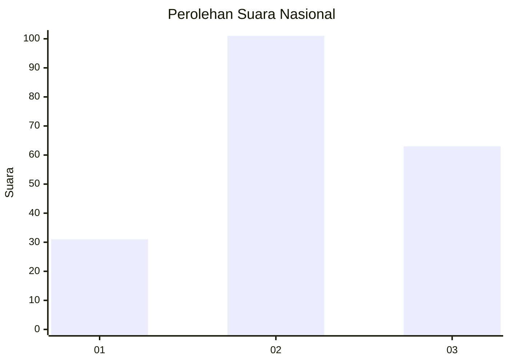
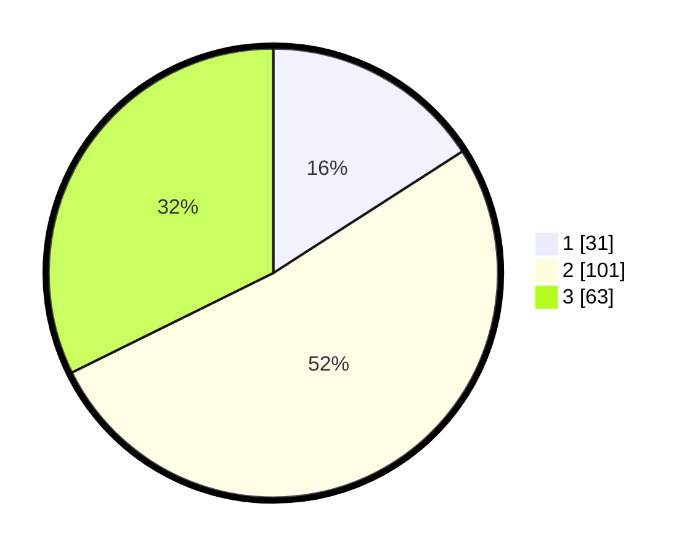

# Hasil

## Grafik

## Tabel

| No. | Nama Paslon    | Suara | Suara (raw) | Persentase |
|:--- |:-------------- | -----:| -----------:| ----------:|
| 1   | ANIES MUHAIMIN | 31    | [31][p-1]   | 15,90      |
| 2   | PRABOWO GIBRAN | 101   | [101][p-2]  | 51,79      |
| 3   | GANJAR MAHFUD  | 63    | [63][p-3]   | 32,31      |

[p-1]: https://github.com/gigit-pemilu/pemilu-2024/blob/main/pilpres/hitung-suara/sub/34-di-yogyakarta/sub/01-kulon-progo/sub/01-temon/sub/2001-jangkaran/sub/001-tps/sub/paslon-1.txt
[p-2]: https://github.com/gigit-pemilu/pemilu-2024/blob/main/pilpres/hitung-suara/sub/34-di-yogyakarta/sub/01-kulon-progo/sub/01-temon/sub/2001-jangkaran/sub/001-tps/sub/paslon-2.txt
[p-3]: https://github.com/gigit-pemilu/pemilu-2024/blob/main/pilpres/hitung-suara/sub/34-di-yogyakarta/sub/01-kulon-progo/sub/01-temon/sub/2001-jangkaran/sub/001-tps/sub/paslon-3.txt

## Foto C Plano

https://sirekap-obj-formc.kpu.go.id/cab0/pemilu/ppwp/34/01/01/20/01/3401012001001-20240216-165844--8ca5b81b-4e89-4d37-a01f-a3c2c5ec5ae2.jpg

https://sirekap-obj-formc.kpu.go.id/cab0/pemilu/ppwp/34/01/01/20/01/3401012001001-20240216-165845--98c237c0-eb31-4533-bd84-7ca50e2524ab.jpg

https://sirekap-obj-formc.kpu.go.id/cab0/pemilu/ppwp/34/01/01/20/01/3401012001001-20240216-165844--057b1f59-1cdb-4f0a-a2bd-ccd01f337839.jpg

## Metadata

| Key        | Value               |
| ---------- | ------------------- |
| Time Stamp | 2024-02-17 16:00:02 |

## DATA PEMILIH TETAP

Jumlah pemilih dalam DPT: **221**.
 * L: **108**.
 * P: **113**.

## DATA PENGGUNA HAK PILIH

Jumlah pengguna hak pilih dalam DPT: **185**.
 * L: **87**.
 * P: **98**.

Jumlah pengguna hak pilih dalam DPTb: **10**.
 * L: **0**.
 * P: **10**.

Jumlah pengguna hak pilih dalam DPK: **1**.
 * L: **0**.
 * P: **1**.

Jumlah pengguna hak pilih: **196**.
 * L: **87**.
 * P: **109**.

## JUMLAH SUARA SAH DAN TIDAK SAH

JUMLAH SELURUH SUARA SAH: **195**.

JUMLAH SUARA TIDAK SAH: **1**.

JUMLAH SELURUH SUARA SAH DAN SUARA TIDAK SAH: **196**.

