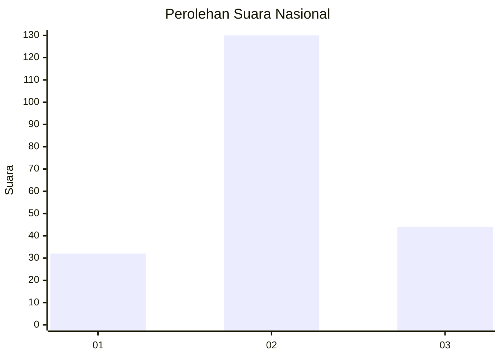
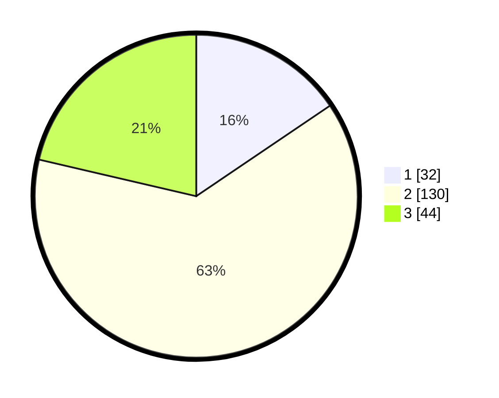

# Hasil

## Grafik

## Tabel

| No. | Nama Paslon    | Suara | Suara (raw) | Persentase |
|:--- |:-------------- | -----:| -----------:| ----------:|
| 1   | ANIES MUHAIMIN | 32    | [32][p-1]   | 15,53      |
| 2   | PRABOWO GIBRAN | 130   | [130][p-2]  | 63,11      |
| 3   | GANJAR MAHFUD  | 44    | [44][p-3]   | 21,36      |

[p-1]: https://github.com/gigit-pemilu/pemilu-2024/blob/main/pilpres/hitung-suara/sub/34-di-yogyakarta/sub/01-kulon-progo/sub/01-temon/sub/2001-jangkaran/sub/002-tps/sub/paslon-1.txt
[p-2]: https://github.com/gigit-pemilu/pemilu-2024/blob/main/pilpres/hitung-suara/sub/34-di-yogyakarta/sub/01-kulon-progo/sub/01-temon/sub/2001-jangkaran/sub/002-tps/sub/paslon-2.txt
[p-3]: https://github.com/gigit-pemilu/pemilu-2024/blob/main/pilpres/hitung-suara/sub/34-di-yogyakarta/sub/01-kulon-progo/sub/01-temon/sub/2001-jangkaran/sub/002-tps/sub/paslon-3.txt

## Foto C Plano

https://sirekap-obj-formc.kpu.go.id/d9c2/pemilu/ppwp/34/01/01/20/01/3401012001002-20240216-093514--11cc19dd-b08c-4652-95d5-55f1da599b2e.jpg

https://sirekap-obj-formc.kpu.go.id/d9c2/pemilu/ppwp/34/01/01/20/01/3401012001002-20240216-093518--a6a00064-46db-4181-9bde-4c796ea14e7f.jpg

https://sirekap-obj-formc.kpu.go.id/d9c2/pemilu/ppwp/34/01/01/20/01/3401012001002-20240216-093516--d7c7ab0a-be10-4a5d-8ebd-29b094533e19.jpg

## Metadata

| Key        | Value               |
| ---------- | ------------------- |
| Time Stamp | 2024-02-17 17:30:00 |

## DATA PEMILIH TETAP

Jumlah pemilih dalam DPT: **231**.
 * L: **107**.
 * P: **124**.

## DATA PENGGUNA HAK PILIH

Jumlah pengguna hak pilih dalam DPT: **207**.
 * L: **97**.
 * P: **110**.

Jumlah pengguna hak pilih dalam DPTb: **5**.
 * L: **3**.
 * P: **2**.

Jumlah pengguna hak pilih dalam DPK: **0**.
 * L: **0**.
 * P: **0**.

Jumlah pengguna hak pilih: **212**.
 * L: **100**.
 * P: **112**.

## JUMLAH SUARA SAH DAN TIDAK SAH

JUMLAH SELURUH SUARA SAH: **206**.

JUMLAH SUARA TIDAK SAH: **6**.

JUMLAH SELURUH SUARA SAH DAN SUARA TIDAK SAH: **212**.

