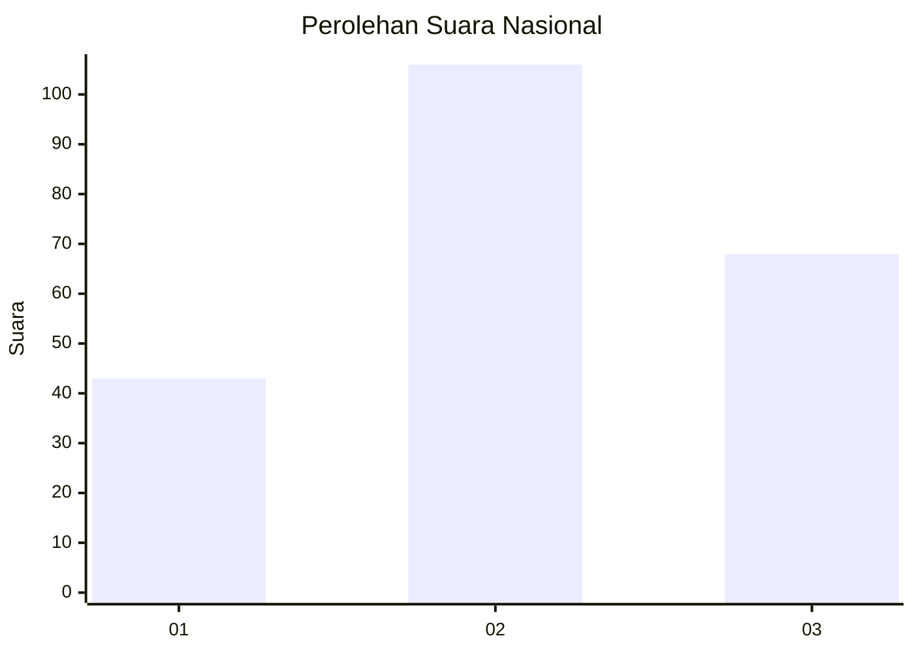
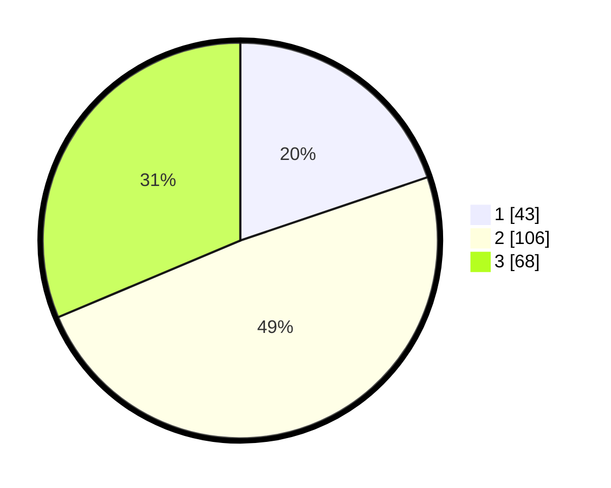

# Hasil

## Grafik

## Tabel

| No. | Nama Paslon    | Suara | Suara (raw) | Persentase |
|:--- |:-------------- | -----:| -----------:| ----------:|
| 1   | ANIES MUHAIMIN | 43    | [43][p-1]   | 19,82      |
| 2   | PRABOWO GIBRAN | 106   | [106][p-2]  | 48,85      |
| 3   | GANJAR MAHFUD  | 68    | [68][p-3]   | 31,34      |

[p-1]: https://github.com/gigit-pemilu/pemilu-2024/blob/main/pilpres/hitung-suara/sub/34-di-yogyakarta/sub/01-kulon-progo/sub/01-temon/sub/2001-jangkaran/sub/003-tps/sub/paslon-1.txt
[p-2]: https://github.com/gigit-pemilu/pemilu-2024/blob/main/pilpres/hitung-suara/sub/34-di-yogyakarta/sub/01-kulon-progo/sub/01-temon/sub/2001-jangkaran/sub/003-tps/sub/paslon-2.txt
[p-3]: https://github.com/gigit-pemilu/pemilu-2024/blob/main/pilpres/hitung-suara/sub/34-di-yogyakarta/sub/01-kulon-progo/sub/01-temon/sub/2001-jangkaran/sub/003-tps/sub/paslon-3.txt

## Foto C Plano

https://sirekap-obj-formc.kpu.go.id/9f0f/pemilu/ppwp/34/01/01/20/01/3401012001003-20240216-153925--0b70507c-96a5-47c2-8789-b02715a0c8ff.jpg

https://sirekap-obj-formc.kpu.go.id/9f0f/pemilu/ppwp/34/01/01/20/01/3401012001003-20240216-153927--381951d8-ade5-4f9a-9241-3fd30c996cdc.jpg

https://sirekap-obj-formc.kpu.go.id/9f0f/pemilu/ppwp/34/01/01/20/01/3401012001003-20240216-153926--d4fd5ed6-ed07-4746-b15f-3c0a5fdec4fc.jpg

## Metadata

| Key        | Value               |
| ---------- | ------------------- |
| Time Stamp | 2024-02-17 17:30:00 |

## DATA PEMILIH TETAP

Jumlah pemilih dalam DPT: **243**.
 * L: **117**.
 * P: **126**.

## DATA PENGGUNA HAK PILIH

Jumlah pengguna hak pilih dalam DPT: **213**.
 * L: **102**.
 * P: **111**.

Jumlah pengguna hak pilih dalam DPTb: **7**.
 * L: **7**.
 * P: **0**.

Jumlah pengguna hak pilih dalam DPK: **2**.
 * L: **0**.
 * P: **2**.

Jumlah pengguna hak pilih: **222**.
 * L: **109**.
 * P: **113**.

## JUMLAH SUARA SAH DAN TIDAK SAH

JUMLAH SELURUH SUARA SAH: **217**.

JUMLAH SUARA TIDAK SAH: **5**.

JUMLAH SELURUH SUARA SAH DAN SUARA TIDAK SAH: **222**.

