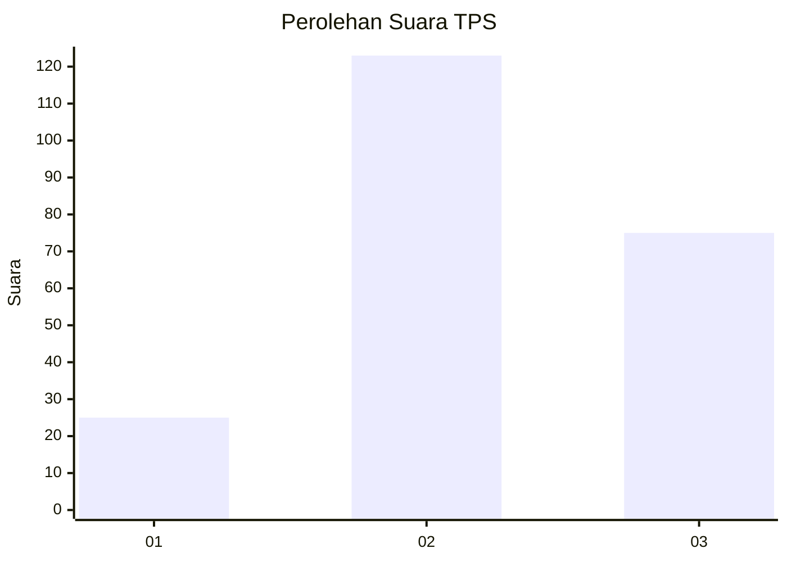
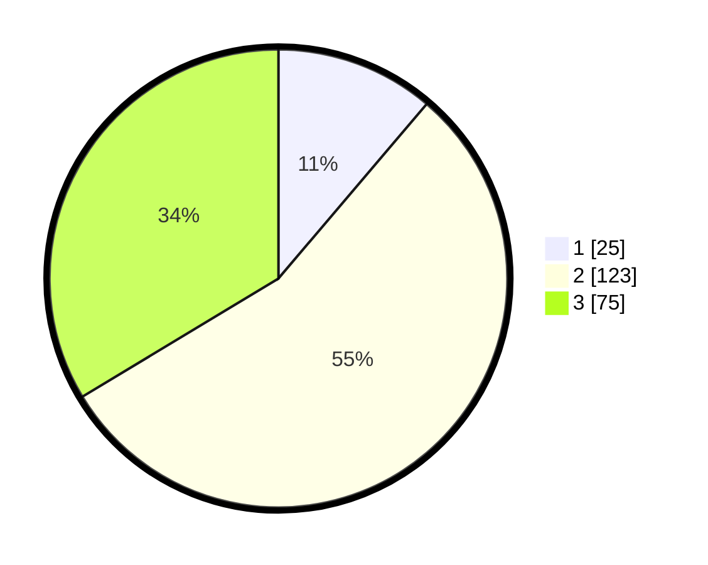

# Hasil

## Grafik

## Tabel

| No. | Nama Paslon    | Suara | Suara (raw) | Persentase |
|:--- |:-------------- | -----:| -----------:| ----------:|
| 1   | ANIES MUHAIMIN | 25    | [25][p-1]   | 11,21      |
| 2   | PRABOWO GIBRAN | 123   | [123][p-2]  | 55,16      |
| 3   | GANJAR MAHFUD  | 75    | [75][p-3]   | 33,63      |

[p-1]: https://github.com/gigit-pemilu/pemilu-2024-34-di-yogyakarta/blob/main/pilpres/hitung-suara/sub/34-di-yogyakarta/sub/01-kulon-progo/sub/01-temon/sub/2001-jangkaran/sub/005-tps/sub/paslon-1.txt
[p-2]: https://github.com/gigit-pemilu/pemilu-2024-34-di-yogyakarta/blob/main/pilpres/hitung-suara/sub/34-di-yogyakarta/sub/01-kulon-progo/sub/01-temon/sub/2001-jangkaran/sub/005-tps/sub/paslon-2.txt
[p-3]: https://github.com/gigit-pemilu/pemilu-2024-34-di-yogyakarta/blob/main/pilpres/hitung-suara/sub/34-di-yogyakarta/sub/01-kulon-progo/sub/01-temon/sub/2001-jangkaran/sub/005-tps/sub/paslon-3.txt

## Foto C Plano

https://sirekap-obj-formc.kpu.go.id/40f8/pemilu/ppwp/34/01/01/20/01/3401012001005-20240216-003251--36a7f527-7128-47e0-a6d4-fedf28215998.jpg

https://sirekap-obj-formc.kpu.go.id/40f8/pemilu/ppwp/34/01/01/20/01/3401012001005-20240216-003257--9478d8dc-965c-49be-9d96-108924b62e84.jpg

https://sirekap-obj-formc.kpu.go.id/40f8/pemilu/ppwp/34/01/01/20/01/3401012001005-20240216-003253--cbcab6a3-2094-4b2e-bf69-33d230151e7f.jpg

## Metadata

| Key        | Value               |
| ---------- | ------------------- |
| Time Stamp | 2024-02-17 17:30:00 |

## DATA PEMILIH TETAP

Jumlah pemilih dalam DPT: **261**.
 * L: **129**.
 * P: **132**.

## DATA PENGGUNA HAK PILIH

Jumlah pengguna hak pilih dalam DPT: **226**.
 * L: **108**.
 * P: **118**.

Jumlah pengguna hak pilih dalam DPTb: **1**.
 * L: **0**.
 * P: **1**.

Jumlah pengguna hak pilih dalam DPK: **1**.
 * L: **1**.
 * P: **0**.

Jumlah pengguna hak pilih: **228**.
 * L: **109**.
 * P: **119**.

## JUMLAH SUARA SAH DAN TIDAK SAH

JUMLAH SELURUH SUARA SAH: **223**.

JUMLAH SUARA TIDAK SAH: **5**.

JUMLAH SELURUH SUARA SAH DAN SUARA TIDAK SAH: **228**.

