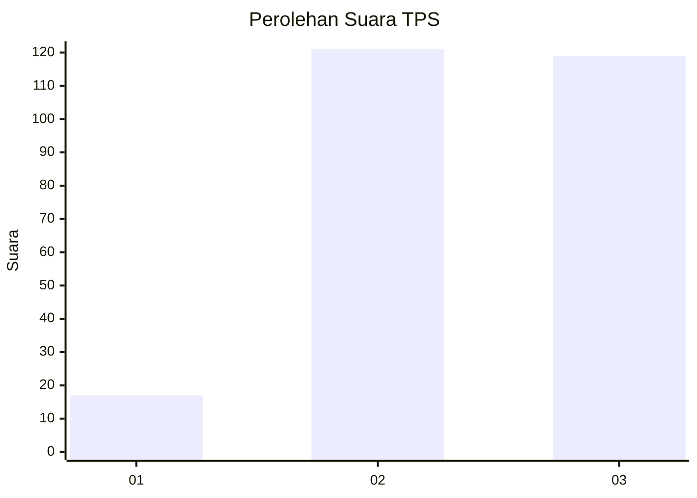
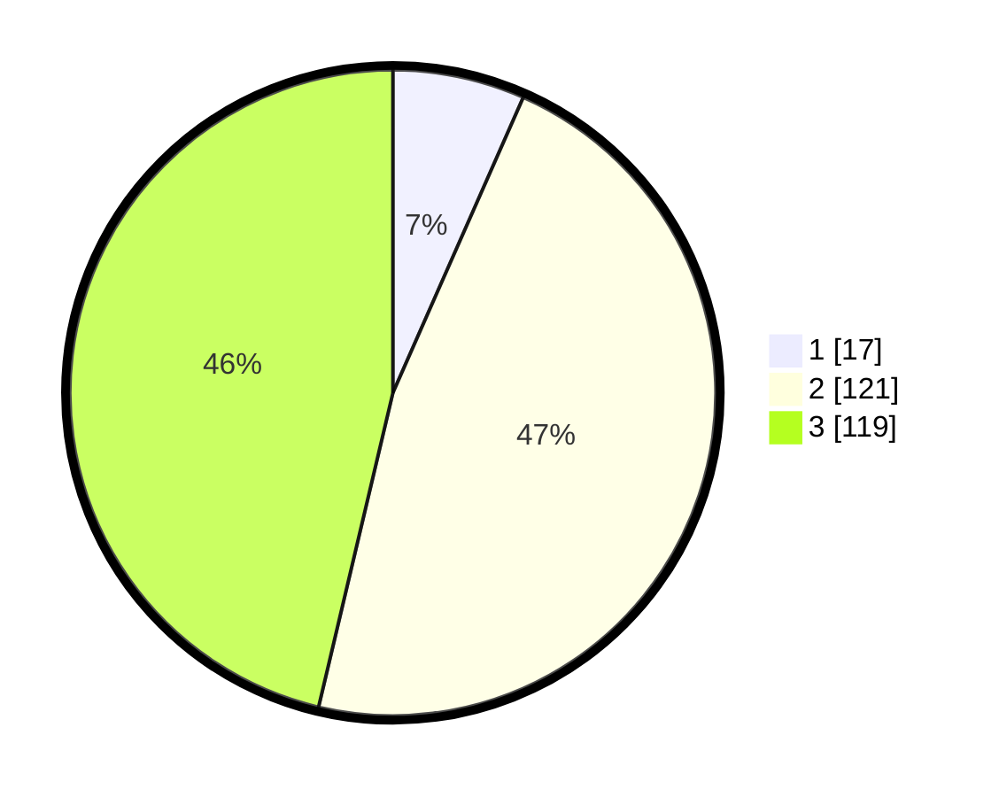

# Hasil

## Grafik

## Tabel

| No. | Nama Paslon    | Suara | Suara (raw) | Persentase |
|:--- |:-------------- | -----:| -----------:| ----------:|
| 1   | ANIES MUHAIMIN | 17    | [17][p-1]   | 6,61       |
| 2   | PRABOWO GIBRAN | 121   | [121][p-2]  | 47,08      |
| 3   | GANJAR MAHFUD  | 119   | [119][p-3]  | 46,30      |

[p-1]: https://github.com/gigit-pemilu/pemilu-2024-34-di-yogyakarta/blob/main/pilpres/hitung-suara/sub/34-di-yogyakarta/sub/01-kulon-progo/sub/01-temon/sub/2002-sindutan/sub/001-tps/sub/paslon-1.txt
[p-2]: https://github.com/gigit-pemilu/pemilu-2024-34-di-yogyakarta/blob/main/pilpres/hitung-suara/sub/34-di-yogyakarta/sub/01-kulon-progo/sub/01-temon/sub/2002-sindutan/sub/001-tps/sub/paslon-2.txt
[p-3]: https://github.com/gigit-pemilu/pemilu-2024-34-di-yogyakarta/blob/main/pilpres/hitung-suara/sub/34-di-yogyakarta/sub/01-kulon-progo/sub/01-temon/sub/2002-sindutan/sub/001-tps/sub/paslon-3.txt

## Foto C Plano

https://sirekap-obj-formc.kpu.go.id/eac8/pemilu/ppwp/34/01/01/20/02/3401012002001-20240216-010827--7083e92e-52f4-4a7e-b484-7aafa166334e.jpg

https://sirekap-obj-formc.kpu.go.id/eac8/pemilu/ppwp/34/01/01/20/02/3401012002001-20240216-010828--da78e203-9c68-4dd8-a50f-2493282d34bb.jpg

https://sirekap-obj-formc.kpu.go.id/eac8/pemilu/ppwp/34/01/01/20/02/3401012002001-20240216-010828--1db7d9b5-5a0a-4f2b-91cf-b9db45457abd.jpg

## Metadata

| Key        | Value               |
| ---------- | ------------------- |
| Time Stamp | 2024-02-17 17:30:00 |

## DATA PEMILIH TETAP

Jumlah pemilih dalam DPT: **287**.
 * L: **133**.
 * P: **154**.

## DATA PENGGUNA HAK PILIH

Jumlah pengguna hak pilih dalam DPT: **253**.
 * L: **122**.
 * P: **131**.

Jumlah pengguna hak pilih dalam DPTb: **8**.
 * L: **5**.
 * P: **3**.

Jumlah pengguna hak pilih dalam DPK: **1**.
 * L: **0**.
 * P: **1**.

Jumlah pengguna hak pilih: **262**.
 * L: **127**.
 * P: **135**.

## JUMLAH SUARA SAH DAN TIDAK SAH

JUMLAH SELURUH SUARA SAH: **257**.

JUMLAH SUARA TIDAK SAH: **5**.

JUMLAH SELURUH SUARA SAH DAN SUARA TIDAK SAH: **262**.

