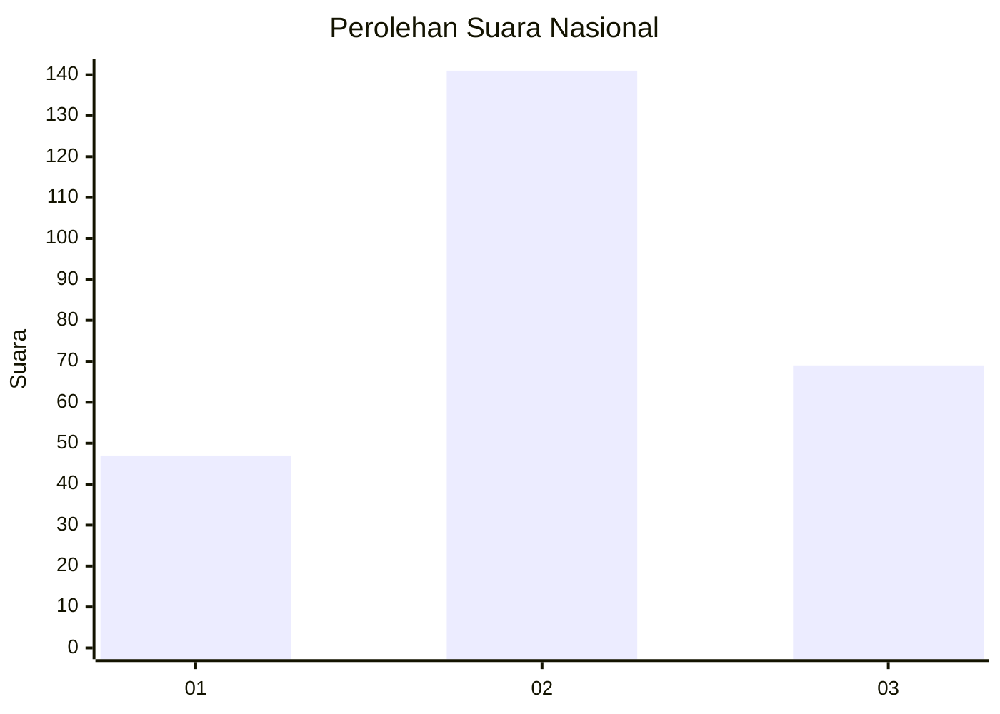
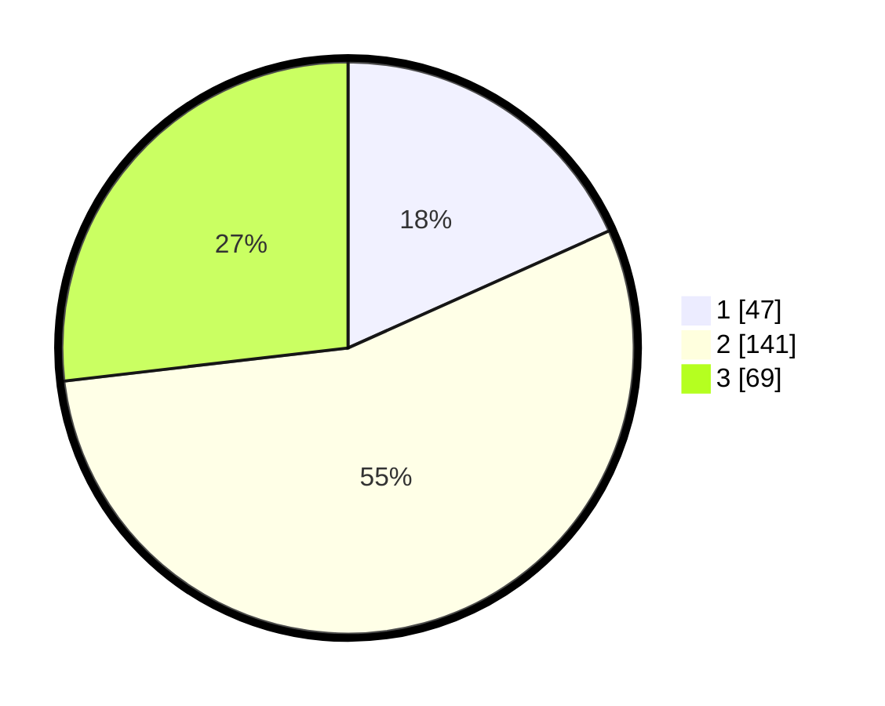

# Hasil

## Grafik

## Tabel

| No. | Nama Paslon    | Suara | Suara (raw) | Persentase |
|:--- |:-------------- | -----:| -----------:| ----------:|
| 1   | ANIES MUHAIMIN | 47    | [47][p-1]   | 18,29      |
| 2   | PRABOWO GIBRAN | 141   | [141][p-2]  | 54,86      |
| 3   | GANJAR MAHFUD  | 69    | [69][p-3]   | 26,85      |

[p-1]: https://github.com/gigit-pemilu/pemilu-2024/blob/main/pilpres/hitung-suara/sub/34-di-yogyakarta/sub/01-kulon-progo/sub/01-temon/sub/2003-palihan/sub/002-tps/sub/paslon-1.txt
[p-2]: https://github.com/gigit-pemilu/pemilu-2024/blob/main/pilpres/hitung-suara/sub/34-di-yogyakarta/sub/01-kulon-progo/sub/01-temon/sub/2003-palihan/sub/002-tps/sub/paslon-2.txt
[p-3]: https://github.com/gigit-pemilu/pemilu-2024/blob/main/pilpres/hitung-suara/sub/34-di-yogyakarta/sub/01-kulon-progo/sub/01-temon/sub/2003-palihan/sub/002-tps/sub/paslon-3.txt

## Foto C Plano

https://sirekap-obj-formc.kpu.go.id/3159/pemilu/ppwp/34/01/01/20/03/3401012003002-20240215-222922--57998306-2c71-4d7a-a328-ded35f126757.jpg

https://sirekap-obj-formc.kpu.go.id/3159/pemilu/ppwp/34/01/01/20/03/3401012003002-20240215-222925--ddb697da-37ad-4986-82f2-17329cafc715.jpg

https://sirekap-obj-formc.kpu.go.id/3159/pemilu/ppwp/34/01/01/20/03/3401012003002-20240215-222924--05f6ef0c-3903-4b8b-bda6-653314f7b8c8.jpg

## Metadata

| Key        | Value               |
| ---------- | ------------------- |
| Time Stamp | 2024-02-15 22:40:13 |

## DATA PEMILIH TETAP

Jumlah pemilih dalam DPT: **276**.
 * L: **123**.
 * P: **153**.

## DATA PENGGUNA HAK PILIH

Jumlah pengguna hak pilih dalam DPT: **250**.
 * L: **111**.
 * P: **139**.

Jumlah pengguna hak pilih dalam DPTb: **9**.
 * L: **3**.
 * P: **6**.

Jumlah pengguna hak pilih dalam DPK: **1**.
 * L: **1**.
 * P: **0**.

Jumlah pengguna hak pilih: **260**.
 * L: **115**.
 * P: **145**.

## JUMLAH SUARA SAH DAN TIDAK SAH

JUMLAH SELURUH SUARA SAH: **257**.

JUMLAH SUARA TIDAK SAH: **3**.

JUMLAH SELURUH SUARA SAH DAN SUARA TIDAK SAH: **260**.

