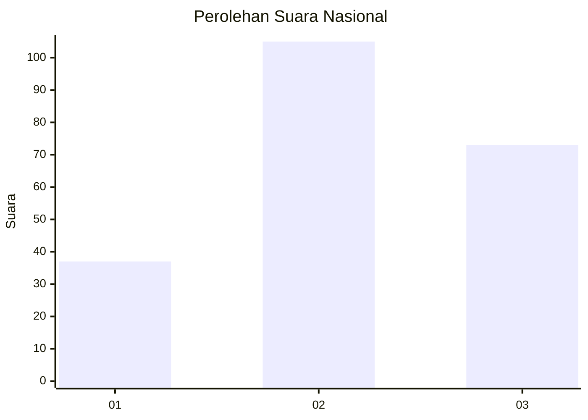
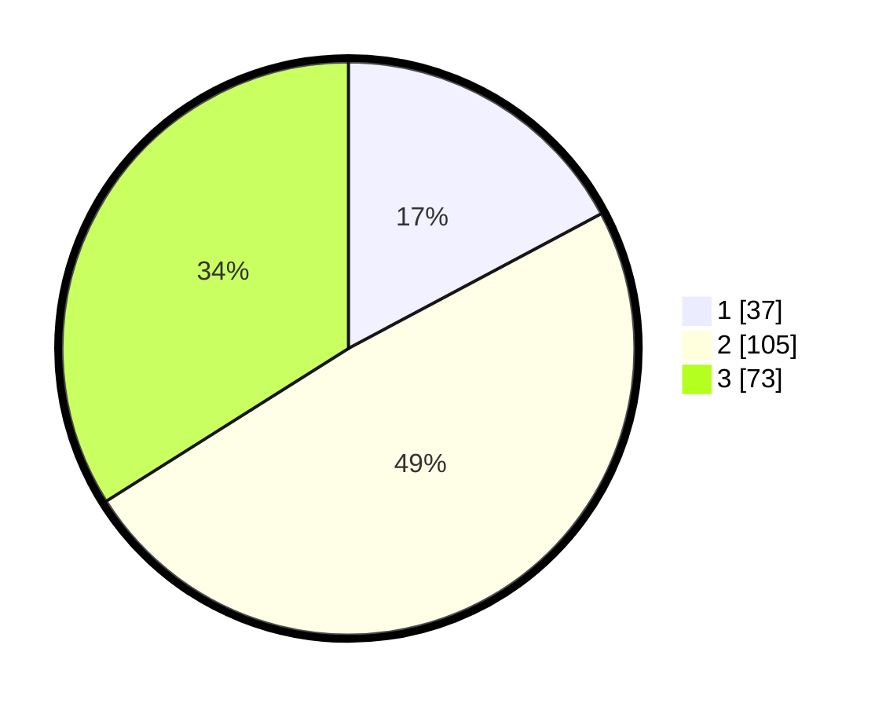

# Hasil

## Grafik

## Tabel

| No. | Nama Paslon    | Suara | Suara (raw) | Persentase |
|:--- |:-------------- | -----:| -----------:| ----------:|
| 1   | ANIES MUHAIMIN | 37    | [37][p-1]   | 17,21      |
| 2   | PRABOWO GIBRAN | 105   | [105][p-2]  | 48,84      |
| 3   | GANJAR MAHFUD  | 73    | [73][p-3]   | 33,95      |

[p-1]: https://github.com/gigit-pemilu/pemilu-2024/blob/main/pilpres/hitung-suara/sub/34-di-yogyakarta/sub/01-kulon-progo/sub/01-temon/sub/2003-palihan/sub/003-tps/sub/paslon-1.txt
[p-2]: https://github.com/gigit-pemilu/pemilu-2024/blob/main/pilpres/hitung-suara/sub/34-di-yogyakarta/sub/01-kulon-progo/sub/01-temon/sub/2003-palihan/sub/003-tps/sub/paslon-2.txt
[p-3]: https://github.com/gigit-pemilu/pemilu-2024/blob/main/pilpres/hitung-suara/sub/34-di-yogyakarta/sub/01-kulon-progo/sub/01-temon/sub/2003-palihan/sub/003-tps/sub/paslon-3.txt

## Foto C Plano

https://sirekap-obj-formc.kpu.go.id/847b/pemilu/ppwp/34/01/01/20/03/3401012003003-20240216-115005--d0701043-298d-486f-b097-efa712b78c49.jpg

https://sirekap-obj-formc.kpu.go.id/847b/pemilu/ppwp/34/01/01/20/03/3401012003003-20240216-115008--187d4ef9-199d-4c40-8fa6-9b9aa2a299c4.jpg

https://sirekap-obj-formc.kpu.go.id/847b/pemilu/ppwp/34/01/01/20/03/3401012003003-20240216-115007--bb505cf0-d614-46a8-8ec6-58538c74abfc.jpg

## Metadata

| Key        | Value               |
| ---------- | ------------------- |
| Time Stamp | 2024-02-17 17:30:00 |

## DATA PEMILIH TETAP

Jumlah pemilih dalam DPT: **239**.
 * L: **108**.
 * P: **131**.

## DATA PENGGUNA HAK PILIH

Jumlah pengguna hak pilih dalam DPT: **213**.
 * L: **96**.
 * P: **117**.

Jumlah pengguna hak pilih dalam DPTb: **10**.
 * L: **2**.
 * P: **8**.

Jumlah pengguna hak pilih dalam DPK: **1**.
 * L: **0**.
 * P: **1**.

Jumlah pengguna hak pilih: **224**.
 * L: **98**.
 * P: **126**.

## JUMLAH SUARA SAH DAN TIDAK SAH

JUMLAH SELURUH SUARA SAH: **215**.

JUMLAH SUARA TIDAK SAH: **9**.

JUMLAH SELURUH SUARA SAH DAN SUARA TIDAK SAH: **224**.

