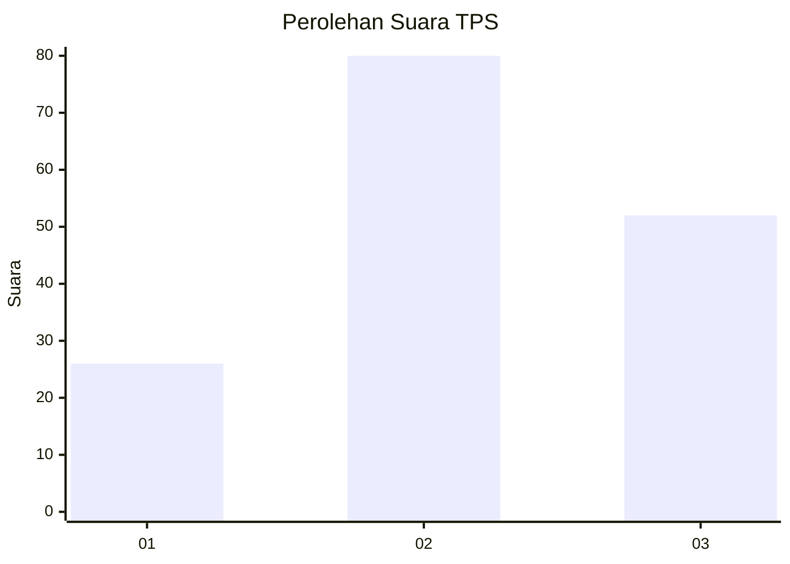
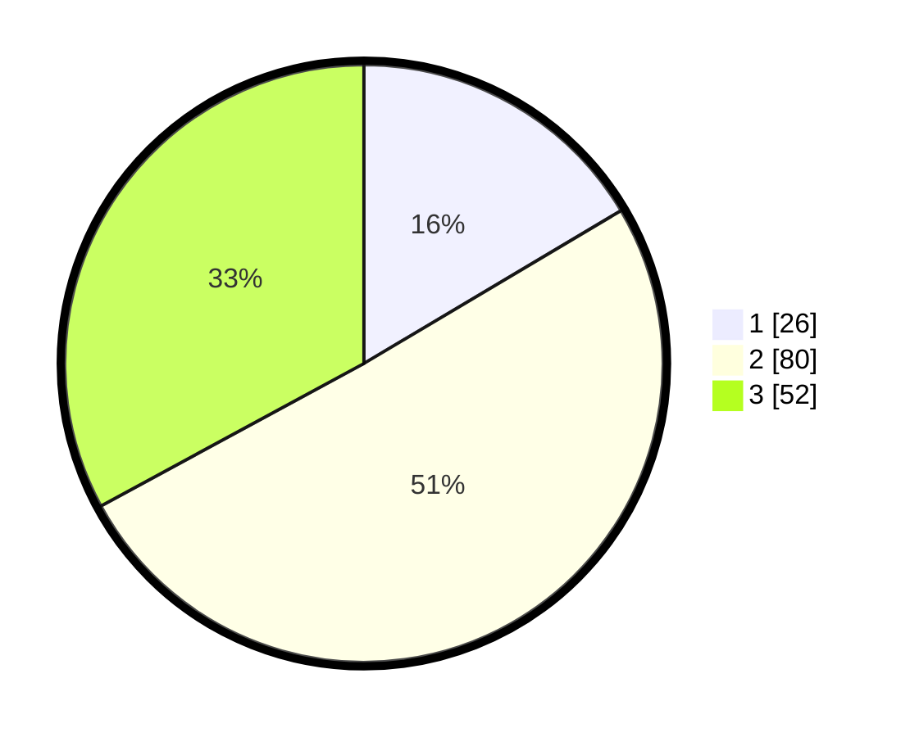

# Hasil

## Grafik

## Tabel

| No. | Nama Paslon    | Suara | Suara (raw) | Persentase |
|:--- |:-------------- | -----:| -----------:| ----------:|
| 1   | ANIES MUHAIMIN | 26    | [26][p-1]   | 16,46      |
| 2   | PRABOWO GIBRAN | 80    | [80][p-2]   | 50,63      |
| 3   | GANJAR MAHFUD  | 52    | [52][p-3]   | 32,91      |

[p-1]: https://github.com/gigit-pemilu/pemilu-2024-34-di-yogyakarta/blob/main/pilpres/hitung-suara/sub/34-di-yogyakarta/sub/01-kulon-progo/sub/01-temon/sub/2003-palihan/sub/004-tps/sub/paslon-1.txt
[p-2]: https://github.com/gigit-pemilu/pemilu-2024-34-di-yogyakarta/blob/main/pilpres/hitung-suara/sub/34-di-yogyakarta/sub/01-kulon-progo/sub/01-temon/sub/2003-palihan/sub/004-tps/sub/paslon-2.txt
[p-3]: https://github.com/gigit-pemilu/pemilu-2024-34-di-yogyakarta/blob/main/pilpres/hitung-suara/sub/34-di-yogyakarta/sub/01-kulon-progo/sub/01-temon/sub/2003-palihan/sub/004-tps/sub/paslon-3.txt

## Foto C Plano

https://sirekap-obj-formc.kpu.go.id/2e98/pemilu/ppwp/34/01/01/20/03/3401012003004-20240216-154807--730181ad-dabc-44c8-bee7-8b429cb661ad.jpg

https://sirekap-obj-formc.kpu.go.id/2e98/pemilu/ppwp/34/01/01/20/03/3401012003004-20240216-154809--d3868305-7448-46c3-84ad-a237a436d6ce.jpg

https://sirekap-obj-formc.kpu.go.id/2e98/pemilu/ppwp/34/01/01/20/03/3401012003004-20240216-154808--f88582c5-a398-45e7-98eb-039cbce79698.jpg

## Metadata

| Key        | Value               |
| ---------- | ------------------- |
| Time Stamp | 2024-02-17 17:30:00 |

## DATA PEMILIH TETAP

Jumlah pemilih dalam DPT: **187**.
 * L: **95**.
 * P: **92**.

## DATA PENGGUNA HAK PILIH

Jumlah pengguna hak pilih dalam DPT: **163**.
 * L: **82**.
 * P: **81**.

Jumlah pengguna hak pilih dalam DPTb: **2**.
 * L: **2**.
 * P: **0**.

Jumlah pengguna hak pilih dalam DPK: **0**.
 * L: **0**.
 * P: **0**.

Jumlah pengguna hak pilih: **165**.
 * L: **84**.
 * P: **81**.

## JUMLAH SUARA SAH DAN TIDAK SAH

JUMLAH SELURUH SUARA SAH: **158**.

JUMLAH SUARA TIDAK SAH: **7**.

JUMLAH SELURUH SUARA SAH DAN SUARA TIDAK SAH: **165**.

