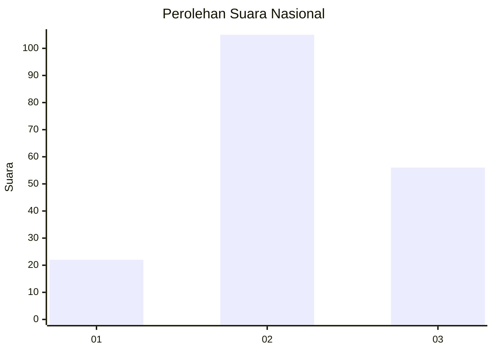
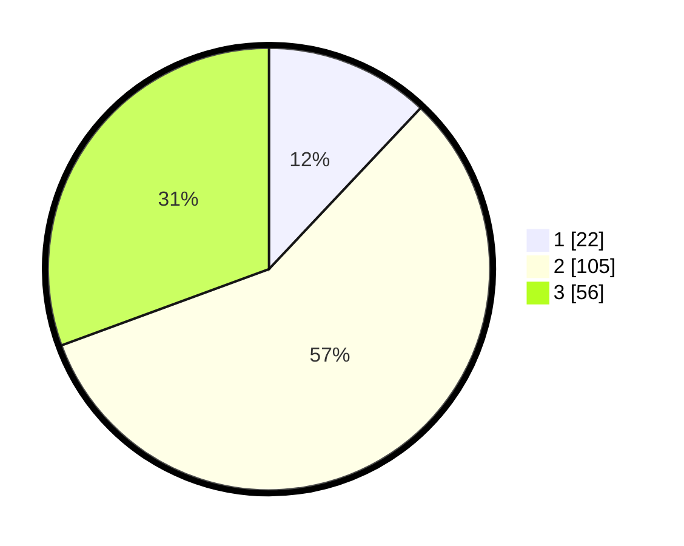

# Hasil

## Grafik

## Tabel

| No. | Nama Paslon    | Suara | Suara (raw) | Persentase |
|:--- |:-------------- | -----:| -----------:| ----------:|
| 1   | ANIES MUHAIMIN | 22    | [22][p-1]   | 12,02      |
| 2   | PRABOWO GIBRAN | 105   | [105][p-2]  | 57,38      |
| 3   | GANJAR MAHFUD  | 56    | [56][p-3]   | 30,60      |

[p-1]: https://github.com/gigit-pemilu/pemilu-2024/blob/main/pilpres/hitung-suara/sub/34-di-yogyakarta/sub/01-kulon-progo/sub/01-temon/sub/2003-palihan/sub/005-tps/sub/paslon-1.txt
[p-2]: https://github.com/gigit-pemilu/pemilu-2024/blob/main/pilpres/hitung-suara/sub/34-di-yogyakarta/sub/01-kulon-progo/sub/01-temon/sub/2003-palihan/sub/005-tps/sub/paslon-2.txt
[p-3]: https://github.com/gigit-pemilu/pemilu-2024/blob/main/pilpres/hitung-suara/sub/34-di-yogyakarta/sub/01-kulon-progo/sub/01-temon/sub/2003-palihan/sub/005-tps/sub/paslon-3.txt

## Foto C Plano

https://sirekap-obj-formc.kpu.go.id/6fbc/pemilu/ppwp/34/01/01/20/03/3401012003005-20240216-083908--0542a173-694c-4388-a4d5-7b0d0f9ee4b2.jpg

https://sirekap-obj-formc.kpu.go.id/6fbc/pemilu/ppwp/34/01/01/20/03/3401012003005-20240216-083910--2dbdcf68-302a-42c7-b130-b97207b8c19a.jpg

https://sirekap-obj-formc.kpu.go.id/6fbc/pemilu/ppwp/34/01/01/20/03/3401012003005-20240216-083909--1e9d1b44-7d54-4465-8603-361b4ab68266.jpg

## Metadata

| Key        | Value               |
| ---------- | ------------------- |
| Time Stamp | 2024-02-17 17:30:00 |

## DATA PEMILIH TETAP

Jumlah pemilih dalam DPT: **210**.
 * L: **111**.
 * P: **99**.

## DATA PENGGUNA HAK PILIH

Jumlah pengguna hak pilih dalam DPT: **179**.
 * L: **94**.
 * P: **85**.

Jumlah pengguna hak pilih dalam DPTb: **11**.
 * L: **8**.
 * P: **3**.

Jumlah pengguna hak pilih dalam DPK: **0**.
 * L: **0**.
 * P: **0**.

Jumlah pengguna hak pilih: **190**.
 * L: **102**.
 * P: **88**.

## JUMLAH SUARA SAH DAN TIDAK SAH

JUMLAH SELURUH SUARA SAH: **183**.

JUMLAH SUARA TIDAK SAH: **7**.

JUMLAH SELURUH SUARA SAH DAN SUARA TIDAK SAH: **190**.

