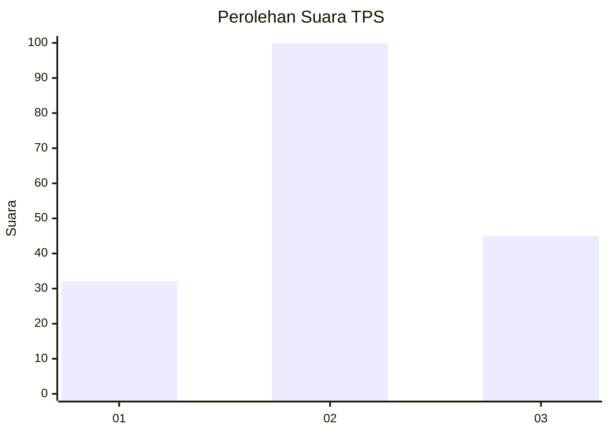
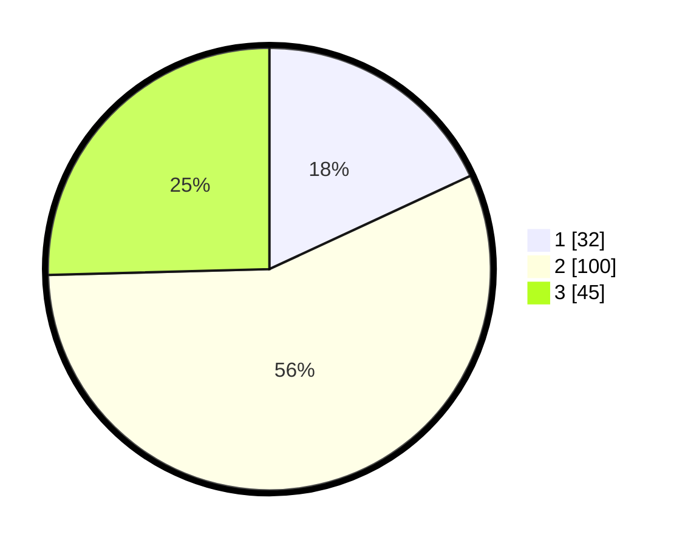

# Hasil

## Grafik

## Tabel

| No. | Nama Paslon    | Suara | Suara (raw) | Persentase |
|:--- |:-------------- | -----:| -----------:| ----------:|
| 1   | ANIES MUHAIMIN | 32    | [32][p-1]   | 18,08      |
| 2   | PRABOWO GIBRAN | 100   | [100][p-2]  | 56,50      |
| 3   | GANJAR MAHFUD  | 45    | [45][p-3]   | 25,42      |

[p-1]: https://github.com/gigit-pemilu/pemilu-2024-34-di-yogyakarta/blob/main/pilpres/hitung-suara/sub/34-di-yogyakarta/sub/01-kulon-progo/sub/01-temon/sub/2003-palihan/sub/007-tps/sub/paslon-1.txt
[p-2]: https://github.com/gigit-pemilu/pemilu-2024-34-di-yogyakarta/blob/main/pilpres/hitung-suara/sub/34-di-yogyakarta/sub/01-kulon-progo/sub/01-temon/sub/2003-palihan/sub/007-tps/sub/paslon-2.txt
[p-3]: https://github.com/gigit-pemilu/pemilu-2024-34-di-yogyakarta/blob/main/pilpres/hitung-suara/sub/34-di-yogyakarta/sub/01-kulon-progo/sub/01-temon/sub/2003-palihan/sub/007-tps/sub/paslon-3.txt

## Foto C Plano

https://sirekap-obj-formc.kpu.go.id/6259/pemilu/ppwp/34/01/01/20/03/3401012003007-20240216-190407--964b5dce-d0f3-4d42-8a19-47fc6d338266.jpg

https://sirekap-obj-formc.kpu.go.id/6259/pemilu/ppwp/34/01/01/20/03/3401012003007-20240216-190409--26d2ab0f-ea77-4213-9468-e273fb06e231.jpg

https://sirekap-obj-formc.kpu.go.id/6259/pemilu/ppwp/34/01/01/20/03/3401012003007-20240216-190408--ec765398-3197-44c0-80f8-d29128eb20f9.jpg

## Metadata

| Key        | Value               |
| ---------- | ------------------- |
| Time Stamp | 2024-02-17 17:30:00 |

## DATA PEMILIH TETAP

Jumlah pemilih dalam DPT: **199**.
 * L: **93**.
 * P: **106**.

## DATA PENGGUNA HAK PILIH

Jumlah pengguna hak pilih dalam DPT: **172**.
 * L: **81**.
 * P: **91**.

Jumlah pengguna hak pilih dalam DPTb: **7**.
 * L: **4**.
 * P: **3**.

Jumlah pengguna hak pilih dalam DPK: **1**.
 * L: **1**.
 * P: **0**.

Jumlah pengguna hak pilih: **180**.
 * L: **86**.
 * P: **94**.

## JUMLAH SUARA SAH DAN TIDAK SAH

JUMLAH SELURUH SUARA SAH: **177**.

JUMLAH SUARA TIDAK SAH: **3**.

JUMLAH SELURUH SUARA SAH DAN SUARA TIDAK SAH: **180**.

