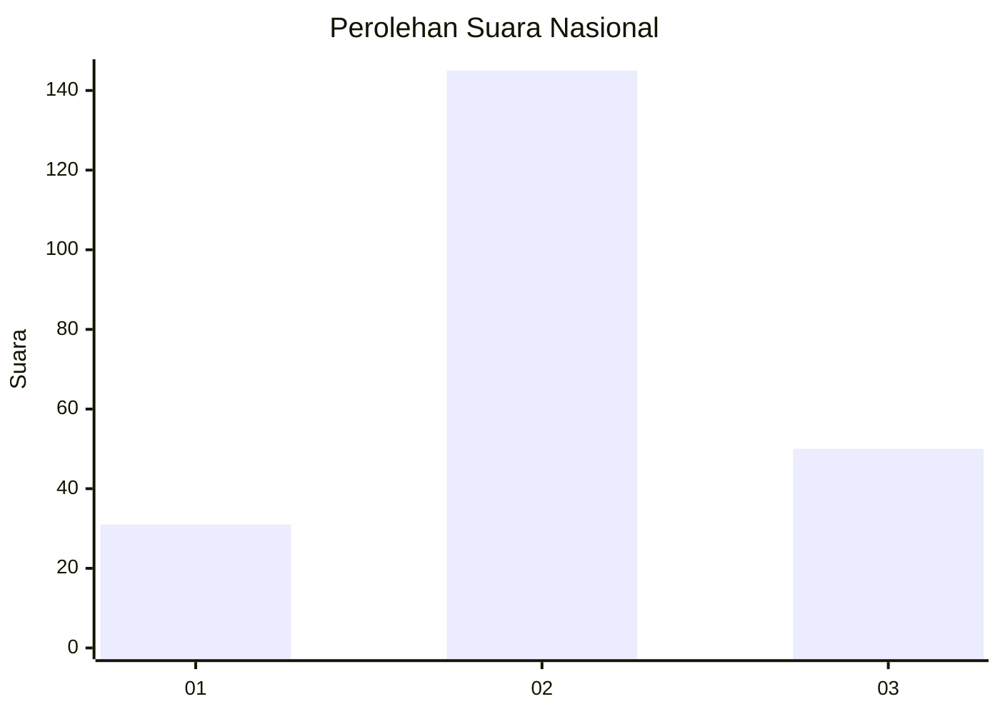
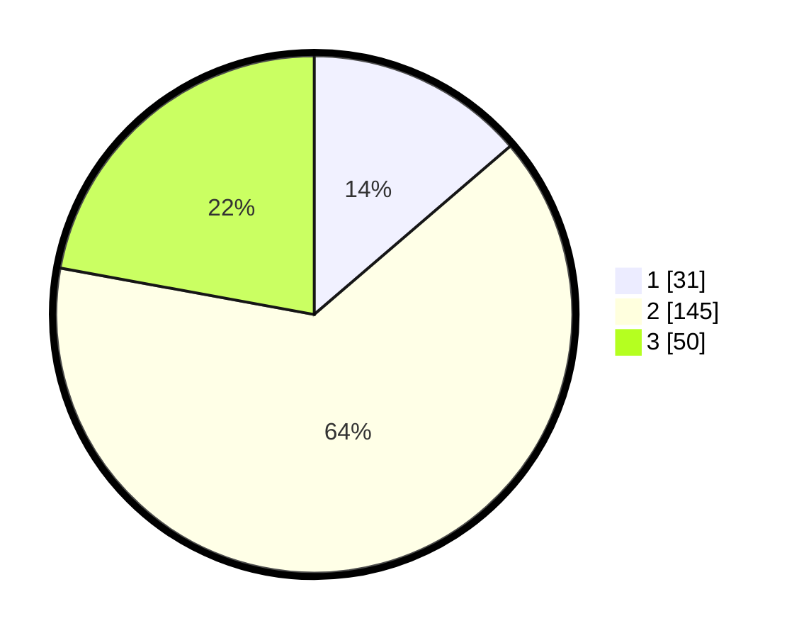

# Hasil

## Grafik

## Tabel

| No. | Nama Paslon    | Suara | Suara (raw) | Persentase |
|:--- |:-------------- | -----:| -----------:| ----------:|
| 1   | ANIES MUHAIMIN | 31    | [31][p-1]   | 13,72      |
| 2   | PRABOWO GIBRAN | 145   | [145][p-2]  | 64,16      |
| 3   | GANJAR MAHFUD  | 50    | [50][p-3]   | 22,12      |

[p-1]: https://github.com/gigit-pemilu/pemilu-2024/blob/main/pilpres/hitung-suara/sub/34-di-yogyakarta/sub/01-kulon-progo/sub/01-temon/sub/2004-glagah/sub/002-tps/sub/paslon-1.txt
[p-2]: https://github.com/gigit-pemilu/pemilu-2024/blob/main/pilpres/hitung-suara/sub/34-di-yogyakarta/sub/01-kulon-progo/sub/01-temon/sub/2004-glagah/sub/002-tps/sub/paslon-2.txt
[p-3]: https://github.com/gigit-pemilu/pemilu-2024/blob/main/pilpres/hitung-suara/sub/34-di-yogyakarta/sub/01-kulon-progo/sub/01-temon/sub/2004-glagah/sub/002-tps/sub/paslon-3.txt

## Foto C Plano

https://sirekap-obj-formc.kpu.go.id/0c88/pemilu/ppwp/34/01/01/20/04/3401012004002-20240214-192235--44359b00-2d8e-4032-97fc-66fec4553622.jpg

https://sirekap-obj-formc.kpu.go.id/0c88/pemilu/ppwp/34/01/01/20/04/3401012004002-20240215-003852--a9e66aba-806d-4c7d-960e-23e8c82100fe.jpg

## Metadata

| Key        | Value               |
| ---------- | ------------------- |
| Time Stamp | 2024-02-15 12:00:28 |

