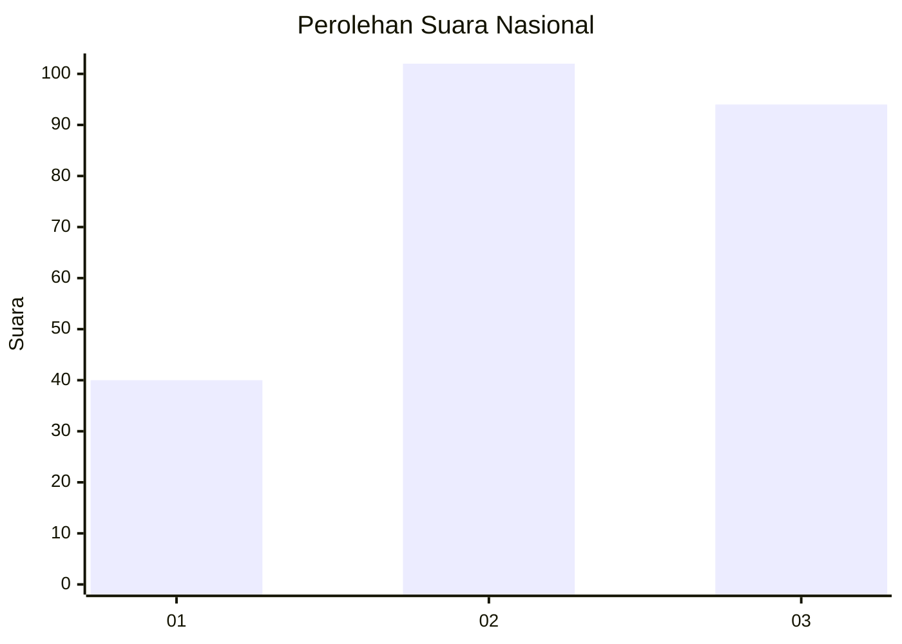
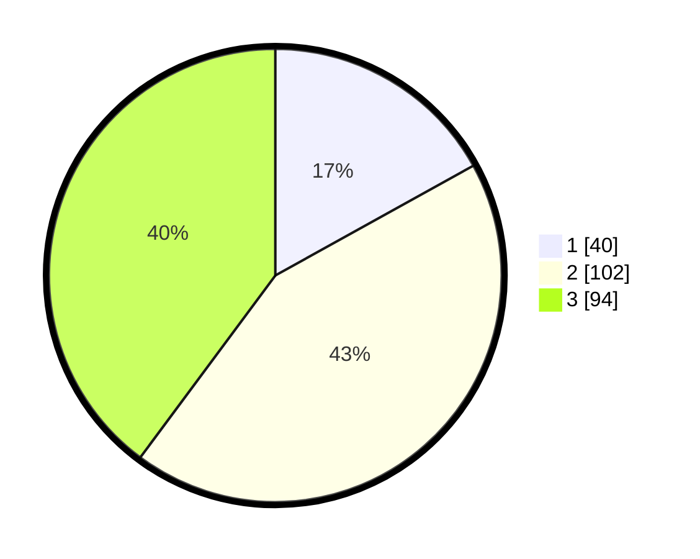

# Hasil

## Grafik

## Tabel

| No. | Nama Paslon    | Suara | Suara (raw) | Persentase |
|:--- |:-------------- | -----:| -----------:| ----------:|
| 1   | ANIES MUHAIMIN | 40    | [40][p-1]   | 16,95      |
| 2   | PRABOWO GIBRAN | 102   | [102][p-2]  | 43,22      |
| 3   | GANJAR MAHFUD  | 94    | [94][p-3]   | 39,83      |

[p-1]: https://github.com/gigit-pemilu/pemilu-2024/blob/main/pilpres/hitung-suara/sub/34-di-yogyakarta/sub/01-kulon-progo/sub/01-temon/sub/2004-glagah/sub/003-tps/sub/paslon-1.txt
[p-2]: https://github.com/gigit-pemilu/pemilu-2024/blob/main/pilpres/hitung-suara/sub/34-di-yogyakarta/sub/01-kulon-progo/sub/01-temon/sub/2004-glagah/sub/003-tps/sub/paslon-2.txt
[p-3]: https://github.com/gigit-pemilu/pemilu-2024/blob/main/pilpres/hitung-suara/sub/34-di-yogyakarta/sub/01-kulon-progo/sub/01-temon/sub/2004-glagah/sub/003-tps/sub/paslon-3.txt

## Foto C Plano

https://sirekap-obj-formc.kpu.go.id/49db/pemilu/ppwp/34/01/01/20/04/3401012004003-20240214-155315--195a2a97-b240-4afe-8b7e-dee6eb65f844.jpg

https://sirekap-obj-formc.kpu.go.id/49db/pemilu/ppwp/34/01/01/20/04/3401012004003-20240215-021545--cc1303cb-9674-4a4a-b1fa-6d2dfdb12480.jpg

https://sirekap-obj-formc.kpu.go.id/49db/pemilu/ppwp/34/01/01/20/04/3401012004003-20240215-022006--2d21bb5e-5519-47f0-bcfd-0a372caadecf.jpg

## Metadata

| Key        | Value               |
| ---------- | ------------------- |
| Time Stamp | 2024-02-15 23:29:50 |

## DATA PEMILIH TETAP

Jumlah pemilih dalam DPT: **284**.
 * L: **144**.
 * P: **140**.

## DATA PENGGUNA HAK PILIH

Jumlah pengguna hak pilih dalam DPT: **236**.
 * L: **117**.
 * P: **119**.

Jumlah pengguna hak pilih dalam DPTb: **6**.
 * L: **4**.
 * P: **2**.

Jumlah pengguna hak pilih dalam DPK: **0**.
 * L: **0**.
 * P: **0**.

Jumlah pengguna hak pilih: **290**.
 * L: **148**.
 * P: **142**.

## JUMLAH SUARA SAH DAN TIDAK SAH

JUMLAH SELURUH SUARA SAH: **236**.

JUMLAH SUARA TIDAK SAH: **6**.

JUMLAH SELURUH SUARA SAH DAN SUARA TIDAK SAH: **290**.

