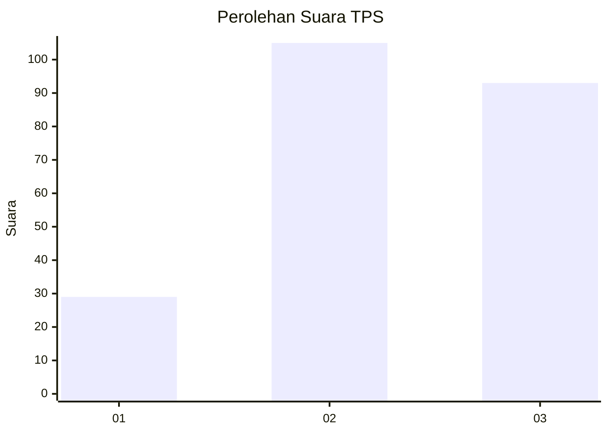
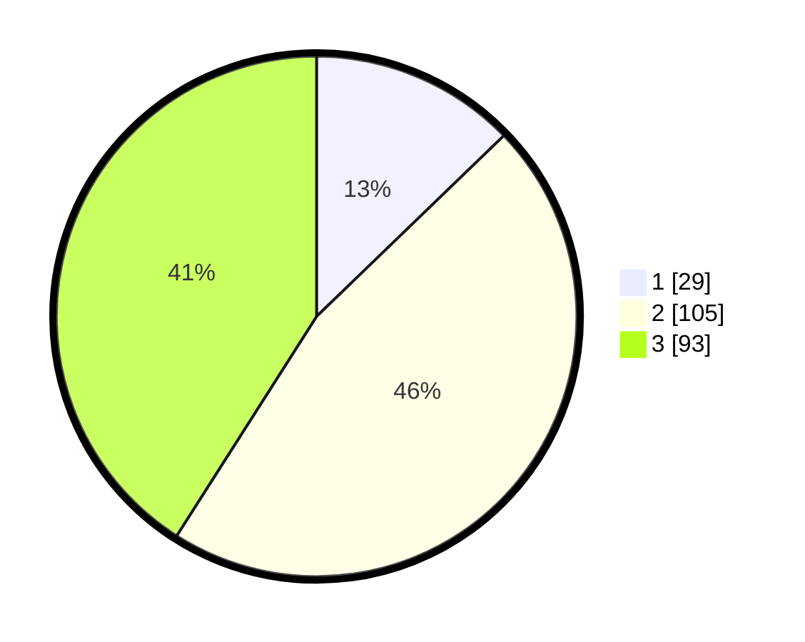

# Hasil

## Grafik

## Tabel

| No. | Nama Paslon    | Suara | Suara (raw) | Persentase |
|:--- |:-------------- | -----:| -----------:| ----------:|
| 1   | ANIES MUHAIMIN | 29    | [29][p-1]   | 12,78      |
| 2   | PRABOWO GIBRAN | 105   | [105][p-2]  | 46,26      |
| 3   | GANJAR MAHFUD  | 93    | [93][p-3]   | 40,97      |

[p-1]: https://github.com/gigit-pemilu/pemilu-2024-34-di-yogyakarta/blob/main/pilpres/hitung-suara/sub/34-di-yogyakarta/sub/01-kulon-progo/sub/01-temon/sub/2004-glagah/sub/004-tps/sub/paslon-1.txt
[p-2]: https://github.com/gigit-pemilu/pemilu-2024-34-di-yogyakarta/blob/main/pilpres/hitung-suara/sub/34-di-yogyakarta/sub/01-kulon-progo/sub/01-temon/sub/2004-glagah/sub/004-tps/sub/paslon-2.txt
[p-3]: https://github.com/gigit-pemilu/pemilu-2024-34-di-yogyakarta/blob/main/pilpres/hitung-suara/sub/34-di-yogyakarta/sub/01-kulon-progo/sub/01-temon/sub/2004-glagah/sub/004-tps/sub/paslon-3.txt

## Foto C Plano

https://sirekap-obj-formc.kpu.go.id/3cb3/pemilu/ppwp/34/01/01/20/04/3401012004004-20240215-171313--9f7a201c-c8da-4de5-a1f5-ac99d40640ad.jpg

https://sirekap-obj-formc.kpu.go.id/3cb3/pemilu/ppwp/34/01/01/20/04/3401012004004-20240215-171427--84c2a44d-95f0-43e3-ac81-2a4d6335ab80.jpg

https://sirekap-obj-formc.kpu.go.id/3cb3/pemilu/ppwp/34/01/01/20/04/3401012004004-20240214-221325--ad47368f-14ad-4b5b-aad3-2208816d6d59.jpg

## Metadata

| Key        | Value               |
| ---------- | ------------------- |
| Time Stamp | 2024-02-17 10:30:03 |

