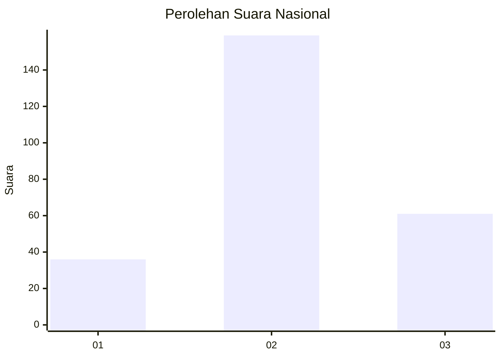
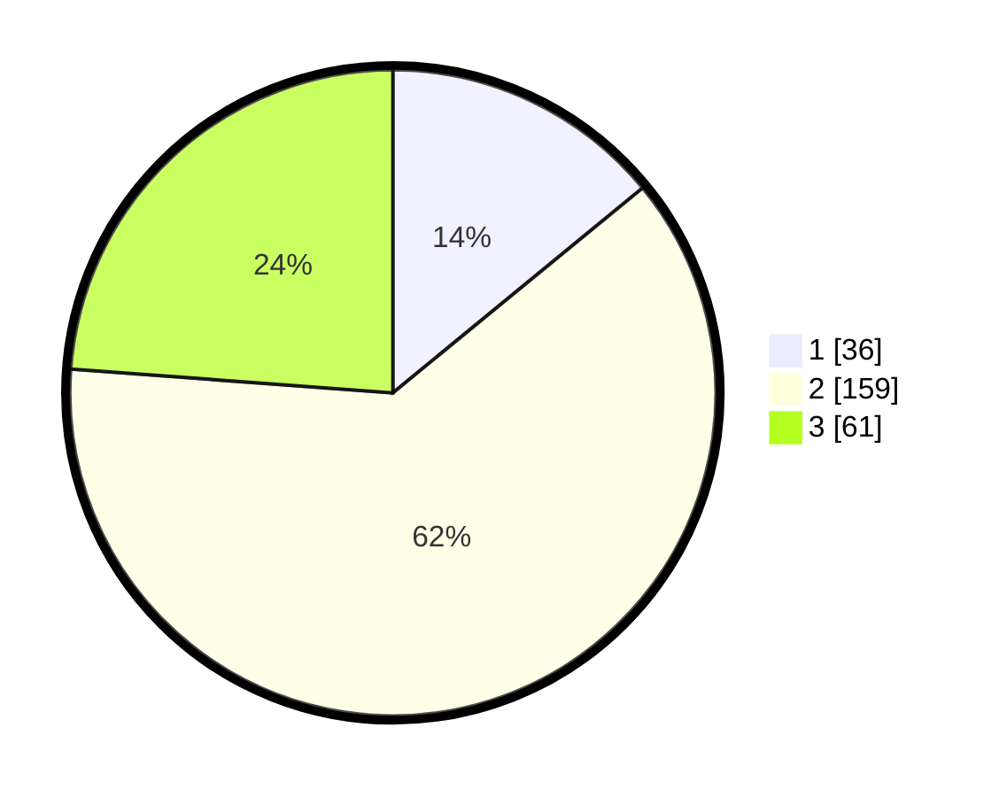

# Hasil

## Grafik

## Tabel

| No. | Nama Paslon    | Suara | Suara (raw) | Persentase |
|:--- |:-------------- | -----:| -----------:| ----------:|
| 1   | ANIES MUHAIMIN | 36    | [36][p-1]   | 14,06      |
| 2   | PRABOWO GIBRAN | 159   | [159][p-2]  | 62,11      |
| 3   | GANJAR MAHFUD  | 61    | [61][p-3]   | 23,83      |

[p-1]: https://github.com/gigit-pemilu/pemilu-2024/blob/main/pilpres/hitung-suara/sub/34-di-yogyakarta/sub/01-kulon-progo/sub/01-temon/sub/2005-kalidengen/sub/001-tps/sub/paslon-1.txt
[p-2]: https://github.com/gigit-pemilu/pemilu-2024/blob/main/pilpres/hitung-suara/sub/34-di-yogyakarta/sub/01-kulon-progo/sub/01-temon/sub/2005-kalidengen/sub/001-tps/sub/paslon-2.txt
[p-3]: https://github.com/gigit-pemilu/pemilu-2024/blob/main/pilpres/hitung-suara/sub/34-di-yogyakarta/sub/01-kulon-progo/sub/01-temon/sub/2005-kalidengen/sub/001-tps/sub/paslon-3.txt

## Foto C Plano

https://sirekap-obj-formc.kpu.go.id/f6e6/pemilu/ppwp/34/01/01/20/05/3401012005001-20240216-003422--9964952e-1e37-4e99-a8ad-ef5ba04639a1.jpg

https://sirekap-obj-formc.kpu.go.id/f6e6/pemilu/ppwp/34/01/01/20/05/3401012005001-20240216-003433--55c6d973-8931-4a07-acf4-133950dc6031.jpg

https://sirekap-obj-formc.kpu.go.id/f6e6/pemilu/ppwp/34/01/01/20/05/3401012005001-20240216-003426--6782ed8d-9396-430e-b75e-ce9d549f7a29.jpg

## Metadata

| Key        | Value               |
| ---------- | ------------------- |
| Time Stamp | 2024-02-19 06:16:00 |

## DATA PEMILIH TETAP

Jumlah pemilih dalam DPT: **278**.
 * L: **132**.
 * P: **146**.

## DATA PENGGUNA HAK PILIH

Jumlah pengguna hak pilih dalam DPT: **250**.
 * L: **121**.
 * P: **129**.

Jumlah pengguna hak pilih dalam DPTb: **10**.
 * L: **4**.
 * P: **6**.

Jumlah pengguna hak pilih dalam DPK: **1**.
 * L: **0**.
 * P: **1**.

Jumlah pengguna hak pilih: **261**.
 * L: **125**.
 * P: **136**.

## JUMLAH SUARA SAH DAN TIDAK SAH

JUMLAH SELURUH SUARA SAH: **256**.

JUMLAH SUARA TIDAK SAH: **5**.

JUMLAH SELURUH SUARA SAH DAN SUARA TIDAK SAH: **261**.

