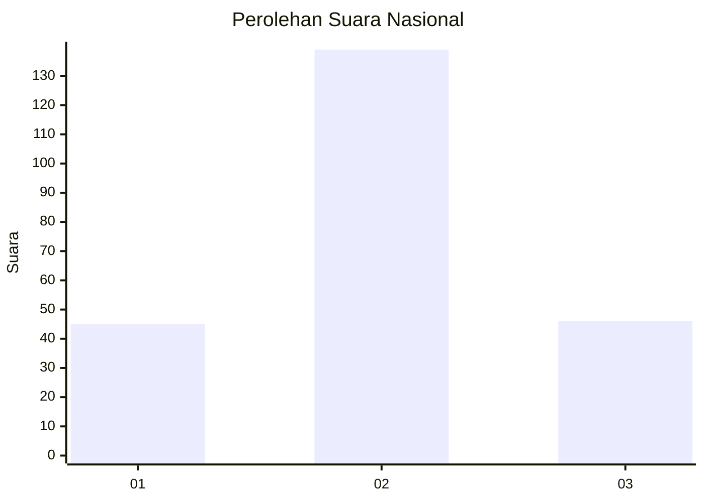
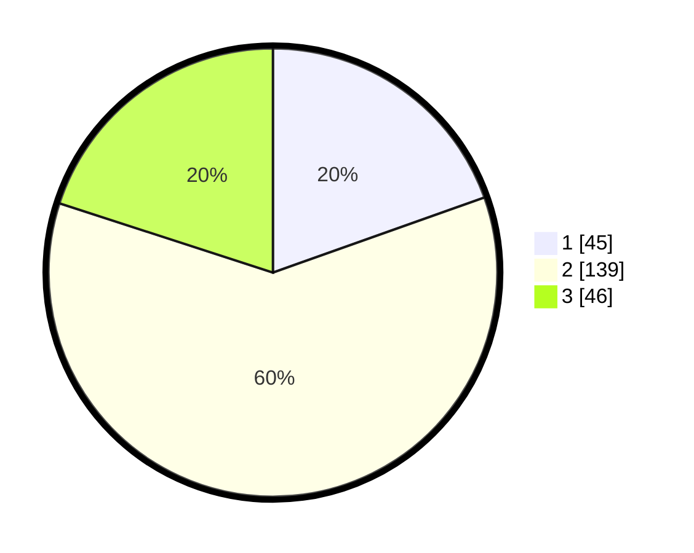

# Hasil

## Grafik

## Tabel

| No. | Nama Paslon    | Suara | Suara (raw) | Persentase |
|:--- |:-------------- | -----:| -----------:| ----------:|
| 1   | ANIES MUHAIMIN | 45    | [45][p-1]   | 19,57      |
| 2   | PRABOWO GIBRAN | 139   | [139][p-2]  | 60,43      |
| 3   | GANJAR MAHFUD  | 46    | [46][p-3]   | 20,00      |

[p-1]: https://github.com/gigit-pemilu/pemilu-2024/blob/main/pilpres/hitung-suara/sub/34-di-yogyakarta/sub/01-kulon-progo/sub/01-temon/sub/2005-kalidengen/sub/003-tps/sub/paslon-1.txt
[p-2]: https://github.com/gigit-pemilu/pemilu-2024/blob/main/pilpres/hitung-suara/sub/34-di-yogyakarta/sub/01-kulon-progo/sub/01-temon/sub/2005-kalidengen/sub/003-tps/sub/paslon-2.txt
[p-3]: https://github.com/gigit-pemilu/pemilu-2024/blob/main/pilpres/hitung-suara/sub/34-di-yogyakarta/sub/01-kulon-progo/sub/01-temon/sub/2005-kalidengen/sub/003-tps/sub/paslon-3.txt

## Foto C Plano

https://sirekap-obj-formc.kpu.go.id/b9d9/pemilu/ppwp/34/01/01/20/05/3401012005003-20240216-165427--bdb43b8e-f3ec-41e7-b1c5-06febec13397.jpg

https://sirekap-obj-formc.kpu.go.id/b9d9/pemilu/ppwp/34/01/01/20/05/3401012005003-20240216-165428--4996e0a7-6e3d-441d-ae68-6b8e6fe7a7b1.jpg

https://sirekap-obj-formc.kpu.go.id/b9d9/pemilu/ppwp/34/01/01/20/05/3401012005003-20240216-165428--64572c20-717f-4f80-b304-184717d2976e.jpg

## Metadata

| Key        | Value               |
| ---------- | ------------------- |
| Time Stamp | 2024-02-19 06:16:00 |

## DATA PEMILIH TETAP

Jumlah pemilih dalam DPT: **262**.
 * L: **129**.
 * P: **133**.

## DATA PENGGUNA HAK PILIH

Jumlah pengguna hak pilih dalam DPT: **223**.
 * L: **117**.
 * P: **106**.

Jumlah pengguna hak pilih dalam DPTb: **11**.
 * L: **4**.
 * P: **7**.

Jumlah pengguna hak pilih dalam DPK: **0**.
 * L: **0**.
 * P: **0**.

Jumlah pengguna hak pilih: **234**.
 * L: **121**.
 * P: **113**.

## JUMLAH SUARA SAH DAN TIDAK SAH

JUMLAH SELURUH SUARA SAH: **230**.

JUMLAH SUARA TIDAK SAH: **4**.

JUMLAH SELURUH SUARA SAH DAN SUARA TIDAK SAH: **234**.

