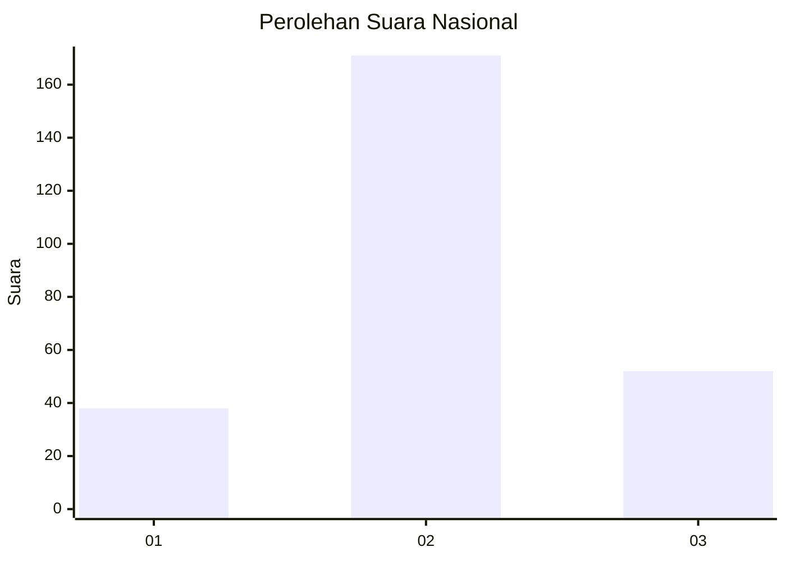
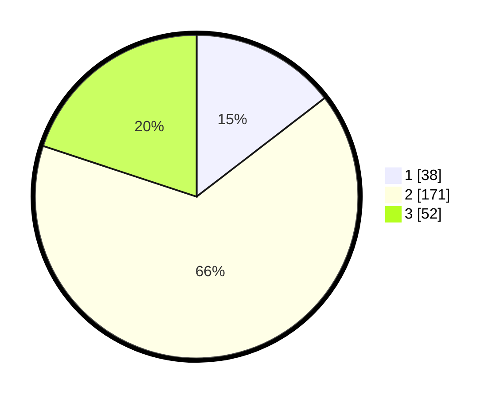

# Hasil

## Grafik

## Tabel

| No. | Nama Paslon    | Suara | Suara (raw) | Persentase |
|:--- |:-------------- | -----:| -----------:| ----------:|
| 1   | ANIES MUHAIMIN | 38    | [38][p-1]   | 14,56      |
| 2   | PRABOWO GIBRAN | 171   | [171][p-2]  | 65,52      |
| 3   | GANJAR MAHFUD  | 52    | [52][p-3]   | 19,92      |

[p-1]: https://github.com/gigit-pemilu/pemilu-2024/blob/main/pilpres/hitung-suara/sub/34-di-yogyakarta/sub/01-kulon-progo/sub/01-temon/sub/2005-kalidengen/sub/004-tps/sub/paslon-1.txt
[p-2]: https://github.com/gigit-pemilu/pemilu-2024/blob/main/pilpres/hitung-suara/sub/34-di-yogyakarta/sub/01-kulon-progo/sub/01-temon/sub/2005-kalidengen/sub/004-tps/sub/paslon-2.txt
[p-3]: https://github.com/gigit-pemilu/pemilu-2024/blob/main/pilpres/hitung-suara/sub/34-di-yogyakarta/sub/01-kulon-progo/sub/01-temon/sub/2005-kalidengen/sub/004-tps/sub/paslon-3.txt

## Foto C Plano

https://sirekap-obj-formc.kpu.go.id/6901/pemilu/ppwp/34/01/01/20/05/3401012005004-20240214-190822--ba630a89-2bb3-4642-ba1f-cbf695b9708d.jpg

https://sirekap-obj-formc.kpu.go.id/6901/pemilu/ppwp/34/01/01/20/05/3401012005004-20240214-224417--d601cd57-4aba-403a-9184-c8ff1487c8eb.jpg

https://sirekap-obj-formc.kpu.go.id/6901/pemilu/ppwp/34/01/01/20/05/3401012005004-20240214-224612--ad295d68-f433-4f0e-afe3-0f4bead74ef6.jpg

## Metadata

| Key        | Value               |
| ---------- | ------------------- |
| Time Stamp | 2024-02-15 12:00:28 |

## DATA PEMILIH TETAP

Jumlah pemilih dalam DPT: **287**.
 * L: **131**.
 * P: **156**.

## DATA PENGGUNA HAK PILIH

Jumlah pengguna hak pilih dalam DPT: **257**.
 * L: **122**.
 * P: **135**.

Jumlah pengguna hak pilih dalam DPTb: **5**.
 * L: **3**.
 * P: **2**.

Jumlah pengguna hak pilih dalam DPK: **2**.
 * L: **1**.
 * P: **1**.

Jumlah pengguna hak pilih: **264**.
 * L: **126**.
 * P: **138**.

## JUMLAH SUARA SAH DAN TIDAK SAH

JUMLAH SELURUH SUARA SAH: **261**.

JUMLAH SUARA TIDAK SAH: **3**.

JUMLAH SELURUH SUARA SAH DAN SUARA TIDAK SAH: **264**.

