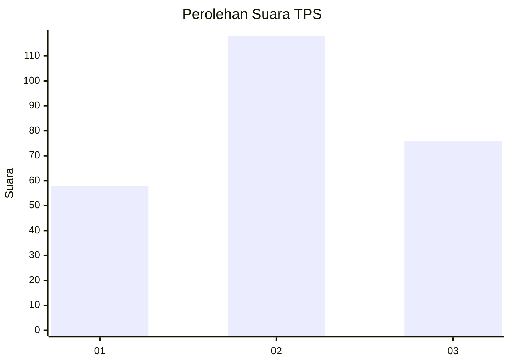
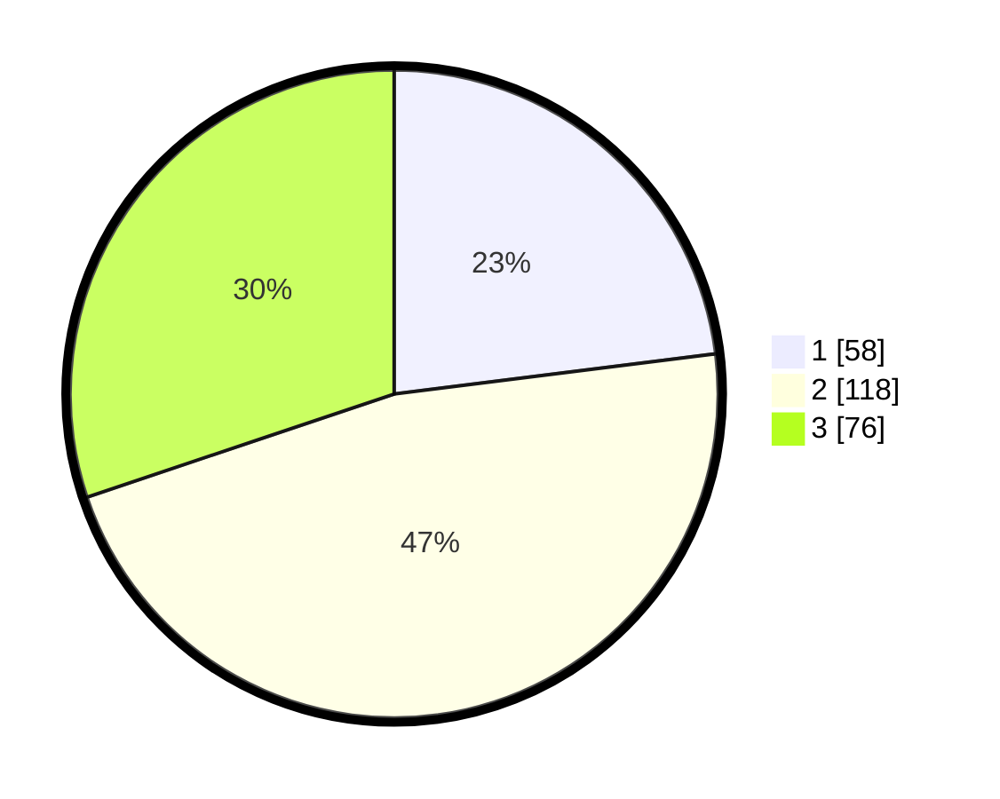

# Hasil

## Grafik

## Tabel

| No. | Nama Paslon    | Suara | Suara (raw) | Persentase |
|:--- |:-------------- | -----:| -----------:| ----------:|
| 1   | ANIES MUHAIMIN | 58    | [58][p-1]   | 23,02      |
| 2   | PRABOWO GIBRAN | 118   | [118][p-2]  | 46,83      |
| 3   | GANJAR MAHFUD  | 76    | [76][p-3]   | 30,16      |

[p-1]: https://github.com/gigit-pemilu/pemilu-2024-34-di-yogyakarta/blob/main/pilpres/hitung-suara/sub/34-di-yogyakarta/sub/01-kulon-progo/sub/01-temon/sub/2006-plumbon/sub/001-tps/sub/paslon-1.txt
[p-2]: https://github.com/gigit-pemilu/pemilu-2024-34-di-yogyakarta/blob/main/pilpres/hitung-suara/sub/34-di-yogyakarta/sub/01-kulon-progo/sub/01-temon/sub/2006-plumbon/sub/001-tps/sub/paslon-2.txt
[p-3]: https://github.com/gigit-pemilu/pemilu-2024-34-di-yogyakarta/blob/main/pilpres/hitung-suara/sub/34-di-yogyakarta/sub/01-kulon-progo/sub/01-temon/sub/2006-plumbon/sub/001-tps/sub/paslon-3.txt

## Foto C Plano

https://sirekap-obj-formc.kpu.go.id/2ce3/pemilu/ppwp/34/01/01/20/06/3401012006001-20240216-143132--7a370f6e-c8b3-4811-91e0-d834b6d8e310.jpg

https://sirekap-obj-formc.kpu.go.id/2ce3/pemilu/ppwp/34/01/01/20/06/3401012006001-20240216-143134--e39e04a8-3d94-4ebc-b365-a901ffa8f2ae.jpg

https://sirekap-obj-formc.kpu.go.id/2ce3/pemilu/ppwp/34/01/01/20/06/3401012006001-20240216-143133--b2da15ab-d84d-4428-b328-7f67d8bd03b9.jpg

## Metadata

| Key        | Value               |
| ---------- | ------------------- |
| Time Stamp | 2024-02-19 06:16:00 |

## DATA PEMILIH TETAP

Jumlah pemilih dalam DPT: **278**.
 * L: **131**.
 * P: **147**.

## DATA PENGGUNA HAK PILIH

Jumlah pengguna hak pilih dalam DPT: **253**.
 * L: **118**.
 * P: **135**.

Jumlah pengguna hak pilih dalam DPTb: **6**.
 * L: **3**.
 * P: **3**.

Jumlah pengguna hak pilih dalam DPK: **1**.
 * L: **0**.
 * P: **1**.

Jumlah pengguna hak pilih: **260**.
 * L: **121**.
 * P: **139**.

## JUMLAH SUARA SAH DAN TIDAK SAH

JUMLAH SELURUH SUARA SAH: **252**.

JUMLAH SUARA TIDAK SAH: **8**.

JUMLAH SELURUH SUARA SAH DAN SUARA TIDAK SAH: **260**.

