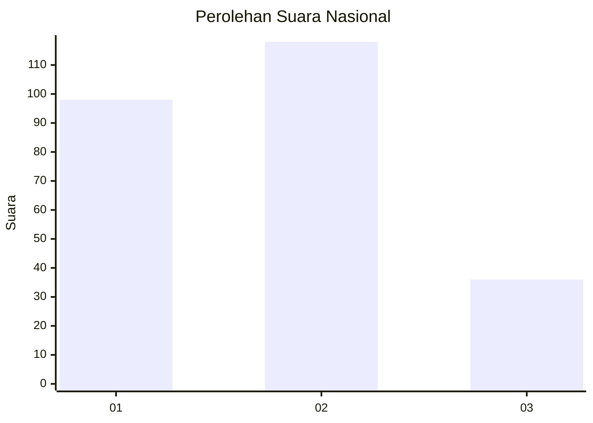
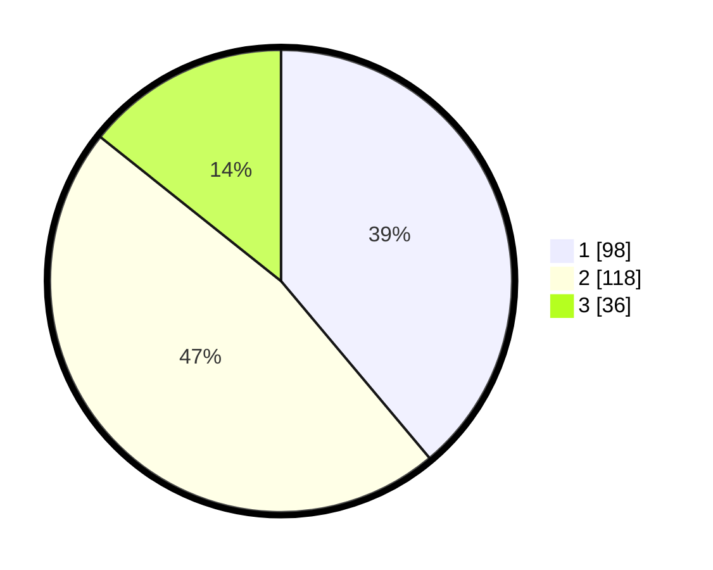

# Hasil

## Grafik

## Tabel

| No. | Nama Paslon    | Suara | Suara (raw) | Persentase |
|:--- |:-------------- | -----:| -----------:| ----------:|
| 1   | ANIES MUHAIMIN | 98    | [98][p-1]   | 38,89      |
| 2   | PRABOWO GIBRAN | 118   | [118][p-2]  | 46,83      |
| 3   | GANJAR MAHFUD  | 36    | [36][p-3]   | 14,29      |

[p-1]: https://github.com/gigit-pemilu/pemilu-2024/blob/main/pilpres/hitung-suara/sub/34-di-yogyakarta/sub/01-kulon-progo/sub/01-temon/sub/2007-kedundang/sub/001-tps/sub/paslon-1.txt
[p-2]: https://github.com/gigit-pemilu/pemilu-2024/blob/main/pilpres/hitung-suara/sub/34-di-yogyakarta/sub/01-kulon-progo/sub/01-temon/sub/2007-kedundang/sub/001-tps/sub/paslon-2.txt
[p-3]: https://github.com/gigit-pemilu/pemilu-2024/blob/main/pilpres/hitung-suara/sub/34-di-yogyakarta/sub/01-kulon-progo/sub/01-temon/sub/2007-kedundang/sub/001-tps/sub/paslon-3.txt

## Foto C Plano

https://sirekap-obj-formc.kpu.go.id/e9c0/pemilu/ppwp/34/01/01/20/07/3401012007001-20240216-134941--148a99e8-5536-40ba-a67f-a2eee091f095.jpg

https://sirekap-obj-formc.kpu.go.id/e9c0/pemilu/ppwp/34/01/01/20/07/3401012007001-20240216-134942--51490f78-b784-435d-af78-a7bb7cf81283.jpg

https://sirekap-obj-formc.kpu.go.id/e9c0/pemilu/ppwp/34/01/01/20/07/3401012007001-20240216-134942--086d13d8-fe33-4ef5-ae17-a3d58b0dbf65.jpg

## Metadata

| Key        | Value               |
| ---------- | ------------------- |
| Time Stamp | 2024-02-19 06:16:00 |

## DATA PEMILIH TETAP

Jumlah pemilih dalam DPT: **292**.
 * L: **137**.
 * P: **155**.

## DATA PENGGUNA HAK PILIH

Jumlah pengguna hak pilih dalam DPT: **250**.
 * L: **118**.
 * P: **132**.

Jumlah pengguna hak pilih dalam DPTb: **1**.
 * L: **1**.
 * P: **0**.

Jumlah pengguna hak pilih dalam DPK: **3**.
 * L: **1**.
 * P: **2**.

Jumlah pengguna hak pilih: **254**.
 * L: **120**.
 * P: **134**.

## JUMLAH SUARA SAH DAN TIDAK SAH

JUMLAH SELURUH SUARA SAH: **252**.

JUMLAH SUARA TIDAK SAH: **2**.

JUMLAH SELURUH SUARA SAH DAN SUARA TIDAK SAH: **254**.

