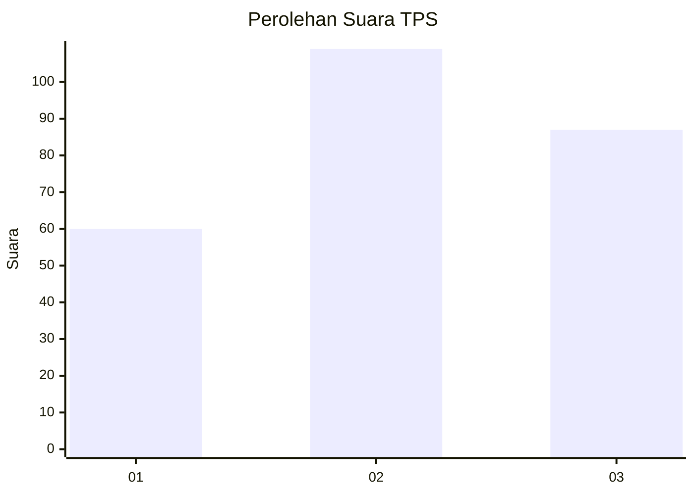
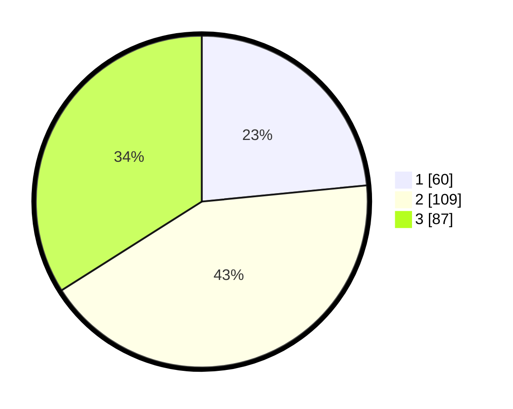

# Hasil

## Grafik

## Tabel

| No. | Nama Paslon    | Suara | Suara (raw) | Persentase |
|:--- |:-------------- | -----:| -----------:| ----------:|
| 1   | ANIES MUHAIMIN | 60    | [60][p-1]   | 23,44      |
| 2   | PRABOWO GIBRAN | 109   | [109][p-2]  | 42,58      |
| 3   | GANJAR MAHFUD  | 87    | [87][p-3]   | 33,98      |

[p-1]: https://github.com/gigit-pemilu/pemilu-2024-34-di-yogyakarta/blob/main/pilpres/hitung-suara/sub/34-di-yogyakarta/sub/01-kulon-progo/sub/01-temon/sub/2010-kaligintung/sub/002-tps/sub/paslon-1.txt
[p-2]: https://github.com/gigit-pemilu/pemilu-2024-34-di-yogyakarta/blob/main/pilpres/hitung-suara/sub/34-di-yogyakarta/sub/01-kulon-progo/sub/01-temon/sub/2010-kaligintung/sub/002-tps/sub/paslon-2.txt
[p-3]: https://github.com/gigit-pemilu/pemilu-2024-34-di-yogyakarta/blob/main/pilpres/hitung-suara/sub/34-di-yogyakarta/sub/01-kulon-progo/sub/01-temon/sub/2010-kaligintung/sub/002-tps/sub/paslon-3.txt

## Foto C Plano

https://sirekap-obj-formc.kpu.go.id/8427/pemilu/ppwp/34/01/01/20/10/3401012010002-20240216-015933--717a8cb3-9093-443e-bd09-2e874cd4f02c.jpg

https://sirekap-obj-formc.kpu.go.id/8427/pemilu/ppwp/34/01/01/20/10/3401012010002-20240216-015935--7baca0a1-07d7-44fd-9ff2-3e7ffb2d7f2f.jpg

https://sirekap-obj-formc.kpu.go.id/8427/pemilu/ppwp/34/01/01/20/10/3401012010002-20240216-015934--3fe48bb0-6965-409b-afe6-f5dcd029ed30.jpg

## Metadata

| Key        | Value               |
| ---------- | ------------------- |
| Time Stamp | 2024-02-19 06:16:00 |

## DATA PEMILIH TETAP

Jumlah pemilih dalam DPT: **291**.
 * L: **132**.
 * P: **159**.

## DATA PENGGUNA HAK PILIH

Jumlah pengguna hak pilih dalam DPT: **253**.
 * L: **114**.
 * P: **139**.

Jumlah pengguna hak pilih dalam DPTb: **6**.
 * L: **4**.
 * P: **2**.

Jumlah pengguna hak pilih dalam DPK: **1**.
 * L: **0**.
 * P: **1**.

Jumlah pengguna hak pilih: **260**.
 * L: **118**.
 * P: **142**.

## JUMLAH SUARA SAH DAN TIDAK SAH

JUMLAH SELURUH SUARA SAH: **256**.

JUMLAH SUARA TIDAK SAH: **4**.

JUMLAH SELURUH SUARA SAH DAN SUARA TIDAK SAH: **260**.

