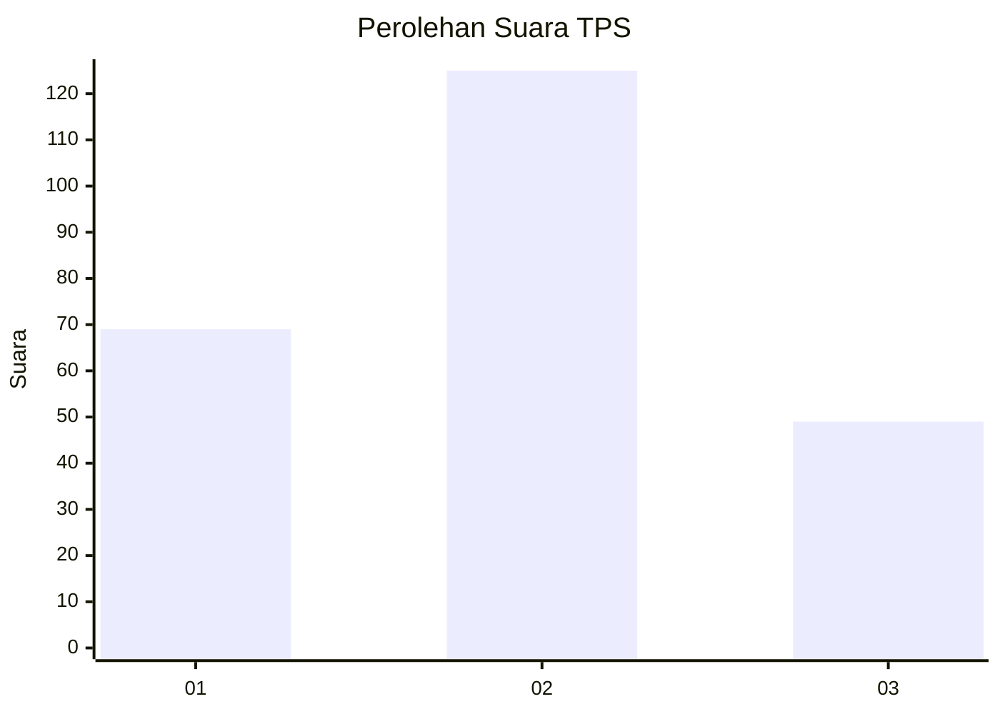
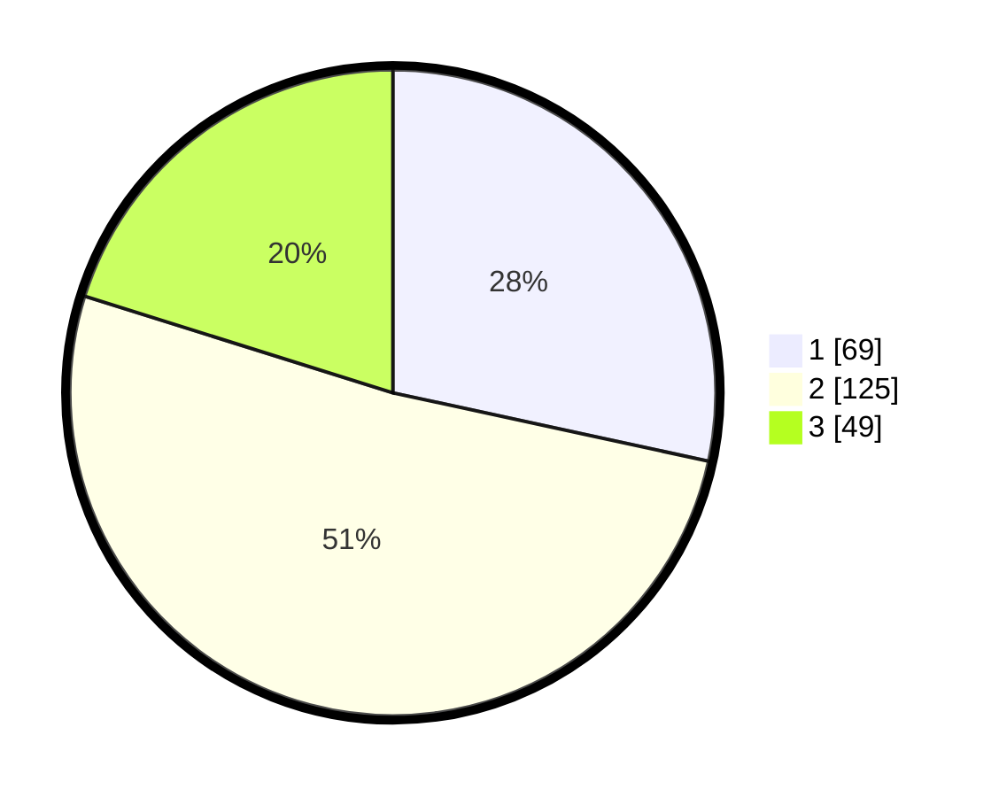

# Hasil

## Grafik

## Tabel

| No. | Nama Paslon    | Suara | Suara (raw) | Persentase |
|:--- |:-------------- | -----:| -----------:| ----------:|
| 1   | ANIES MUHAIMIN | 69    | [69][p-1]   | 28,40      |
| 2   | PRABOWO GIBRAN | 125   | [125][p-2]  | 51,44      |
| 3   | GANJAR MAHFUD  | 49    | [49][p-3]   | 20,16      |

[p-1]: https://github.com/gigit-pemilu/pemilu-2024-34-di-yogyakarta/blob/main/pilpres/hitung-suara/sub/34-di-yogyakarta/sub/01-kulon-progo/sub/01-temon/sub/2010-kaligintung/sub/004-tps/sub/paslon-1.txt
[p-2]: https://github.com/gigit-pemilu/pemilu-2024-34-di-yogyakarta/blob/main/pilpres/hitung-suara/sub/34-di-yogyakarta/sub/01-kulon-progo/sub/01-temon/sub/2010-kaligintung/sub/004-tps/sub/paslon-2.txt
[p-3]: https://github.com/gigit-pemilu/pemilu-2024-34-di-yogyakarta/blob/main/pilpres/hitung-suara/sub/34-di-yogyakarta/sub/01-kulon-progo/sub/01-temon/sub/2010-kaligintung/sub/004-tps/sub/paslon-3.txt

## Foto C Plano

https://sirekap-obj-formc.kpu.go.id/185e/pemilu/ppwp/34/01/01/20/10/3401012010004-20240216-170155--be818f6c-53c8-4fa7-8121-666761d17b9d.jpg

https://sirekap-obj-formc.kpu.go.id/185e/pemilu/ppwp/34/01/01/20/10/3401012010004-20240216-170157--1c65e3b8-f54d-491b-89ba-fecfd43b3876.jpg

https://sirekap-obj-formc.kpu.go.id/185e/pemilu/ppwp/34/01/01/20/10/3401012010004-20240216-170156--a0f8dbf0-4171-4d48-92c1-ddfcf24eed14.jpg

## Metadata

| Key        | Value               |
| ---------- | ------------------- |
| Time Stamp | 2024-02-19 06:16:00 |

## DATA PEMILIH TETAP

Jumlah pemilih dalam DPT: **280**.
 * L: **125**.
 * P: **155**.

## DATA PENGGUNA HAK PILIH

Jumlah pengguna hak pilih dalam DPT: **238**.
 * L: **109**.
 * P: **129**.

Jumlah pengguna hak pilih dalam DPTb: **5**.
 * L: **5**.
 * P: **0**.

Jumlah pengguna hak pilih dalam DPK: **0**.
 * L: **0**.
 * P: **0**.

Jumlah pengguna hak pilih: **243**.
 * L: **114**.
 * P: **129**.

## JUMLAH SUARA SAH DAN TIDAK SAH

JUMLAH SELURUH SUARA SAH: **243**.

JUMLAH SUARA TIDAK SAH: **0**.

JUMLAH SELURUH SUARA SAH DAN SUARA TIDAK SAH: **243**.

