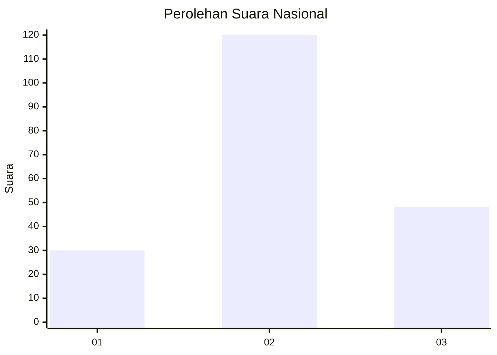
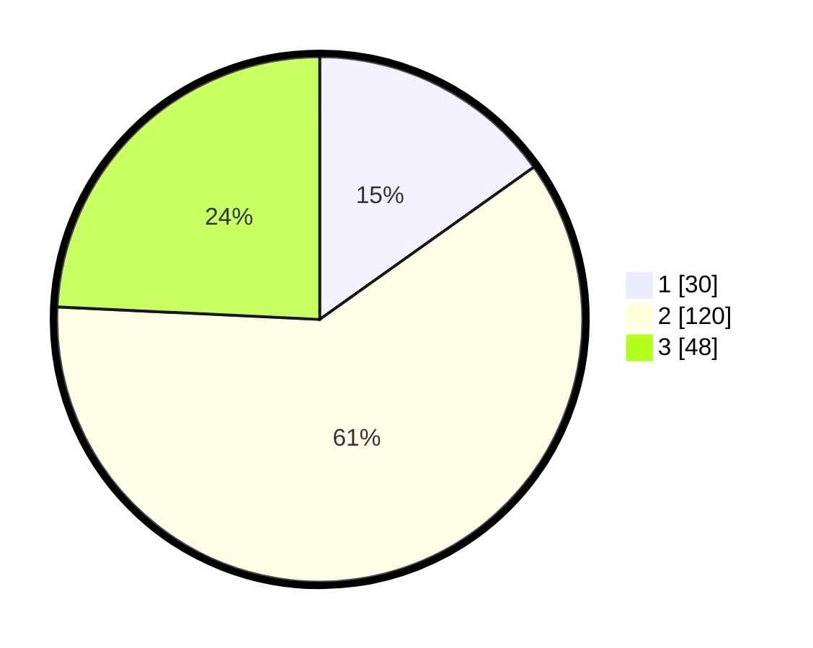

# Hasil

## Grafik

## Tabel

| No. | Nama Paslon    | Suara | Suara (raw) | Persentase |
|:--- |:-------------- | -----:| -----------:| ----------:|
| 1   | ANIES MUHAIMIN | 30    | [30][p-1]   | 15,15      |
| 2   | PRABOWO GIBRAN | 120   | [120][p-2]  | 60,61      |
| 3   | GANJAR MAHFUD  | 48    | [48][p-3]   | 24,24      |

[p-1]: https://github.com/gigit-pemilu/pemilu-2024/blob/main/pilpres/hitung-suara/sub/34-di-yogyakarta/sub/01-kulon-progo/sub/01-temon/sub/2011-temon-wetan/sub/004-tps/sub/paslon-1.txt
[p-2]: https://github.com/gigit-pemilu/pemilu-2024/blob/main/pilpres/hitung-suara/sub/34-di-yogyakarta/sub/01-kulon-progo/sub/01-temon/sub/2011-temon-wetan/sub/004-tps/sub/paslon-2.txt
[p-3]: https://github.com/gigit-pemilu/pemilu-2024/blob/main/pilpres/hitung-suara/sub/34-di-yogyakarta/sub/01-kulon-progo/sub/01-temon/sub/2011-temon-wetan/sub/004-tps/sub/paslon-3.txt

## Foto C Plano

https://sirekap-obj-formc.kpu.go.id/63d8/pemilu/ppwp/34/01/01/20/11/3401012011004-20240216-025231--c721c38c-0f7e-4e0e-aa63-2bde61da72d7.jpg

https://sirekap-obj-formc.kpu.go.id/63d8/pemilu/ppwp/34/01/01/20/11/3401012011004-20240216-025247--54057a9c-fa4a-44f6-9ca6-3f7495959464.jpg

https://sirekap-obj-formc.kpu.go.id/63d8/pemilu/ppwp/34/01/01/20/11/3401012011004-20240216-083953--bf2dbf8a-cca6-4f18-827a-67739b7b6fad.jpg

## Metadata

| Key        | Value               |
| ---------- | ------------------- |
| Time Stamp | 2024-02-19 06:16:00 |

## DATA PEMILIH TETAP

Jumlah pemilih dalam DPT: **225**.
 * L: **110**.
 * P: **115**.

## DATA PENGGUNA HAK PILIH

Jumlah pengguna hak pilih dalam DPT: **193**.
 * L: **91**.
 * P: **102**.

Jumlah pengguna hak pilih dalam DPTb: **10**.
 * L: **9**.
 * P: **1**.

Jumlah pengguna hak pilih dalam DPK: **0**.
 * L: **0**.
 * P: **0**.

Jumlah pengguna hak pilih: **203**.
 * L: **100**.
 * P: **103**.

## JUMLAH SUARA SAH DAN TIDAK SAH

JUMLAH SELURUH SUARA SAH: **198**.

JUMLAH SUARA TIDAK SAH: **5**.

JUMLAH SELURUH SUARA SAH DAN SUARA TIDAK SAH: **203**.

