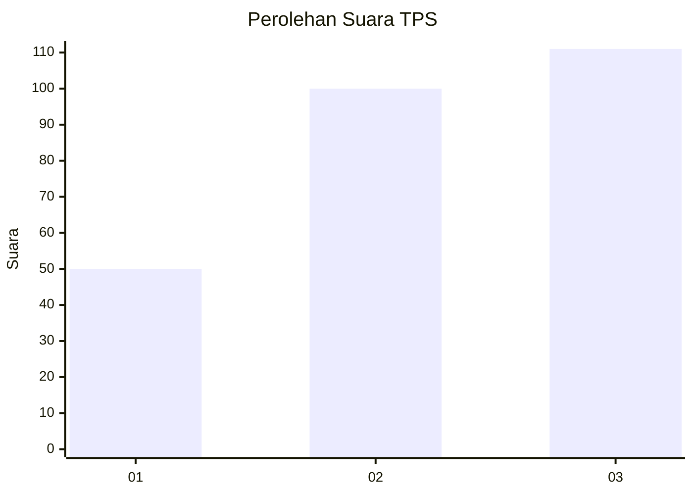
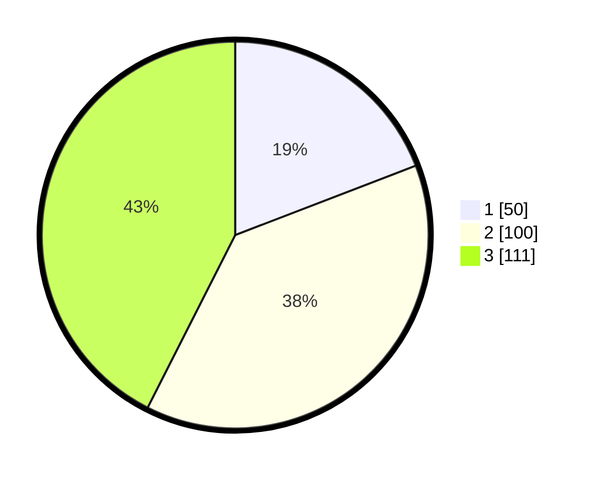

# Hasil

## Grafik

## Tabel

| No. | Nama Paslon    | Suara | Suara (raw) | Persentase |
|:--- |:-------------- | -----:| -----------:| ----------:|
| 1   | ANIES MUHAIMIN | 50    | [50][p-1]   | 19,16      |
| 2   | PRABOWO GIBRAN | 100   | [100][p-2]  | 38,31      |
| 3   | GANJAR MAHFUD  | 111   | [111][p-3]  | 42,53      |

[p-1]: https://github.com/gigit-pemilu/pemilu-2024-34-di-yogyakarta/blob/main/pilpres/hitung-suara/sub/34-di-yogyakarta/sub/01-kulon-progo/sub/01-temon/sub/2013-kebonrejo/sub/002-tps/sub/paslon-1.txt
[p-2]: https://github.com/gigit-pemilu/pemilu-2024-34-di-yogyakarta/blob/main/pilpres/hitung-suara/sub/34-di-yogyakarta/sub/01-kulon-progo/sub/01-temon/sub/2013-kebonrejo/sub/002-tps/sub/paslon-2.txt
[p-3]: https://github.com/gigit-pemilu/pemilu-2024-34-di-yogyakarta/blob/main/pilpres/hitung-suara/sub/34-di-yogyakarta/sub/01-kulon-progo/sub/01-temon/sub/2013-kebonrejo/sub/002-tps/sub/paslon-3.txt

## Foto C Plano

https://sirekap-obj-formc.kpu.go.id/c546/pemilu/ppwp/34/01/01/20/13/3401012013002-20240216-132445--cae2c399-dbda-4042-91e4-a201f7272788.jpg

https://sirekap-obj-formc.kpu.go.id/c546/pemilu/ppwp/34/01/01/20/13/3401012013002-20240216-132447--0c715cd9-3b78-4ce5-a8d3-62962a6f8288.jpg

https://sirekap-obj-formc.kpu.go.id/c546/pemilu/ppwp/34/01/01/20/13/3401012013002-20240216-132446--081c14ca-5335-43cc-8749-0ea6b150b308.jpg

## Metadata

| Key        | Value               |
| ---------- | ------------------- |
| Time Stamp | 2024-02-19 06:16:00 |

## DATA PEMILIH TETAP

Jumlah pemilih dalam DPT: **292**.
 * L: **139**.
 * P: **153**.

## DATA PENGGUNA HAK PILIH

Jumlah pengguna hak pilih dalam DPT: **248**.
 * L: **118**.
 * P: **130**.

Jumlah pengguna hak pilih dalam DPTb: **11**.
 * L: **7**.
 * P: **4**.

Jumlah pengguna hak pilih dalam DPK: **3**.
 * L: **3**.
 * P: **0**.

Jumlah pengguna hak pilih: **262**.
 * L: **128**.
 * P: **134**.

## JUMLAH SUARA SAH DAN TIDAK SAH

JUMLAH SELURUH SUARA SAH: **261**.

JUMLAH SUARA TIDAK SAH: **1**.

JUMLAH SELURUH SUARA SAH DAN SUARA TIDAK SAH: **262**.

