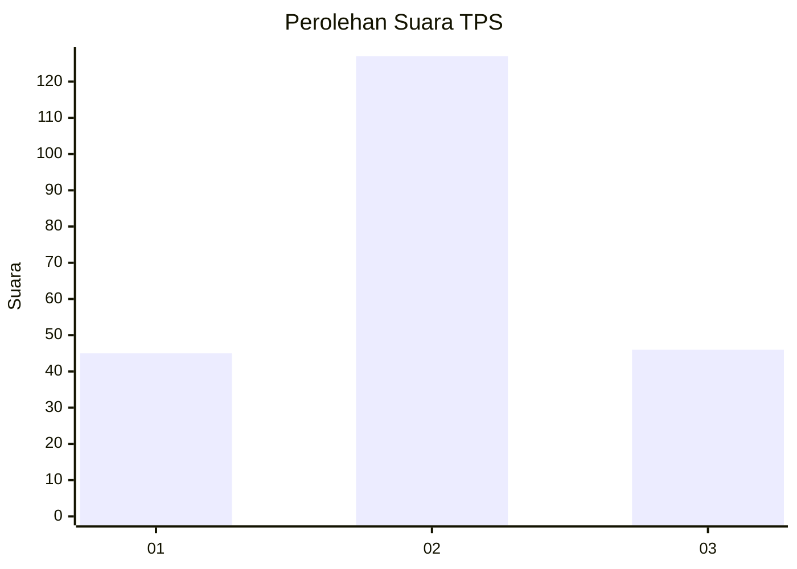
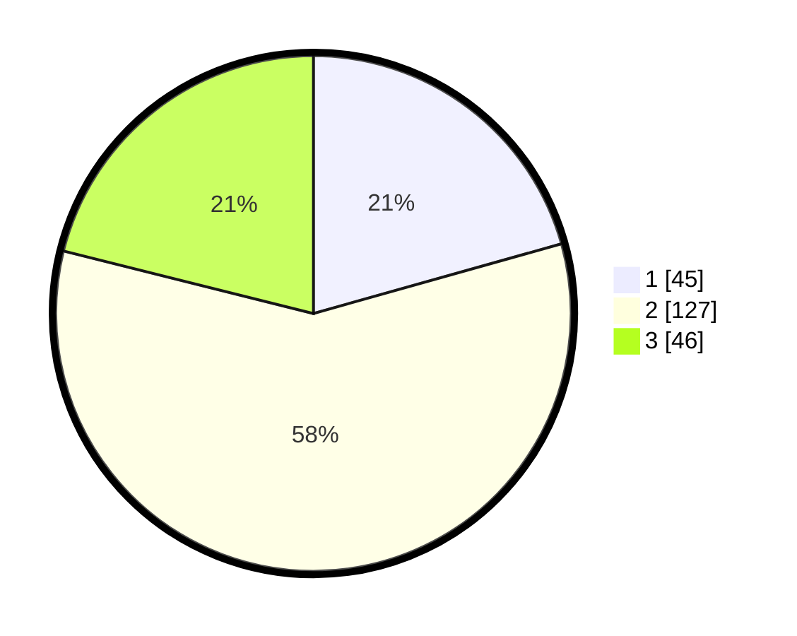

# Hasil

## Grafik

## Tabel

| No. | Nama Paslon    | Suara | Suara (raw) | Persentase |
|:--- |:-------------- | -----:| -----------:| ----------:|
| 1   | ANIES MUHAIMIN | 45    | [45][p-1]   | 20,64      |
| 2   | PRABOWO GIBRAN | 127   | [127][p-2]  | 58,26      |
| 3   | GANJAR MAHFUD  | 46    | [46][p-3]   | 21,10      |

[p-1]: https://github.com/gigit-pemilu/pemilu-2024-34-di-yogyakarta/blob/main/pilpres/hitung-suara/sub/34-di-yogyakarta/sub/01-kulon-progo/sub/01-temon/sub/2014-janten/sub/001-tps/sub/paslon-1.txt
[p-2]: https://github.com/gigit-pemilu/pemilu-2024-34-di-yogyakarta/blob/main/pilpres/hitung-suara/sub/34-di-yogyakarta/sub/01-kulon-progo/sub/01-temon/sub/2014-janten/sub/001-tps/sub/paslon-2.txt
[p-3]: https://github.com/gigit-pemilu/pemilu-2024-34-di-yogyakarta/blob/main/pilpres/hitung-suara/sub/34-di-yogyakarta/sub/01-kulon-progo/sub/01-temon/sub/2014-janten/sub/001-tps/sub/paslon-3.txt

## Foto C Plano

https://sirekap-obj-formc.kpu.go.id/0d0f/pemilu/ppwp/34/01/01/20/14/3401012014001-20240214-201410--41fcd810-9179-4f5e-8b2e-423dc4e6ffc8.jpg

https://sirekap-obj-formc.kpu.go.id/0d0f/pemilu/ppwp/34/01/01/20/14/3401012014001-20240214-201502--2ddda860-7f19-42ce-8f8b-5ec71ba5b8cb.jpg

https://sirekap-obj-formc.kpu.go.id/0d0f/pemilu/ppwp/34/01/01/20/14/3401012014001-20240214-201552--7582aec0-70e6-4f9c-91c5-b22d4269504f.jpg

## Metadata

| Key        | Value               |
| ---------- | ------------------- |
| Time Stamp | 2024-02-15 16:00:26 |

