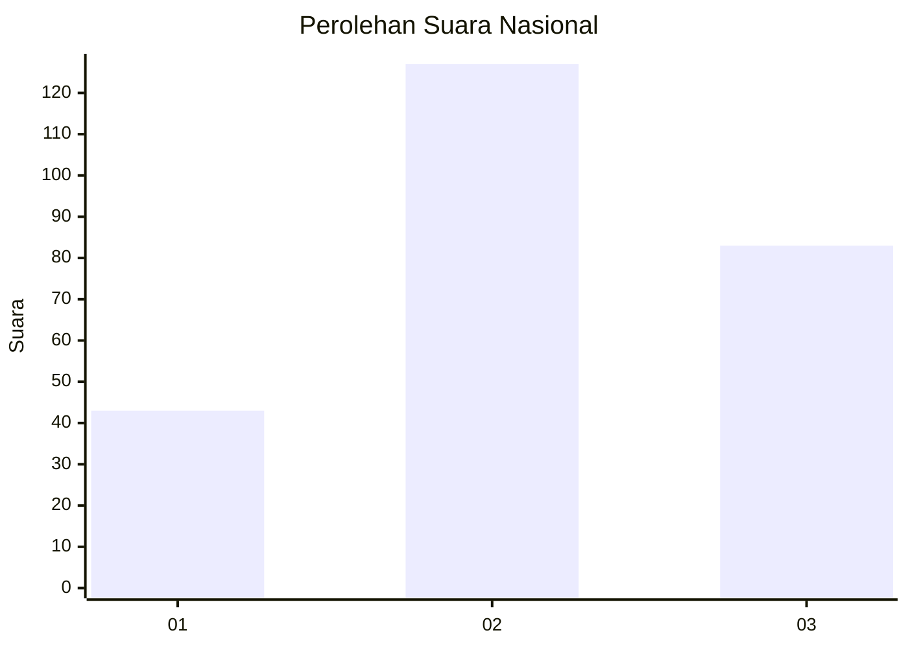
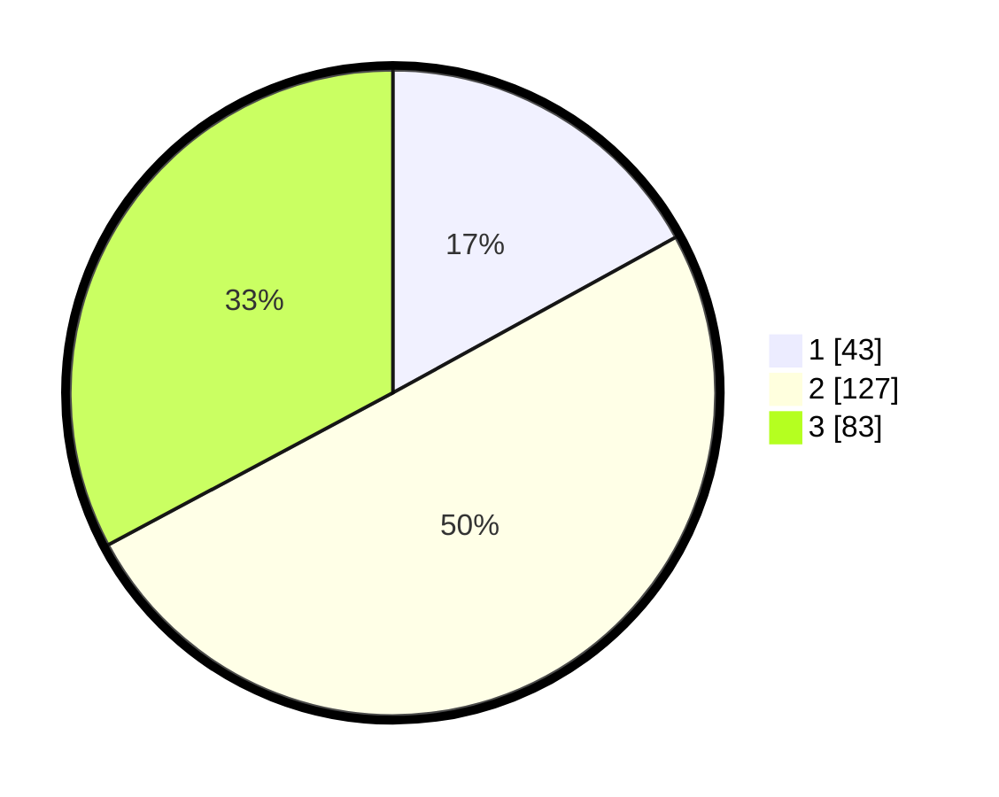

# Hasil

## Grafik

## Tabel

| No. | Nama Paslon    | Suara | Suara (raw) | Persentase |
|:--- |:-------------- | -----:| -----------:| ----------:|
| 1   | ANIES MUHAIMIN | 43    | [43][p-1]   | 17,00      |
| 2   | PRABOWO GIBRAN | 127   | [127][p-2]  | 50,20      |
| 3   | GANJAR MAHFUD  | 83    | [83][p-3]   | 32,81      |

[p-1]: https://github.com/gigit-pemilu/pemilu-2024/blob/main/pilpres/hitung-suara/sub/34-di-yogyakarta/sub/01-kulon-progo/sub/02-wates/sub/1008-wates/sub/002-tps/sub/paslon-1.txt
[p-2]: https://github.com/gigit-pemilu/pemilu-2024/blob/main/pilpres/hitung-suara/sub/34-di-yogyakarta/sub/01-kulon-progo/sub/02-wates/sub/1008-wates/sub/002-tps/sub/paslon-2.txt
[p-3]: https://github.com/gigit-pemilu/pemilu-2024/blob/main/pilpres/hitung-suara/sub/34-di-yogyakarta/sub/01-kulon-progo/sub/02-wates/sub/1008-wates/sub/002-tps/sub/paslon-3.txt

## Foto C Plano

https://sirekap-obj-formc.kpu.go.id/ac96/pemilu/ppwp/34/01/02/10/08/3401021008002-20240217-101254--3f69e3fe-191b-40b1-b6ce-0d8d024d4b57.jpg

https://sirekap-obj-formc.kpu.go.id/ac96/pemilu/ppwp/34/01/02/10/08/3401021008002-20240215-083822--5ec7dd96-c374-437f-bb35-52305673664d.jpg

https://sirekap-obj-formc.kpu.go.id/ac96/pemilu/ppwp/34/01/02/10/08/3401021008002-20240217-101444--2a136239-4aa0-40af-a183-7cf70c54cbb6.jpg

## Metadata

| Key        | Value               |
| ---------- | ------------------- |
| Time Stamp | 2024-02-17 10:30:03 |

## DATA PEMILIH TETAP

Jumlah pemilih dalam DPT: **284**.
 * L: **135**.
 * P: **149**.

## DATA PENGGUNA HAK PILIH

Jumlah pengguna hak pilih dalam DPT: **254**.
 * L: **118**.
 * P: **136**.

Jumlah pengguna hak pilih dalam DPTb: **5**.
 * L: **3**.
 * P: **2**.

Jumlah pengguna hak pilih dalam DPK: **0**.
 * L: **0**.
 * P: **0**.

Jumlah pengguna hak pilih: **259**.
 * L: **121**.
 * P: **138**.

## JUMLAH SUARA SAH DAN TIDAK SAH

JUMLAH SELURUH SUARA SAH: **253**.

JUMLAH SUARA TIDAK SAH: **6**.

JUMLAH SELURUH SUARA SAH DAN SUARA TIDAK SAH: **259**.

