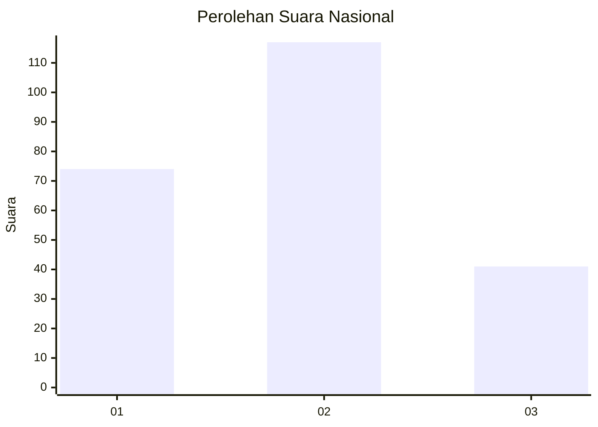
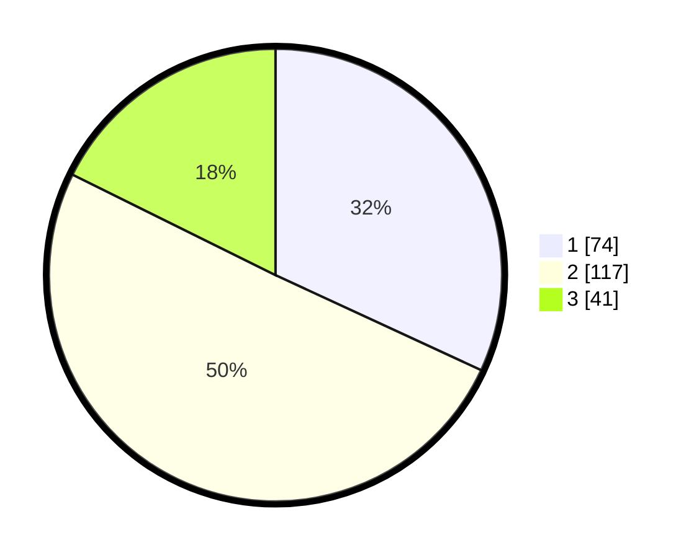

# Hasil

## Grafik

## Tabel

| No. | Nama Paslon    | Suara | Suara (raw) | Persentase |
|:--- |:-------------- | -----:| -----------:| ----------:|
| 1   | ANIES MUHAIMIN | 74    | [74][p-1]   | 31,90      |
| 2   | PRABOWO GIBRAN | 117   | [117][p-2]  | 50,43      |
| 3   | GANJAR MAHFUD  | 41    | [41][p-3]   | 17,67      |

[p-1]: https://github.com/gigit-pemilu/pemilu-2024/blob/main/pilpres/hitung-suara/sub/34-di-yogyakarta/sub/01-kulon-progo/sub/02-wates/sub/1008-wates/sub/003-tps/sub/paslon-1.txt
[p-2]: https://github.com/gigit-pemilu/pemilu-2024/blob/main/pilpres/hitung-suara/sub/34-di-yogyakarta/sub/01-kulon-progo/sub/02-wates/sub/1008-wates/sub/003-tps/sub/paslon-2.txt
[p-3]: https://github.com/gigit-pemilu/pemilu-2024/blob/main/pilpres/hitung-suara/sub/34-di-yogyakarta/sub/01-kulon-progo/sub/02-wates/sub/1008-wates/sub/003-tps/sub/paslon-3.txt

## Foto C Plano

https://sirekap-obj-formc.kpu.go.id/da75/pemilu/ppwp/34/01/02/10/08/3401021008003-20240218-220458--ec63f350-c9c4-4bec-85ce-0525e062b7c2.jpg

https://sirekap-obj-formc.kpu.go.id/da75/pemilu/ppwp/34/01/02/10/08/3401021008003-20240218-220759--dc33c18b-b2b9-4938-b325-a22d8c0ce9d7.jpg

https://sirekap-obj-formc.kpu.go.id/da75/pemilu/ppwp/34/01/02/10/08/3401021008003-20240214-222713--75ff0397-0da2-4d35-a1d5-72a5e430fc29.jpg

## Metadata

| Key        | Value               |
| ---------- | ------------------- |
| Time Stamp | 2024-02-24 22:31:28 |

