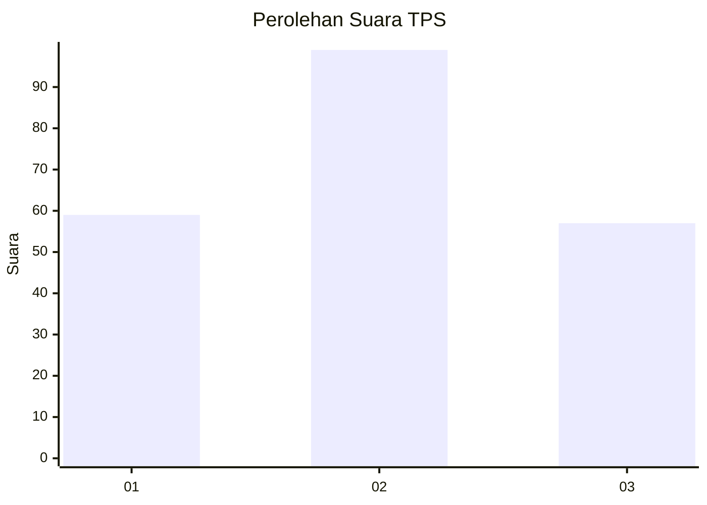
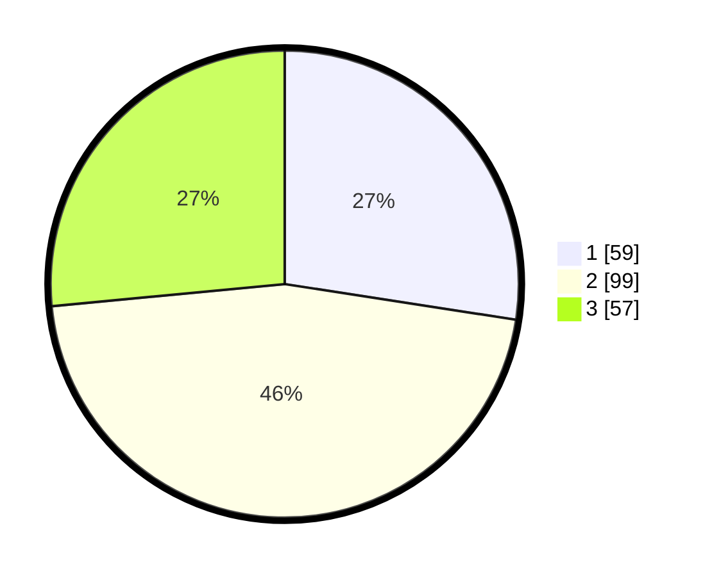

# Hasil

## Grafik

## Tabel

| No. | Nama Paslon    | Suara | Suara (raw) | Persentase |
|:--- |:-------------- | -----:| -----------:| ----------:|
| 1   | ANIES MUHAIMIN | 59    | [59][p-1]   | 27,44      |
| 2   | PRABOWO GIBRAN | 99    | [99][p-2]   | 46,05      |
| 3   | GANJAR MAHFUD  | 57    | [57][p-3]   | 26,51      |

[p-1]: https://github.com/gigit-pemilu/pemilu-2024-34-di-yogyakarta/blob/main/pilpres/hitung-suara/sub/34-di-yogyakarta/sub/01-kulon-progo/sub/02-wates/sub/1008-wates/sub/008-tps/sub/paslon-1.txt
[p-2]: https://github.com/gigit-pemilu/pemilu-2024-34-di-yogyakarta/blob/main/pilpres/hitung-suara/sub/34-di-yogyakarta/sub/01-kulon-progo/sub/02-wates/sub/1008-wates/sub/008-tps/sub/paslon-2.txt
[p-3]: https://github.com/gigit-pemilu/pemilu-2024-34-di-yogyakarta/blob/main/pilpres/hitung-suara/sub/34-di-yogyakarta/sub/01-kulon-progo/sub/02-wates/sub/1008-wates/sub/008-tps/sub/paslon-3.txt

## Foto C Plano

https://sirekap-obj-formc.kpu.go.id/8e5c/pemilu/ppwp/34/01/02/10/08/3401021008008-20240214-155825--d44024fb-c875-482e-9b6b-4d8b4de4d154.jpg

https://sirekap-obj-formc.kpu.go.id/8e5c/pemilu/ppwp/34/01/02/10/08/3401021008008-20240214-160057--62935b22-9d8a-4523-bbdb-353573554580.jpg

https://sirekap-obj-formc.kpu.go.id/8e5c/pemilu/ppwp/34/01/02/10/08/3401021008008-20240215-004618--9cdfd171-70d1-4d2c-9056-757bed64f987.jpg

## Metadata

| Key        | Value               |
| ---------- | ------------------- |
| Time Stamp | 2024-02-15 16:00:26 |

