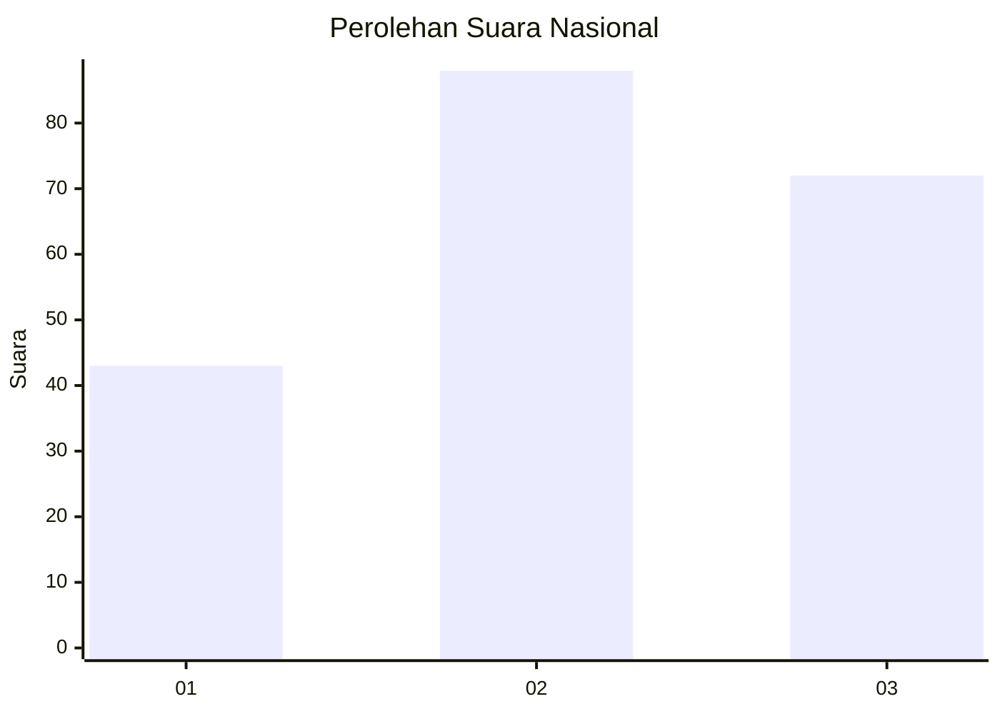
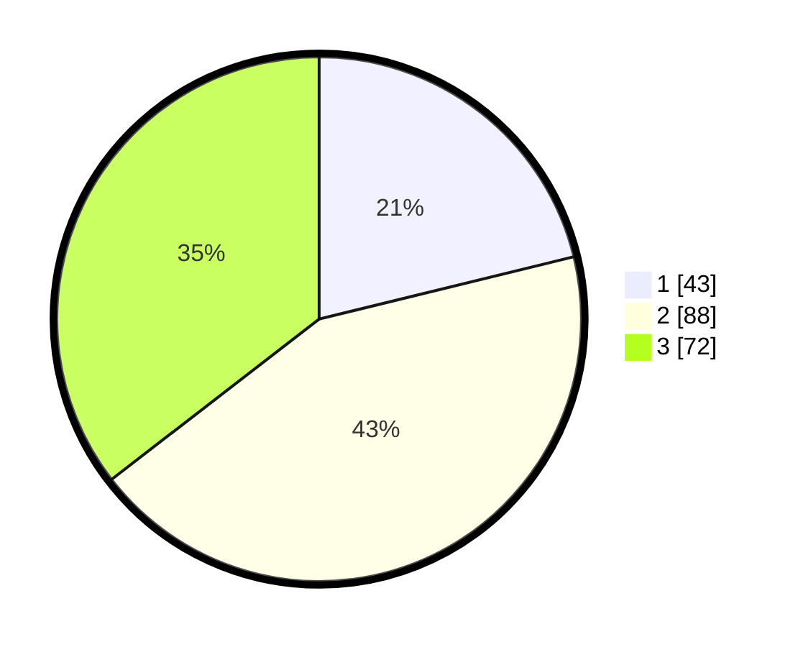

# Hasil

## Grafik

## Tabel

| No. | Nama Paslon    | Suara | Suara (raw) | Persentase |
|:--- |:-------------- | -----:| -----------:| ----------:|
| 1   | ANIES MUHAIMIN | 43    | [43][p-1]   | 21,18      |
| 2   | PRABOWO GIBRAN | 88    | [88][p-2]   | 43,35      |
| 3   | GANJAR MAHFUD  | 72    | [72][p-3]   | 35,47      |

[p-1]: https://github.com/gigit-pemilu/pemilu-2024/blob/main/pilpres/hitung-suara/sub/34-di-yogyakarta/sub/01-kulon-progo/sub/02-wates/sub/1008-wates/sub/009-tps/sub/paslon-1.txt
[p-2]: https://github.com/gigit-pemilu/pemilu-2024/blob/main/pilpres/hitung-suara/sub/34-di-yogyakarta/sub/01-kulon-progo/sub/02-wates/sub/1008-wates/sub/009-tps/sub/paslon-2.txt
[p-3]: https://github.com/gigit-pemilu/pemilu-2024/blob/main/pilpres/hitung-suara/sub/34-di-yogyakarta/sub/01-kulon-progo/sub/02-wates/sub/1008-wates/sub/009-tps/sub/paslon-3.txt

## Foto C Plano

https://sirekap-obj-formc.kpu.go.id/90d2/pemilu/ppwp/34/01/02/10/08/3401021008009-20240215-002008--99747183-8d7e-4d47-9a2a-535453aba633.jpg

https://sirekap-obj-formc.kpu.go.id/90d2/pemilu/ppwp/34/01/02/10/08/3401021008009-20240215-002736--ff4f7044-64d7-4297-98e4-4afe175777c7.jpg

https://sirekap-obj-formc.kpu.go.id/90d2/pemilu/ppwp/34/01/02/10/08/3401021008009-20240215-002920--608d6f07-ff6b-4583-82dc-7046dbfd4ab0.jpg

## Metadata

| Key        | Value               |
| ---------- | ------------------- |
| Time Stamp | 2024-02-15 16:00:26 |

