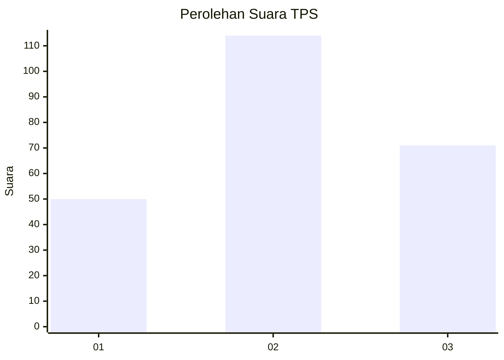
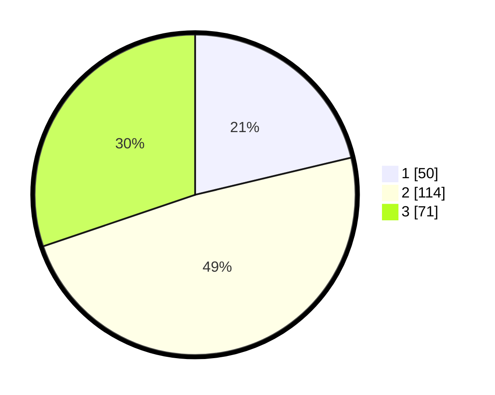

# Hasil

## Grafik

## Tabel

| No. | Nama Paslon    | Suara | Suara (raw) | Persentase |
|:--- |:-------------- | -----:| -----------:| ----------:|
| 1   | ANIES MUHAIMIN | 50    | [50][p-1]   | 21,28      |
| 2   | PRABOWO GIBRAN | 114   | [114][p-2]  | 48,51      |
| 3   | GANJAR MAHFUD  | 71    | [71][p-3]   | 30,21      |

[p-1]: https://github.com/gigit-pemilu/pemilu-2024-34-di-yogyakarta/blob/main/pilpres/hitung-suara/sub/34-di-yogyakarta/sub/01-kulon-progo/sub/02-wates/sub/1008-wates/sub/010-tps/sub/paslon-1.txt
[p-2]: https://github.com/gigit-pemilu/pemilu-2024-34-di-yogyakarta/blob/main/pilpres/hitung-suara/sub/34-di-yogyakarta/sub/01-kulon-progo/sub/02-wates/sub/1008-wates/sub/010-tps/sub/paslon-2.txt
[p-3]: https://github.com/gigit-pemilu/pemilu-2024-34-di-yogyakarta/blob/main/pilpres/hitung-suara/sub/34-di-yogyakarta/sub/01-kulon-progo/sub/02-wates/sub/1008-wates/sub/010-tps/sub/paslon-3.txt

## Foto C Plano

https://sirekap-obj-formc.kpu.go.id/b868/pemilu/ppwp/34/01/02/10/08/3401021008010-20240214-160135--104e8b3b-f8bc-4fc3-8979-8e90b40005e3.jpg

https://sirekap-obj-formc.kpu.go.id/b868/pemilu/ppwp/34/01/02/10/08/3401021008010-20240214-193403--de53b329-cffe-469e-96b6-0a6424f57ea5.jpg

https://sirekap-obj-formc.kpu.go.id/b868/pemilu/ppwp/34/01/02/10/08/3401021008010-20240215-023544--fc707012-4ea2-4f90-87b4-9ec9cbb8847f.jpg

## Metadata

| Key        | Value               |
| ---------- | ------------------- |
| Time Stamp | 2024-02-19 06:16:00 |

## DATA PEMILIH TETAP

Jumlah pemilih dalam DPT: **267**.
 * L: **114**.
 * P: **153**.

## DATA PENGGUNA HAK PILIH

Jumlah pengguna hak pilih dalam DPT: **230**.
 * L: **99**.
 * P: **131**.

Jumlah pengguna hak pilih dalam DPTb: **9**.
 * L: **5**.
 * P: **4**.

Jumlah pengguna hak pilih dalam DPK: **1**.
 * L: **1**.
 * P: **0**.

Jumlah pengguna hak pilih: **240**.
 * L: **105**.
 * P: **135**.

## JUMLAH SUARA SAH DAN TIDAK SAH

JUMLAH SELURUH SUARA SAH: **235**.

JUMLAH SUARA TIDAK SAH: **5**.

JUMLAH SELURUH SUARA SAH DAN SUARA TIDAK SAH: **240**.

