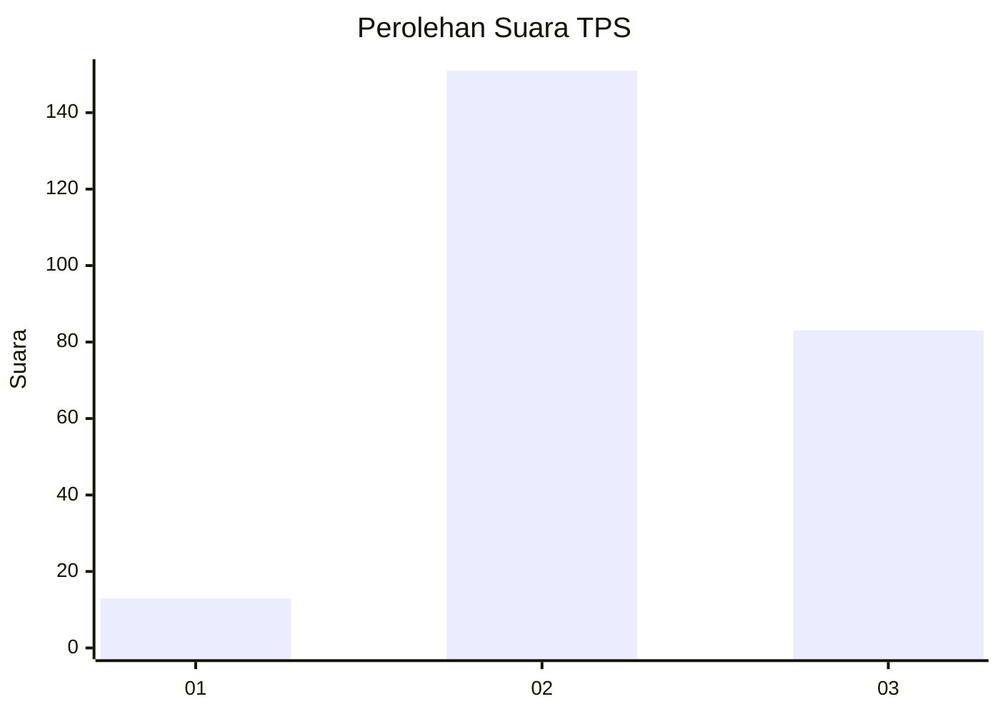
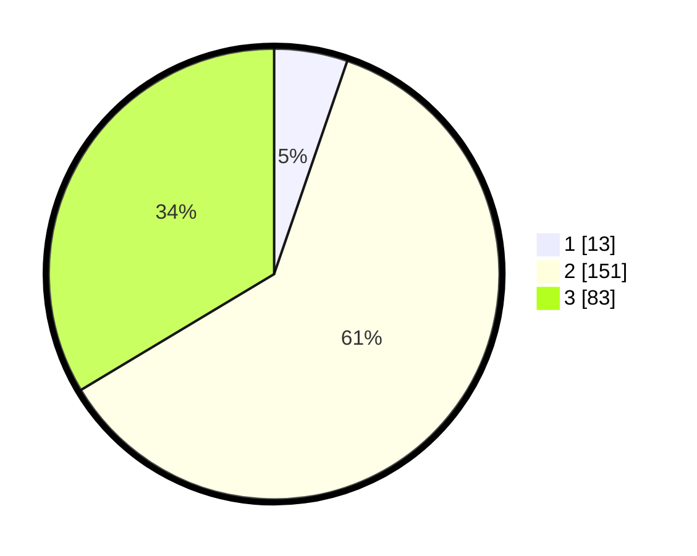

# Hasil

## Grafik

## Tabel

| No. | Nama Paslon    | Suara | Suara (raw) | Persentase |
|:--- |:-------------- | -----:| -----------:| ----------:|
| 1   | ANIES MUHAIMIN | 13    | [13][p-1]   | 5,26       |
| 2   | PRABOWO GIBRAN | 151   | [151][p-2]  | 61,13      |
| 3   | GANJAR MAHFUD  | 83    | [83][p-3]   | 33,60      |

[p-1]: https://github.com/gigit-pemilu/pemilu-2024-34-di-yogyakarta/blob/main/pilpres/hitung-suara/sub/34-di-yogyakarta/sub/01-kulon-progo/sub/02-wates/sub/1008-wates/sub/016-tps/sub/paslon-1.txt
[p-2]: https://github.com/gigit-pemilu/pemilu-2024-34-di-yogyakarta/blob/main/pilpres/hitung-suara/sub/34-di-yogyakarta/sub/01-kulon-progo/sub/02-wates/sub/1008-wates/sub/016-tps/sub/paslon-2.txt
[p-3]: https://github.com/gigit-pemilu/pemilu-2024-34-di-yogyakarta/blob/main/pilpres/hitung-suara/sub/34-di-yogyakarta/sub/01-kulon-progo/sub/02-wates/sub/1008-wates/sub/016-tps/sub/paslon-3.txt

## Foto C Plano

https://sirekap-obj-formc.kpu.go.id/c845/pemilu/ppwp/34/01/02/10/08/3401021008016-20240215-073411--263ff920-22e7-48d1-98ff-c44277c7158f.jpg

https://sirekap-obj-formc.kpu.go.id/c845/pemilu/ppwp/34/01/02/10/08/3401021008016-20240215-073523--3cb7347d-febd-456e-ac00-2a9b1c75cdaf.jpg

https://sirekap-obj-formc.kpu.go.id/c845/pemilu/ppwp/34/01/02/10/08/3401021008016-20240215-073614--3a5add9a-5676-479b-bcb4-2695a96a86ad.jpg

## Metadata

| Key        | Value               |
| ---------- | ------------------- |
| Time Stamp | 2024-02-15 16:00:26 |

