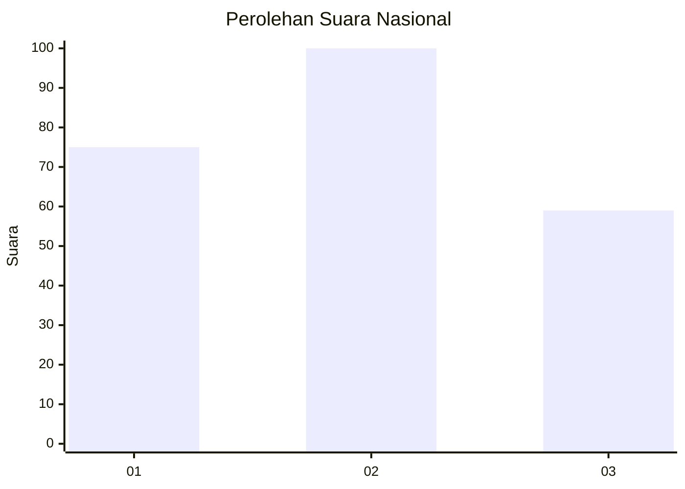
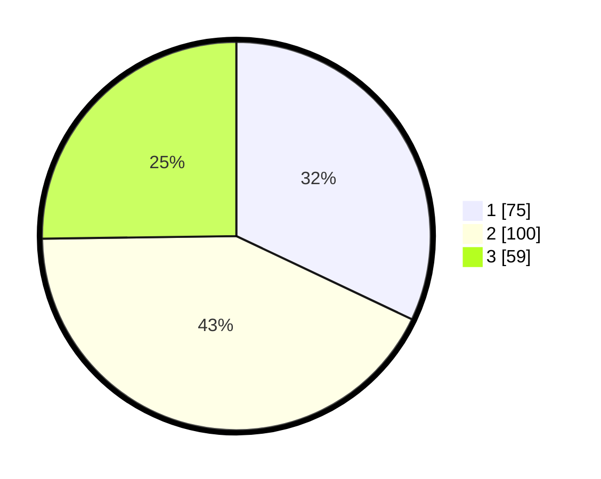

# Hasil

## Grafik

## Tabel

| No. | Nama Paslon    | Suara | Suara (raw) | Persentase |
|:--- |:-------------- | -----:| -----------:| ----------:|
| 1   | ANIES MUHAIMIN | 75    | [75][p-1]   | 32,05      |
| 2   | PRABOWO GIBRAN | 100   | [100][p-2]  | 42,74      |
| 3   | GANJAR MAHFUD  | 59    | [59][p-3]   | 25,21      |

[p-1]: https://github.com/gigit-pemilu/pemilu-2024/blob/main/pilpres/hitung-suara/sub/34-di-yogyakarta/sub/01-kulon-progo/sub/02-wates/sub/1008-wates/sub/025-tps/sub/paslon-1.txt
[p-2]: https://github.com/gigit-pemilu/pemilu-2024/blob/main/pilpres/hitung-suara/sub/34-di-yogyakarta/sub/01-kulon-progo/sub/02-wates/sub/1008-wates/sub/025-tps/sub/paslon-2.txt
[p-3]: https://github.com/gigit-pemilu/pemilu-2024/blob/main/pilpres/hitung-suara/sub/34-di-yogyakarta/sub/01-kulon-progo/sub/02-wates/sub/1008-wates/sub/025-tps/sub/paslon-3.txt

## Foto C Plano

https://sirekap-obj-formc.kpu.go.id/f507/pemilu/ppwp/34/01/02/10/08/3401021008025-20240215-001253--b9805266-53c4-4c1b-b97c-4c856c74ecef.jpg

https://sirekap-obj-formc.kpu.go.id/f507/pemilu/ppwp/34/01/02/10/08/3401021008025-20240215-001501--9953003b-3005-4a58-b639-7c4dfb1f76c7.jpg

## Metadata

| Key        | Value               |
| ---------- | ------------------- |
| Time Stamp | 2024-02-24 22:31:28 |

