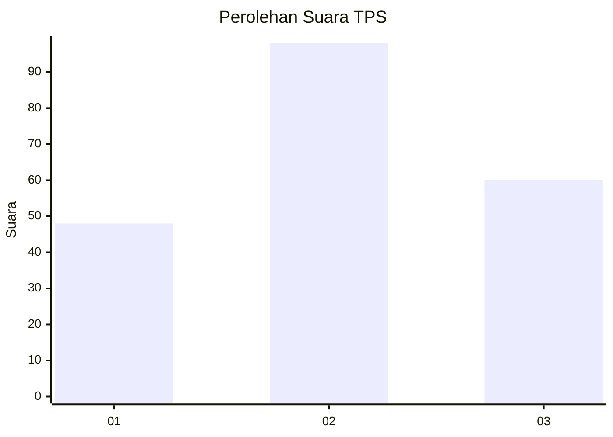
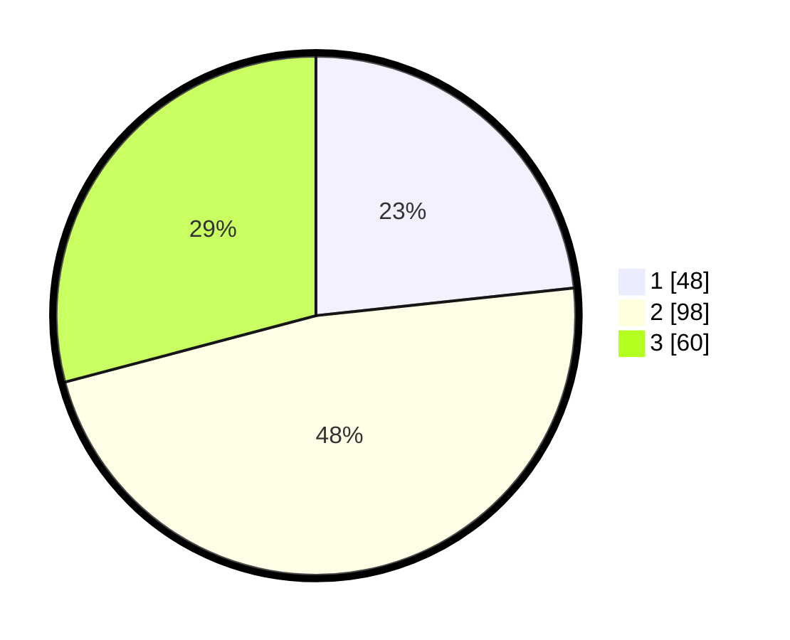

# Hasil

## Grafik

## Tabel

| No. | Nama Paslon    | Suara | Suara (raw) | Persentase |
|:--- |:-------------- | -----:| -----------:| ----------:|
| 1   | ANIES MUHAIMIN | 48    | [48][p-1]   | 23,30      |
| 2   | PRABOWO GIBRAN | 98    | [98][p-2]   | 47,57      |
| 3   | GANJAR MAHFUD  | 60    | [60][p-3]   | 29,13      |

[p-1]: https://github.com/gigit-pemilu/pemilu-2024-34-di-yogyakarta/blob/main/pilpres/hitung-suara/sub/34-di-yogyakarta/sub/01-kulon-progo/sub/02-wates/sub/1008-wates/sub/026-tps/sub/paslon-1.txt
[p-2]: https://github.com/gigit-pemilu/pemilu-2024-34-di-yogyakarta/blob/main/pilpres/hitung-suara/sub/34-di-yogyakarta/sub/01-kulon-progo/sub/02-wates/sub/1008-wates/sub/026-tps/sub/paslon-2.txt
[p-3]: https://github.com/gigit-pemilu/pemilu-2024-34-di-yogyakarta/blob/main/pilpres/hitung-suara/sub/34-di-yogyakarta/sub/01-kulon-progo/sub/02-wates/sub/1008-wates/sub/026-tps/sub/paslon-3.txt

## Foto C Plano

https://sirekap-obj-formc.kpu.go.id/5b1c/pemilu/ppwp/34/01/02/10/08/3401021008026-20240214-190903--4bdeb6b8-42f5-4992-81b5-5d436e4ccf6f.jpg

https://sirekap-obj-formc.kpu.go.id/5b1c/pemilu/ppwp/34/01/02/10/08/3401021008026-20240214-190735--506910d7-b652-4299-9c05-cc1e9f888646.jpg

https://sirekap-obj-formc.kpu.go.id/5b1c/pemilu/ppwp/34/01/02/10/08/3401021008026-20240214-190821--52dfd005-b5a3-40c1-a1bf-2e8e360ec22e.jpg

## Metadata

| Key        | Value               |
| ---------- | ------------------- |
| Time Stamp | 2024-02-15 16:00:26 |

