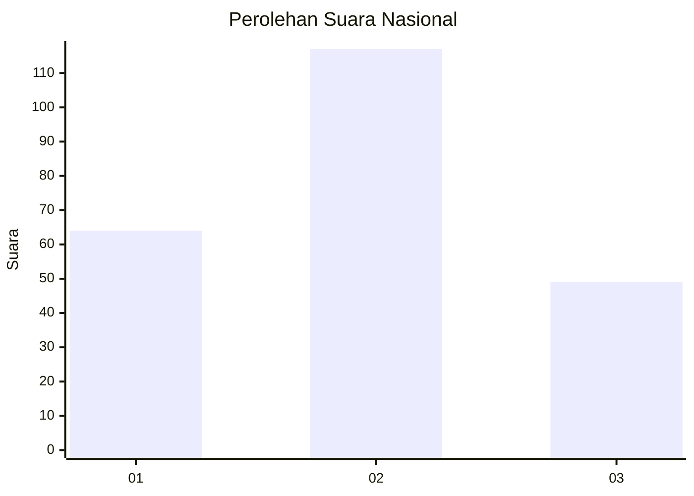
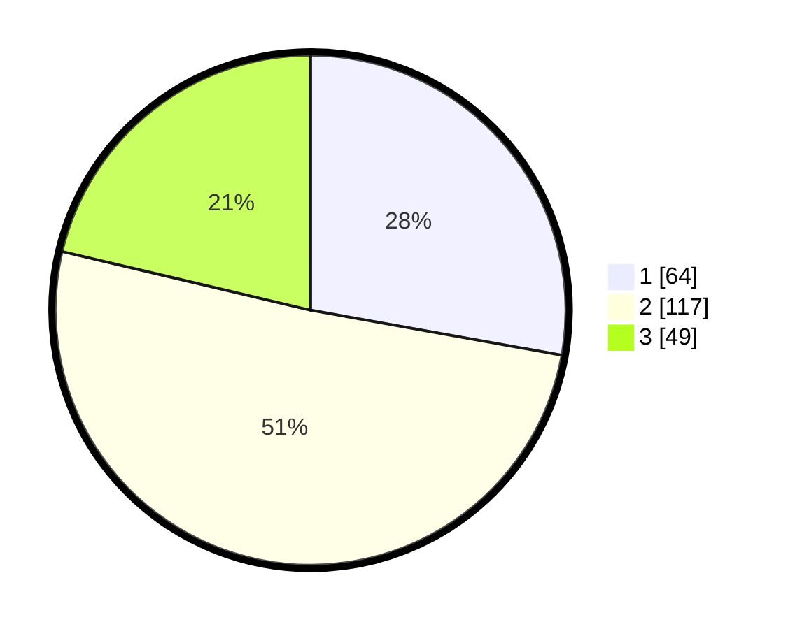

# Hasil

## Grafik

## Tabel

| No. | Nama Paslon    | Suara | Suara (raw) | Persentase |
|:--- |:-------------- | -----:| -----------:| ----------:|
| 1   | ANIES MUHAIMIN | 64    | [64][p-1]   | 27,83      |
| 2   | PRABOWO GIBRAN | 117   | [117][p-2]  | 50,87      |
| 3   | GANJAR MAHFUD  | 49    | [49][p-3]   | 21,30      |

[p-1]: https://github.com/gigit-pemilu/pemilu-2024/blob/main/pilpres/hitung-suara/sub/34-di-yogyakarta/sub/01-kulon-progo/sub/02-wates/sub/1008-wates/sub/027-tps/sub/paslon-1.txt
[p-2]: https://github.com/gigit-pemilu/pemilu-2024/blob/main/pilpres/hitung-suara/sub/34-di-yogyakarta/sub/01-kulon-progo/sub/02-wates/sub/1008-wates/sub/027-tps/sub/paslon-2.txt
[p-3]: https://github.com/gigit-pemilu/pemilu-2024/blob/main/pilpres/hitung-suara/sub/34-di-yogyakarta/sub/01-kulon-progo/sub/02-wates/sub/1008-wates/sub/027-tps/sub/paslon-3.txt

## Foto C Plano

https://sirekap-obj-formc.kpu.go.id/231e/pemilu/ppwp/34/01/02/10/08/3401021008027-20240215-002535--3d9bdf6c-85a3-496a-9a56-1361368b3478.jpg

https://sirekap-obj-formc.kpu.go.id/231e/pemilu/ppwp/34/01/02/10/08/3401021008027-20240215-002751--1606dc49-e9a4-47a9-89aa-109145e39f99.jpg

https://sirekap-obj-formc.kpu.go.id/231e/pemilu/ppwp/34/01/02/10/08/3401021008027-20240215-002914--6cbf85b6-7025-4a4a-9fb9-cc6b3eb55d26.jpg

## Metadata

| Key        | Value               |
| ---------- | ------------------- |
| Time Stamp | 2024-02-15 18:30:25 |

