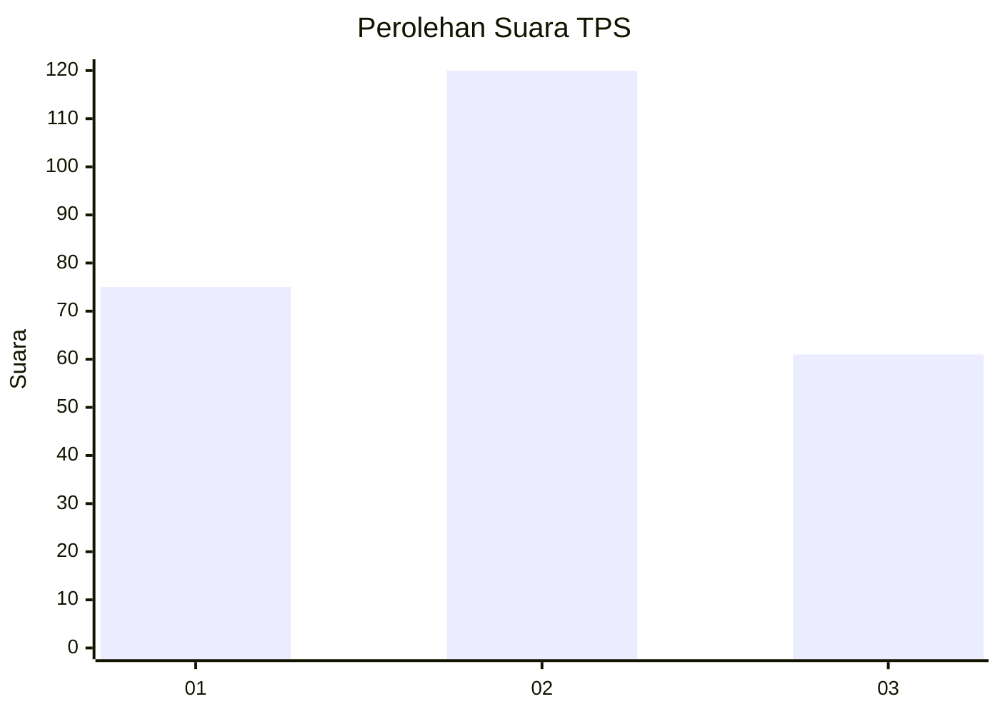
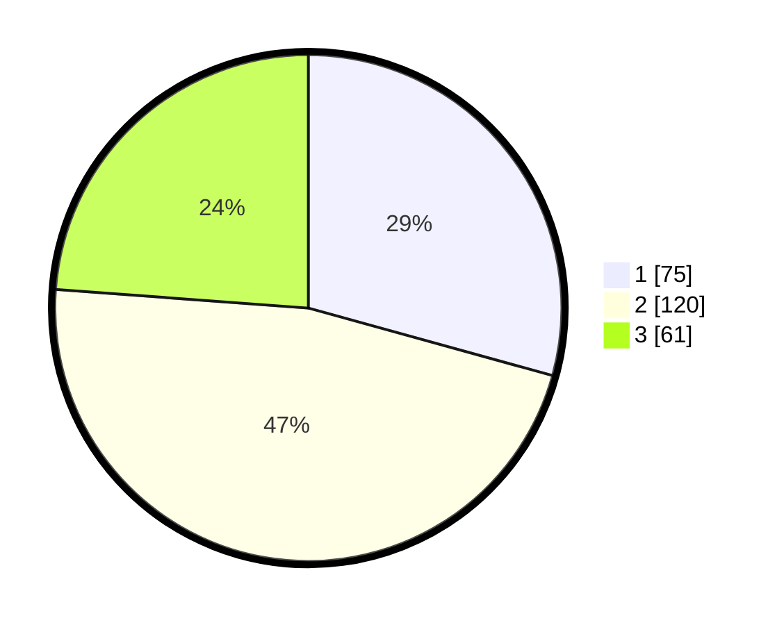

# Hasil

## Grafik

## Tabel

| No. | Nama Paslon    | Suara | Suara (raw) | Persentase |
|:--- |:-------------- | -----:| -----------:| ----------:|
| 1   | ANIES MUHAIMIN | 75    | [75][p-1]   | 29,30      |
| 2   | PRABOWO GIBRAN | 120   | [120][p-2]  | 46,88      |
| 3   | GANJAR MAHFUD  | 61    | [61][p-3]   | 23,83      |

[p-1]: https://github.com/gigit-pemilu/pemilu-2024-34-di-yogyakarta/blob/main/pilpres/hitung-suara/sub/34-di-yogyakarta/sub/01-kulon-progo/sub/02-wates/sub/1008-wates/sub/028-tps/sub/paslon-1.txt
[p-2]: https://github.com/gigit-pemilu/pemilu-2024-34-di-yogyakarta/blob/main/pilpres/hitung-suara/sub/34-di-yogyakarta/sub/01-kulon-progo/sub/02-wates/sub/1008-wates/sub/028-tps/sub/paslon-2.txt
[p-3]: https://github.com/gigit-pemilu/pemilu-2024-34-di-yogyakarta/blob/main/pilpres/hitung-suara/sub/34-di-yogyakarta/sub/01-kulon-progo/sub/02-wates/sub/1008-wates/sub/028-tps/sub/paslon-3.txt

## Foto C Plano

https://sirekap-obj-formc.kpu.go.id/bb86/pemilu/ppwp/34/01/02/10/08/3401021008028-20240214-230120--08f5a3b0-fa2c-4986-beb4-b912da82e5f3.jpg

https://sirekap-obj-formc.kpu.go.id/bb86/pemilu/ppwp/34/01/02/10/08/3401021008028-20240214-230203--e8578511-8754-44c7-96ba-2656bfcba839.jpg

https://sirekap-obj-formc.kpu.go.id/bb86/pemilu/ppwp/34/01/02/10/08/3401021008028-20240214-230250--6b4cf3b1-9fec-426e-99cd-6ae7a9f22a31.jpg

## Metadata

| Key        | Value               |
| ---------- | ------------------- |
| Time Stamp | 2024-02-16 08:00:28 |

