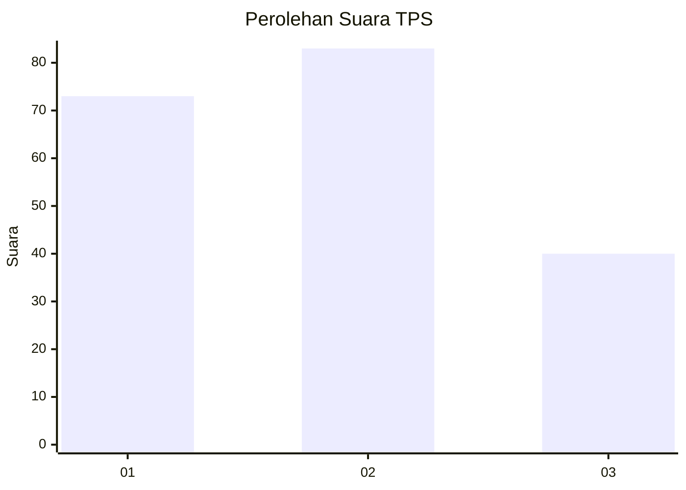
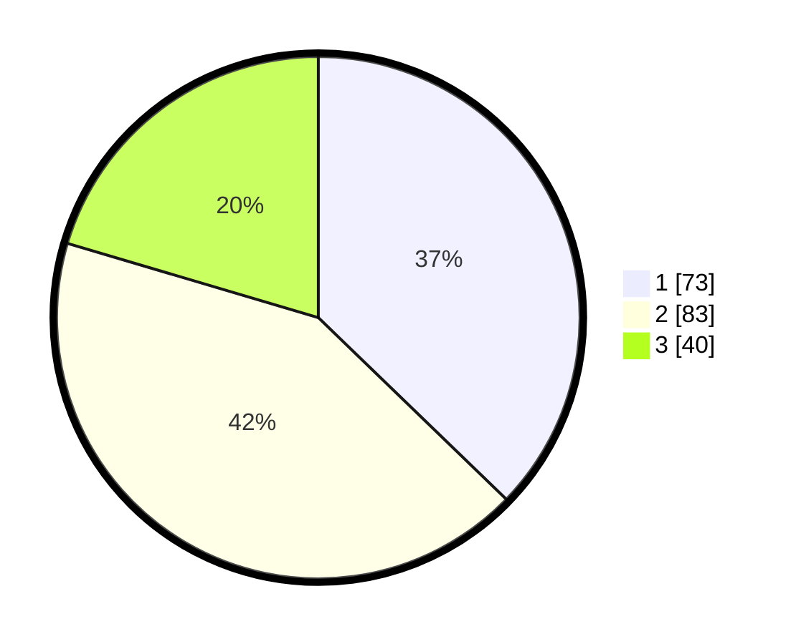

# Hasil

## Grafik

## Tabel

| No. | Nama Paslon    | Suara | Suara (raw) | Persentase |
|:--- |:-------------- | -----:| -----------:| ----------:|
| 1   | ANIES MUHAIMIN | 73    | [73][p-1]   | 37,24      |
| 2   | PRABOWO GIBRAN | 83    | [83][p-2]   | 42,35      |
| 3   | GANJAR MAHFUD  | 40    | [40][p-3]   | 20,41      |

[p-1]: https://github.com/gigit-pemilu/pemilu-2024-34-di-yogyakarta/blob/main/pilpres/hitung-suara/sub/34-di-yogyakarta/sub/01-kulon-progo/sub/02-wates/sub/1008-wates/sub/032-tps/sub/paslon-1.txt
[p-2]: https://github.com/gigit-pemilu/pemilu-2024-34-di-yogyakarta/blob/main/pilpres/hitung-suara/sub/34-di-yogyakarta/sub/01-kulon-progo/sub/02-wates/sub/1008-wates/sub/032-tps/sub/paslon-2.txt
[p-3]: https://github.com/gigit-pemilu/pemilu-2024-34-di-yogyakarta/blob/main/pilpres/hitung-suara/sub/34-di-yogyakarta/sub/01-kulon-progo/sub/02-wates/sub/1008-wates/sub/032-tps/sub/paslon-3.txt

## Foto C Plano

https://sirekap-obj-formc.kpu.go.id/641a/pemilu/ppwp/34/01/02/10/08/3401021008032-20240215-000446--9fb92189-a7d4-4651-81bc-28287b639365.jpg

https://sirekap-obj-formc.kpu.go.id/641a/pemilu/ppwp/34/01/02/10/08/3401021008032-20240215-000517--2eb2be8a-a01c-48bf-9d7e-cc37331363d2.jpg

https://sirekap-obj-formc.kpu.go.id/641a/pemilu/ppwp/34/01/02/10/08/3401021008032-20240215-000606--74fcaf11-5f6e-4dbe-b1c4-fba39b99e41f.jpg

## Metadata

| Key        | Value               |
| ---------- | ------------------- |
| Time Stamp | 2024-02-15 16:00:26 |

