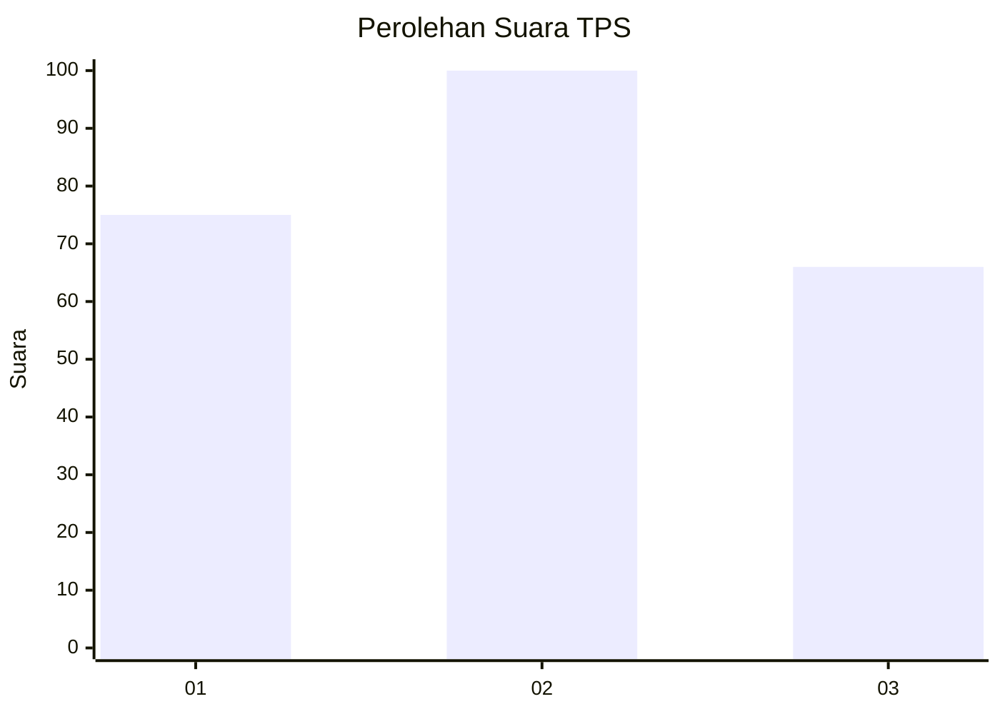
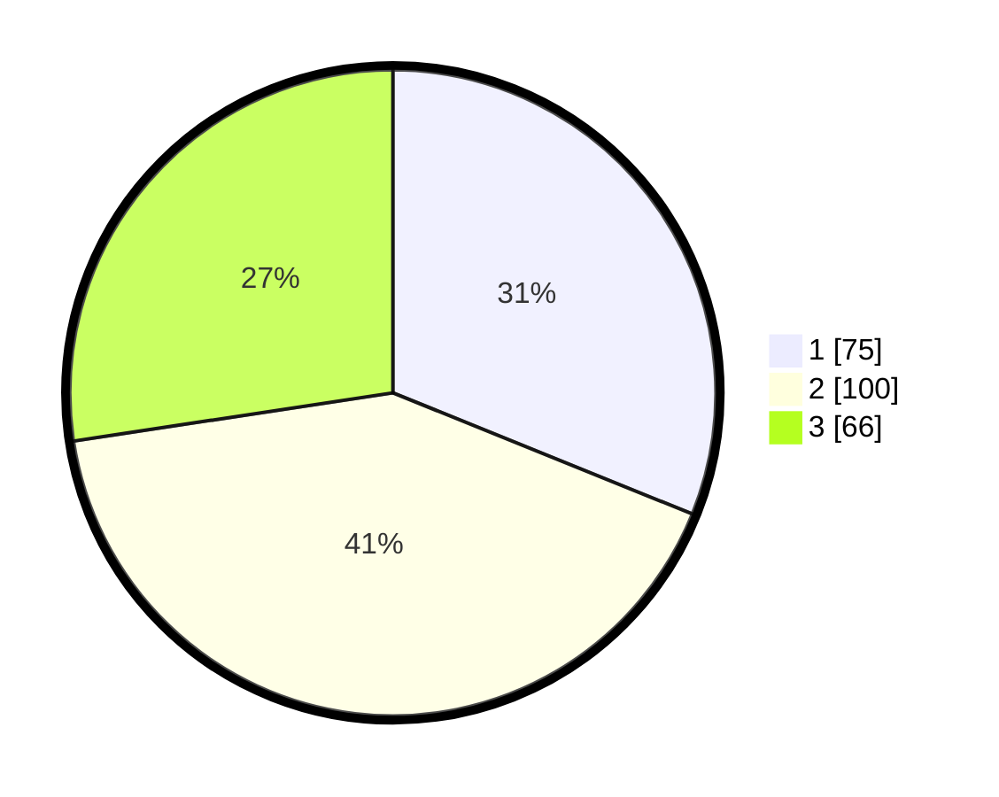

# Hasil

## Grafik

## Tabel

| No. | Nama Paslon    | Suara | Suara (raw) | Persentase |
|:--- |:-------------- | -----:| -----------:| ----------:|
| 1   | ANIES MUHAIMIN | 75    | [75][p-1]   | 31,12      |
| 2   | PRABOWO GIBRAN | 100   | [100][p-2]  | 41,49      |
| 3   | GANJAR MAHFUD  | 66    | [66][p-3]   | 27,39      |

[p-1]: https://github.com/gigit-pemilu/pemilu-2024-34-di-yogyakarta/blob/main/pilpres/hitung-suara/sub/34-di-yogyakarta/sub/01-kulon-progo/sub/02-wates/sub/1008-wates/sub/035-tps/sub/paslon-1.txt
[p-2]: https://github.com/gigit-pemilu/pemilu-2024-34-di-yogyakarta/blob/main/pilpres/hitung-suara/sub/34-di-yogyakarta/sub/01-kulon-progo/sub/02-wates/sub/1008-wates/sub/035-tps/sub/paslon-2.txt
[p-3]: https://github.com/gigit-pemilu/pemilu-2024-34-di-yogyakarta/blob/main/pilpres/hitung-suara/sub/34-di-yogyakarta/sub/01-kulon-progo/sub/02-wates/sub/1008-wates/sub/035-tps/sub/paslon-3.txt

## Foto C Plano

https://sirekap-obj-formc.kpu.go.id/9596/pemilu/ppwp/34/01/02/10/08/3401021008035-20240215-003229--a34e21ab-d2fa-4cef-aac7-59d589cf2cbb.jpg

https://sirekap-obj-formc.kpu.go.id/9596/pemilu/ppwp/34/01/02/10/08/3401021008035-20240215-003425--d8a1a0cb-65fc-4684-b603-565f7c55edf2.jpg

https://sirekap-obj-formc.kpu.go.id/9596/pemilu/ppwp/34/01/02/10/08/3401021008035-20240215-003547--abe67d29-401b-45fa-aa75-db3d2d1a59a3.jpg

## Metadata

| Key        | Value               |
| ---------- | ------------------- |
| Time Stamp | 2024-02-24 22:31:28 |

