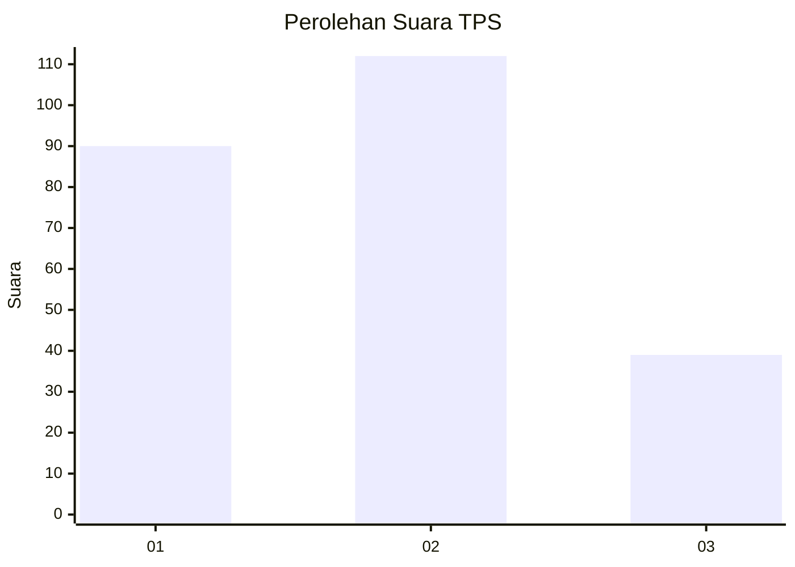
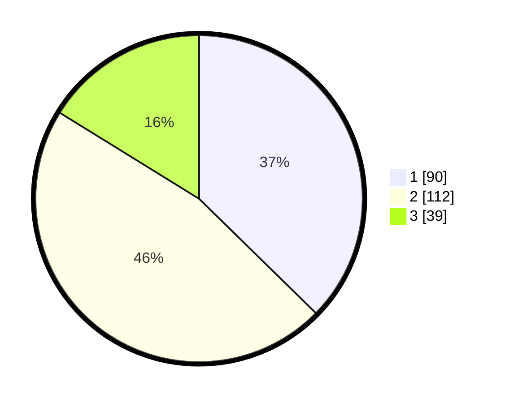

# Hasil

## Grafik

## Tabel

| No. | Nama Paslon    | Suara | Suara (raw) | Persentase |
|:--- |:-------------- | -----:| -----------:| ----------:|
| 1   | ANIES MUHAIMIN | 90    | [90][p-1]   | 37,34      |
| 2   | PRABOWO GIBRAN | 112   | [112][p-2]  | 46,47      |
| 3   | GANJAR MAHFUD  | 39    | [39][p-3]   | 16,18      |

[p-1]: https://github.com/gigit-pemilu/pemilu-2024-34-di-yogyakarta/blob/main/pilpres/hitung-suara/sub/34-di-yogyakarta/sub/01-kulon-progo/sub/02-wates/sub/1008-wates/sub/037-tps/sub/paslon-1.txt
[p-2]: https://github.com/gigit-pemilu/pemilu-2024-34-di-yogyakarta/blob/main/pilpres/hitung-suara/sub/34-di-yogyakarta/sub/01-kulon-progo/sub/02-wates/sub/1008-wates/sub/037-tps/sub/paslon-2.txt
[p-3]: https://github.com/gigit-pemilu/pemilu-2024-34-di-yogyakarta/blob/main/pilpres/hitung-suara/sub/34-di-yogyakarta/sub/01-kulon-progo/sub/02-wates/sub/1008-wates/sub/037-tps/sub/paslon-3.txt

## Foto C Plano

https://sirekap-obj-formc.kpu.go.id/e66f/pemilu/ppwp/34/01/02/10/08/3401021008037-20240214-230648--5cb3d7da-3550-4173-9480-9331b14e5d01.jpg

https://sirekap-obj-formc.kpu.go.id/e66f/pemilu/ppwp/34/01/02/10/08/3401021008037-20240214-230837--6b5c6a7b-c4e6-472b-a805-162d2134b513.jpg

https://sirekap-obj-formc.kpu.go.id/e66f/pemilu/ppwp/34/01/02/10/08/3401021008037-20240214-231049--9791abb1-1cc1-4f5f-a07c-31e81482a4db.jpg

## Metadata

| Key        | Value               |
| ---------- | ------------------- |
| Time Stamp | 2024-02-15 16:30:25 |

