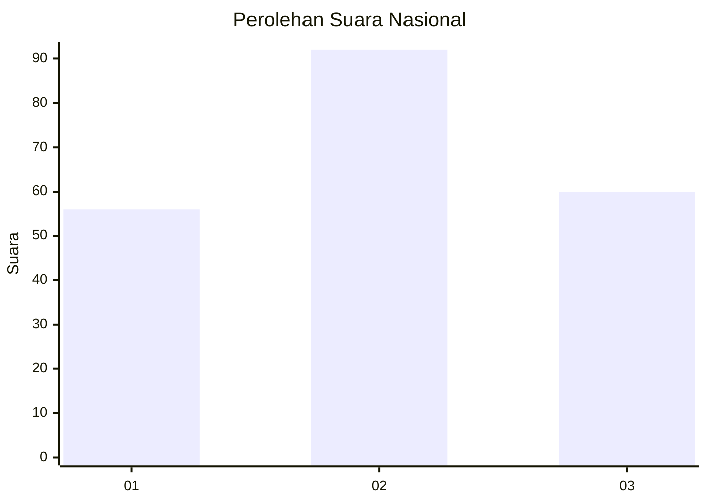
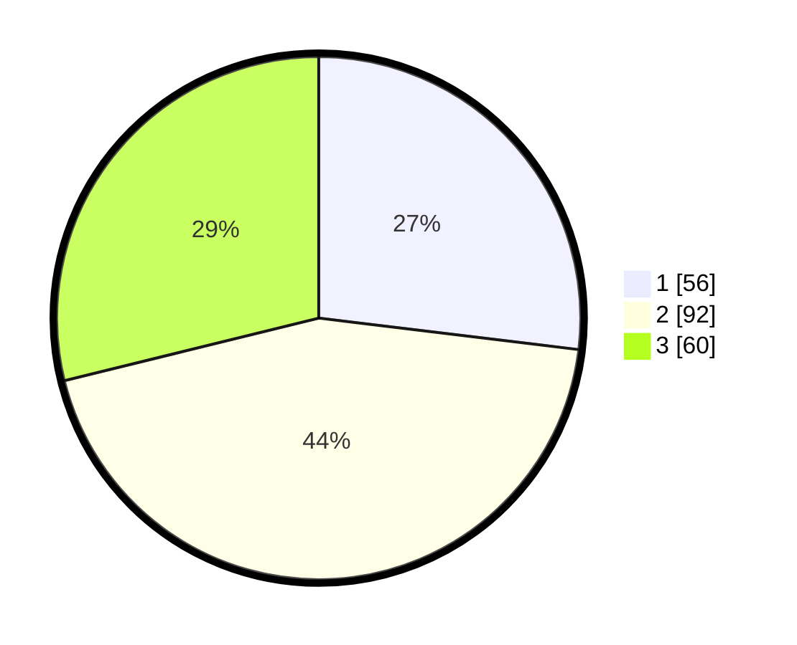

# Hasil

## Grafik

## Tabel

| No. | Nama Paslon    | Suara | Suara (raw) | Persentase |
|:--- |:-------------- | -----:| -----------:| ----------:|
| 1   | ANIES MUHAIMIN | 56    | [56][p-1]   | 26,92      |
| 2   | PRABOWO GIBRAN | 92    | [92][p-2]   | 44,23      |
| 3   | GANJAR MAHFUD  | 60    | [60][p-3]   | 28,85      |

[p-1]: https://github.com/gigit-pemilu/pemilu-2024/blob/main/pilpres/hitung-suara/sub/34-di-yogyakarta/sub/01-kulon-progo/sub/02-wates/sub/1008-wates/sub/038-tps/sub/paslon-1.txt
[p-2]: https://github.com/gigit-pemilu/pemilu-2024/blob/main/pilpres/hitung-suara/sub/34-di-yogyakarta/sub/01-kulon-progo/sub/02-wates/sub/1008-wates/sub/038-tps/sub/paslon-2.txt
[p-3]: https://github.com/gigit-pemilu/pemilu-2024/blob/main/pilpres/hitung-suara/sub/34-di-yogyakarta/sub/01-kulon-progo/sub/02-wates/sub/1008-wates/sub/038-tps/sub/paslon-3.txt

## Foto C Plano

https://sirekap-obj-formc.kpu.go.id/9660/pemilu/ppwp/34/01/02/10/08/3401021008038-20240214-221101--07e04e9b-4dc8-4eea-b78e-ab426f836872.jpg

https://sirekap-obj-formc.kpu.go.id/9660/pemilu/ppwp/34/01/02/10/08/3401021008038-20240214-221238--71255225-89f5-456b-8fdc-9b5d1f16736d.jpg

https://sirekap-obj-formc.kpu.go.id/9660/pemilu/ppwp/34/01/02/10/08/3401021008038-20240214-221354--73f44531-23ff-4c8b-8ea0-b3d7f50090d4.jpg

## Metadata

| Key        | Value               |
| ---------- | ------------------- |
| Time Stamp | 2024-02-15 16:30:25 |

