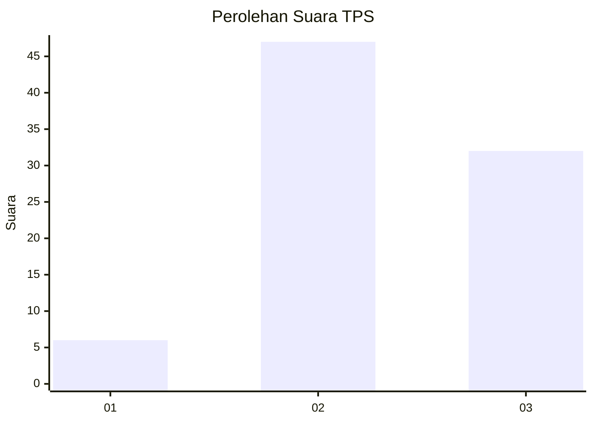
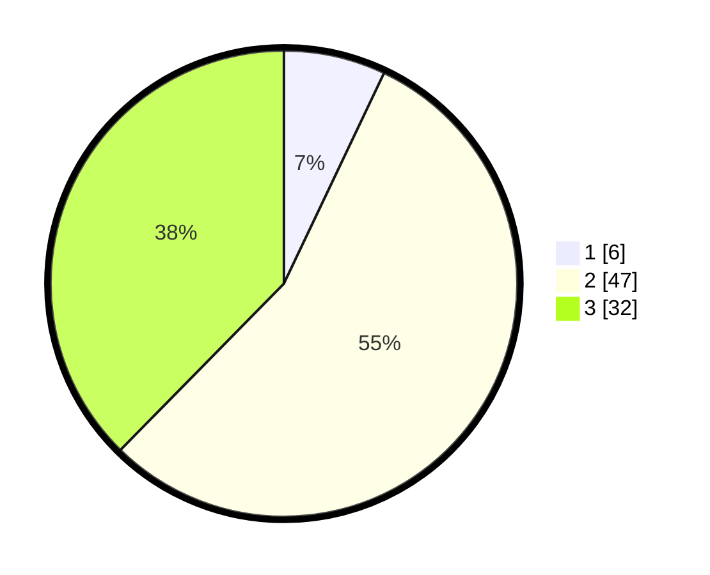

# Hasil

## Grafik

## Tabel

| No. | Nama Paslon    | Suara | Suara (raw) | Persentase |
|:--- |:-------------- | -----:| -----------:| ----------:|
| 1   | ANIES MUHAIMIN | 6     | [6][p-1]    | 7,06       |
| 2   | PRABOWO GIBRAN | 47    | [47][p-2]   | 55,29      |
| 3   | GANJAR MAHFUD  | 32    | [32][p-3]   | 37,65      |

[p-1]: https://github.com/gigit-pemilu/pemilu-2024-34-di-yogyakarta/blob/main/pilpres/hitung-suara/sub/34-di-yogyakarta/sub/01-kulon-progo/sub/02-wates/sub/1008-wates/sub/901-tps/sub/paslon-1.txt
[p-2]: https://github.com/gigit-pemilu/pemilu-2024-34-di-yogyakarta/blob/main/pilpres/hitung-suara/sub/34-di-yogyakarta/sub/01-kulon-progo/sub/02-wates/sub/1008-wates/sub/901-tps/sub/paslon-2.txt
[p-3]: https://github.com/gigit-pemilu/pemilu-2024-34-di-yogyakarta/blob/main/pilpres/hitung-suara/sub/34-di-yogyakarta/sub/01-kulon-progo/sub/02-wates/sub/1008-wates/sub/901-tps/sub/paslon-3.txt

## Foto C Plano

https://sirekap-obj-formc.kpu.go.id/6a64/pemilu/ppwp/34/01/02/10/08/3401021008901-20240215-000356--11f06fae-c4c8-43b8-9657-06f72ccfd2f2.jpg

https://sirekap-obj-formc.kpu.go.id/6a64/pemilu/ppwp/34/01/02/10/08/3401021008901-20240215-000518--7338005a-2710-4c64-b3b4-6fcee7a0b5b1.jpg

https://sirekap-obj-formc.kpu.go.id/6a64/pemilu/ppwp/34/01/02/10/08/3401021008901-20240215-000707--d70a861a-5e19-420f-ad0a-86a57cfb5b6c.jpg

## Metadata

| Key        | Value               |
| ---------- | ------------------- |
| Time Stamp | 2024-02-15 16:30:25 |

