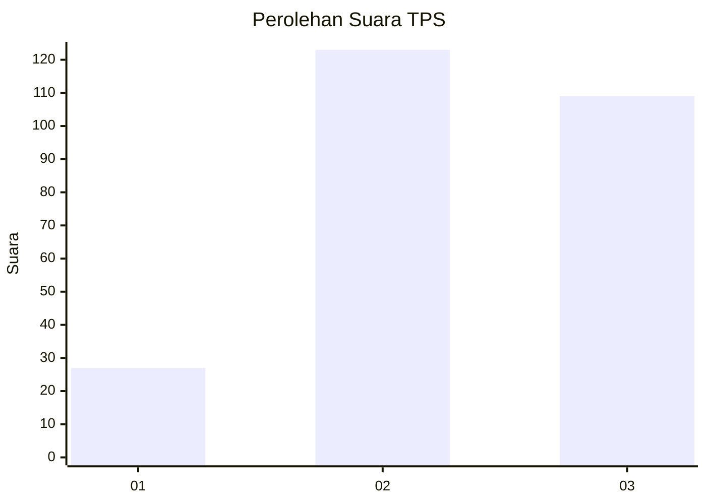
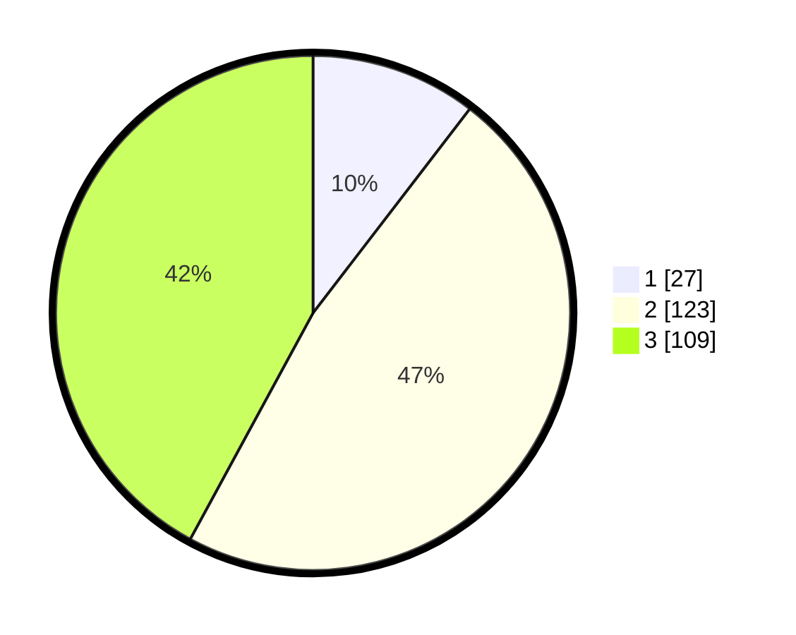

# Hasil

## Grafik

## Tabel

| No. | Nama Paslon    | Suara | Suara (raw) | Persentase |
|:--- |:-------------- | -----:| -----------:| ----------:|
| 1   | ANIES MUHAIMIN | 27    | [27][p-1]   | 10,42      |
| 2   | PRABOWO GIBRAN | 123   | [123][p-2]  | 47,49      |
| 3   | GANJAR MAHFUD  | 109   | [109][p-3]  | 42,08      |

[p-1]: https://github.com/gigit-pemilu/pemilu-2024-34-di-yogyakarta/blob/main/pilpres/hitung-suara/sub/34-di-yogyakarta/sub/01-kulon-progo/sub/02-wates/sub/2001-karangwuni/sub/003-tps/sub/paslon-1.txt
[p-2]: https://github.com/gigit-pemilu/pemilu-2024-34-di-yogyakarta/blob/main/pilpres/hitung-suara/sub/34-di-yogyakarta/sub/01-kulon-progo/sub/02-wates/sub/2001-karangwuni/sub/003-tps/sub/paslon-2.txt
[p-3]: https://github.com/gigit-pemilu/pemilu-2024-34-di-yogyakarta/blob/main/pilpres/hitung-suara/sub/34-di-yogyakarta/sub/01-kulon-progo/sub/02-wates/sub/2001-karangwuni/sub/003-tps/sub/paslon-3.txt

## Foto C Plano

https://sirekap-obj-formc.kpu.go.id/eeff/pemilu/ppwp/34/01/02/20/01/3401022001003-20240214-215234--b246d870-64ca-4c69-9ec3-b4a7463d7fef.jpg

https://sirekap-obj-formc.kpu.go.id/eeff/pemilu/ppwp/34/01/02/20/01/3401022001003-20240214-155550--4a4e58de-5cde-46b5-bad6-b47649f80272.jpg

https://sirekap-obj-formc.kpu.go.id/eeff/pemilu/ppwp/34/01/02/20/01/3401022001003-20240214-155357--1f037600-5bec-4162-a877-6b94abd14153.jpg

## Metadata

| Key        | Value               |
| ---------- | ------------------- |
| Time Stamp | 2024-02-19 06:16:00 |

