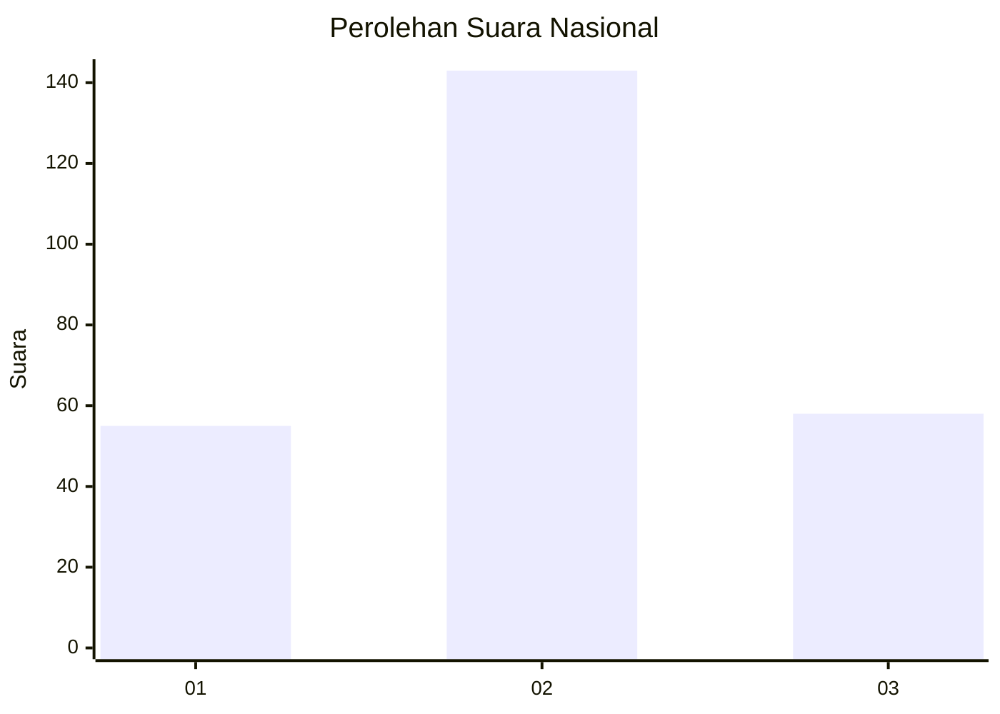
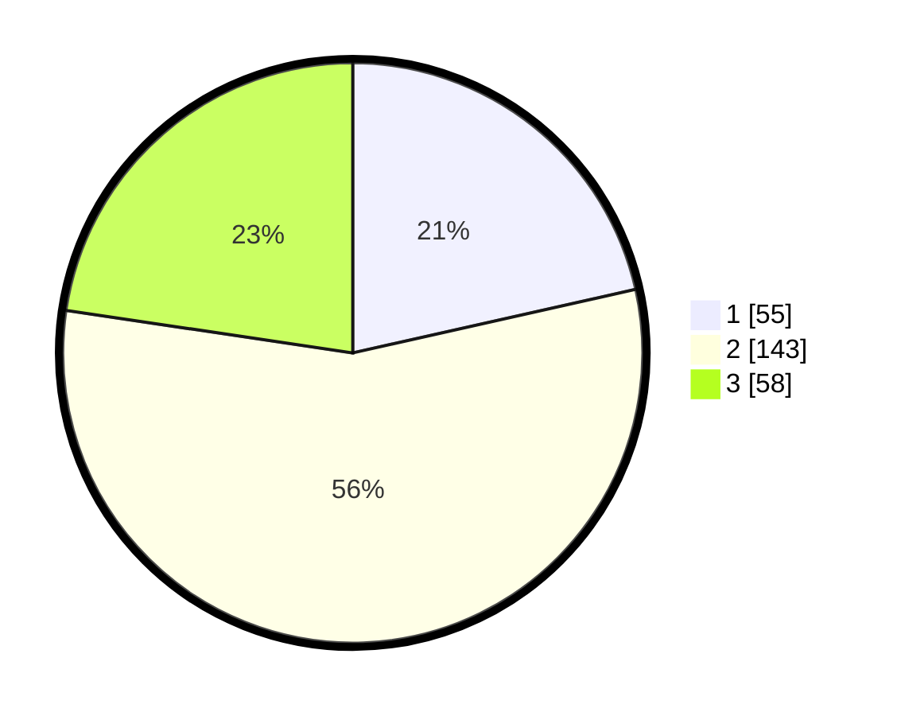

# Hasil

## Grafik

## Tabel

| No. | Nama Paslon    | Suara | Suara (raw) | Persentase |
|:--- |:-------------- | -----:| -----------:| ----------:|
| 1   | ANIES MUHAIMIN | 55    | [55][p-1]   | 21,48      |
| 2   | PRABOWO GIBRAN | 143   | [143][p-2]  | 55,86      |
| 3   | GANJAR MAHFUD  | 58    | [58][p-3]   | 22,66      |

[p-1]: https://github.com/gigit-pemilu/pemilu-2024/blob/main/pilpres/hitung-suara/sub/34-di-yogyakarta/sub/01-kulon-progo/sub/02-wates/sub/2001-karangwuni/sub/005-tps/sub/paslon-1.txt
[p-2]: https://github.com/gigit-pemilu/pemilu-2024/blob/main/pilpres/hitung-suara/sub/34-di-yogyakarta/sub/01-kulon-progo/sub/02-wates/sub/2001-karangwuni/sub/005-tps/sub/paslon-2.txt
[p-3]: https://github.com/gigit-pemilu/pemilu-2024/blob/main/pilpres/hitung-suara/sub/34-di-yogyakarta/sub/01-kulon-progo/sub/02-wates/sub/2001-karangwuni/sub/005-tps/sub/paslon-3.txt

## Foto C Plano

https://sirekap-obj-formc.kpu.go.id/ef09/pemilu/ppwp/34/01/02/20/01/3401022001005-20240215-025557--cd7090fb-c95e-4a64-924b-0fe0203490fb.jpg

https://sirekap-obj-formc.kpu.go.id/ef09/pemilu/ppwp/34/01/02/20/01/3401022001005-20240215-025704--3e900601-7ed9-4a63-973d-7d0b83db7f60.jpg

https://sirekap-obj-formc.kpu.go.id/ef09/pemilu/ppwp/34/01/02/20/01/3401022001005-20240215-025826--69e16725-ffba-4531-89bc-922907b12996.jpg

## Metadata

| Key        | Value               |
| ---------- | ------------------- |
| Time Stamp | 2024-02-15 16:30:25 |

