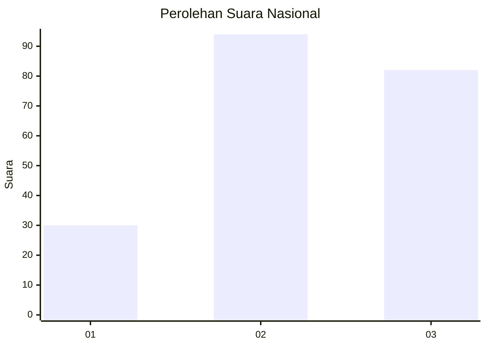
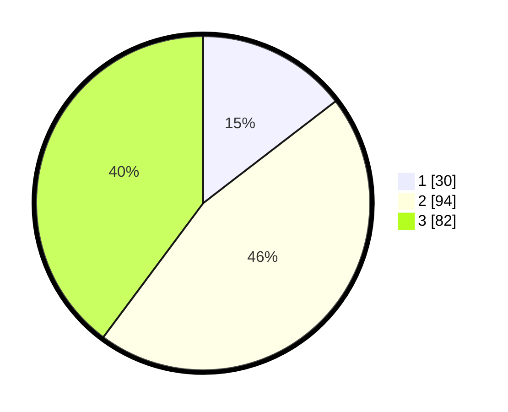

# Hasil

## Grafik

## Tabel

| No. | Nama Paslon    | Suara | Suara (raw) | Persentase |
|:--- |:-------------- | -----:| -----------:| ----------:|
| 1   | ANIES MUHAIMIN | 30    | [30][p-1]   | 14,56      |
| 2   | PRABOWO GIBRAN | 94    | [94][p-2]   | 45,63      |
| 3   | GANJAR MAHFUD  | 82    | [82][p-3]   | 39,81      |

[p-1]: https://github.com/gigit-pemilu/pemilu-2024/blob/main/pilpres/hitung-suara/sub/34-di-yogyakarta/sub/01-kulon-progo/sub/02-wates/sub/2001-karangwuni/sub/009-tps/sub/paslon-1.txt
[p-2]: https://github.com/gigit-pemilu/pemilu-2024/blob/main/pilpres/hitung-suara/sub/34-di-yogyakarta/sub/01-kulon-progo/sub/02-wates/sub/2001-karangwuni/sub/009-tps/sub/paslon-2.txt
[p-3]: https://github.com/gigit-pemilu/pemilu-2024/blob/main/pilpres/hitung-suara/sub/34-di-yogyakarta/sub/01-kulon-progo/sub/02-wates/sub/2001-karangwuni/sub/009-tps/sub/paslon-3.txt

## Foto C Plano

https://sirekap-obj-formc.kpu.go.id/11c6/pemilu/ppwp/34/01/02/20/01/3401022001009-20240214-194044--ec6f164c-ce6b-439d-9d91-36916316cbf5.jpg

https://sirekap-obj-formc.kpu.go.id/11c6/pemilu/ppwp/34/01/02/20/01/3401022001009-20240214-194216--f8b5503e-0921-4a81-90fe-c3f5e9e60bb7.jpg

https://sirekap-obj-formc.kpu.go.id/11c6/pemilu/ppwp/34/01/02/20/01/3401022001009-20240214-194320--9686e2a2-be91-4c44-8167-02d4b7936498.jpg

## Metadata

| Key        | Value               |
| ---------- | ------------------- |
| Time Stamp | 2024-02-24 22:31:28 |

