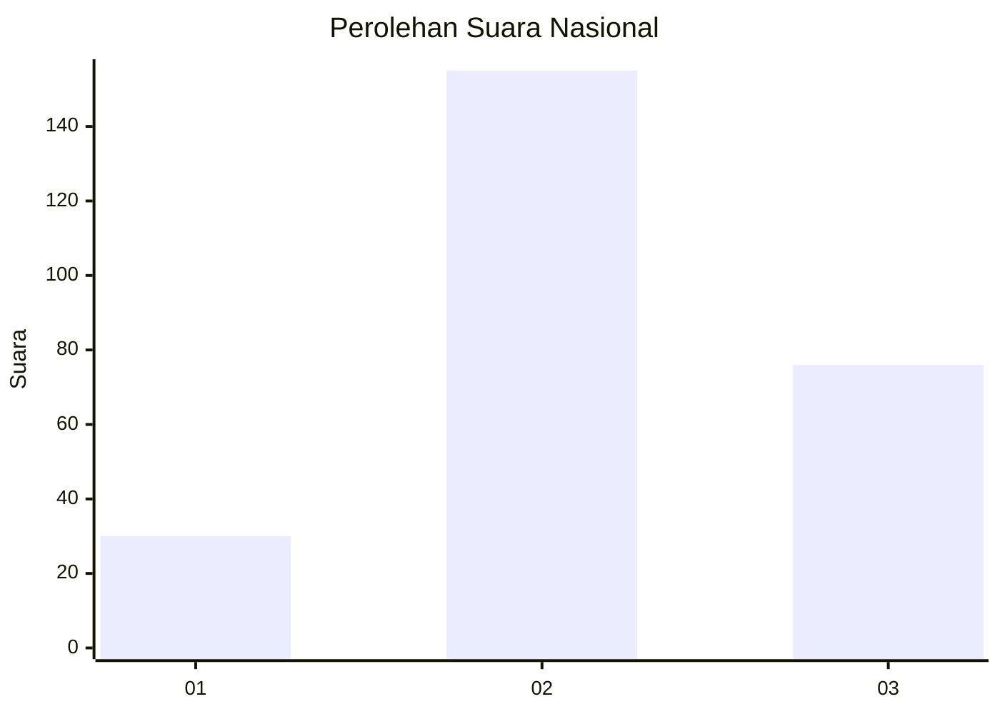
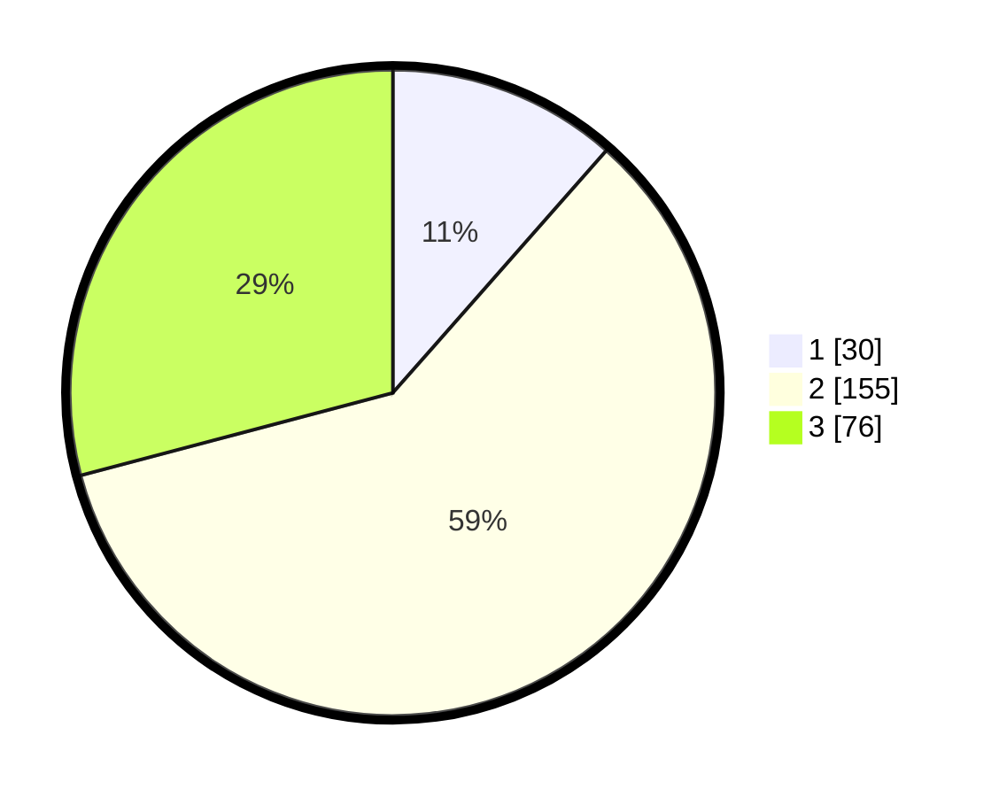

# Hasil

## Grafik

## Tabel

| No. | Nama Paslon    | Suara | Suara (raw) | Persentase |
|:--- |:-------------- | -----:| -----------:| ----------:|
| 1   | ANIES MUHAIMIN | 30    | [30][p-1]   | 11,49      |
| 2   | PRABOWO GIBRAN | 155   | [155][p-2]  | 59,39      |
| 3   | GANJAR MAHFUD  | 76    | [76][p-3]   | 29,12      |

[p-1]: https://github.com/gigit-pemilu/pemilu-2024/blob/main/pilpres/hitung-suara/sub/34-di-yogyakarta/sub/01-kulon-progo/sub/02-wates/sub/2002-sogan/sub/001-tps/sub/paslon-1.txt
[p-2]: https://github.com/gigit-pemilu/pemilu-2024/blob/main/pilpres/hitung-suara/sub/34-di-yogyakarta/sub/01-kulon-progo/sub/02-wates/sub/2002-sogan/sub/001-tps/sub/paslon-2.txt
[p-3]: https://github.com/gigit-pemilu/pemilu-2024/blob/main/pilpres/hitung-suara/sub/34-di-yogyakarta/sub/01-kulon-progo/sub/02-wates/sub/2002-sogan/sub/001-tps/sub/paslon-3.txt

## Foto C Plano

https://sirekap-obj-formc.kpu.go.id/c778/pemilu/ppwp/34/01/02/20/02/3401022002001-20240215-033558--58a77d12-bc3d-4451-a12c-4a0cd04bc006.jpg

https://sirekap-obj-formc.kpu.go.id/c778/pemilu/ppwp/34/01/02/20/02/3401022002001-20240215-034252--04944f9b-f0f7-4611-b191-6ad7c85f3e84.jpg

https://sirekap-obj-formc.kpu.go.id/c778/pemilu/ppwp/34/01/02/20/02/3401022002001-20240215-034650--d91126bf-8c42-4fc7-864c-f0d9eb19acd5.jpg

## Metadata

| Key        | Value               |
| ---------- | ------------------- |
| Time Stamp | 2024-02-15 15:30:25 |

## DATA PEMILIH TETAP

Jumlah pemilih dalam DPT: **283**.
 * L: **142**.
 * P: **141**.

## DATA PENGGUNA HAK PILIH

Jumlah pengguna hak pilih dalam DPT: **253**.
 * L: **125**.
 * P: **128**.

Jumlah pengguna hak pilih dalam DPTb: **9**.
 * L: **6**.
 * P: **3**.

Jumlah pengguna hak pilih dalam DPK: **0**.
 * L: **0**.
 * P: **0**.

Jumlah pengguna hak pilih: **262**.
 * L: **131**.
 * P: **131**.

## JUMLAH SUARA SAH DAN TIDAK SAH

JUMLAH SELURUH SUARA SAH: **261**.

JUMLAH SUARA TIDAK SAH: **1**.

JUMLAH SELURUH SUARA SAH DAN SUARA TIDAK SAH: **262**.

