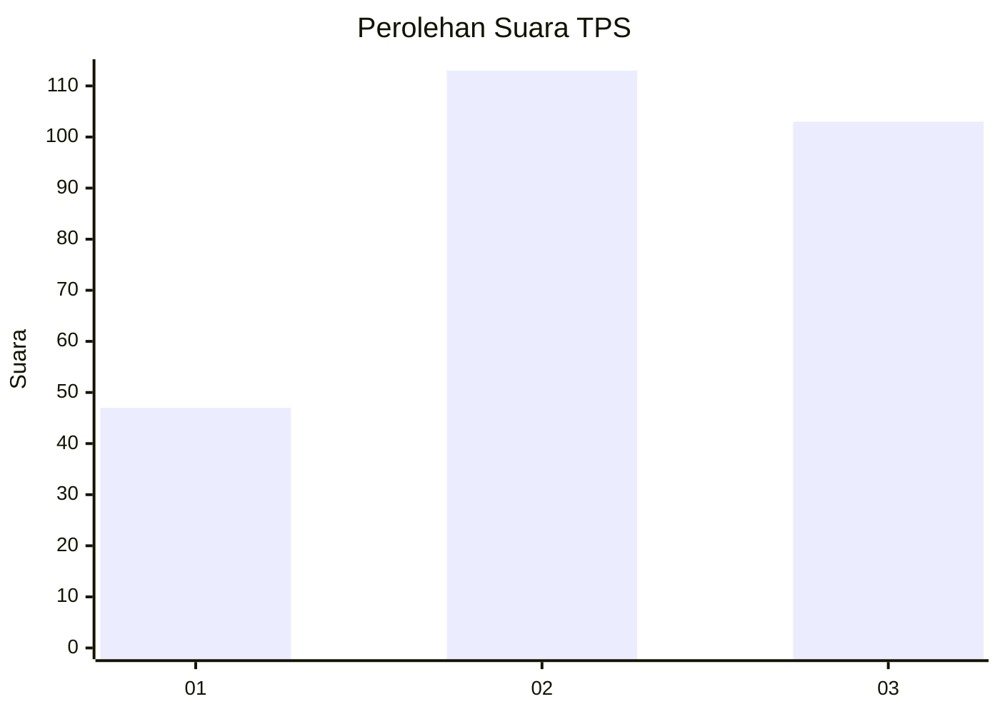
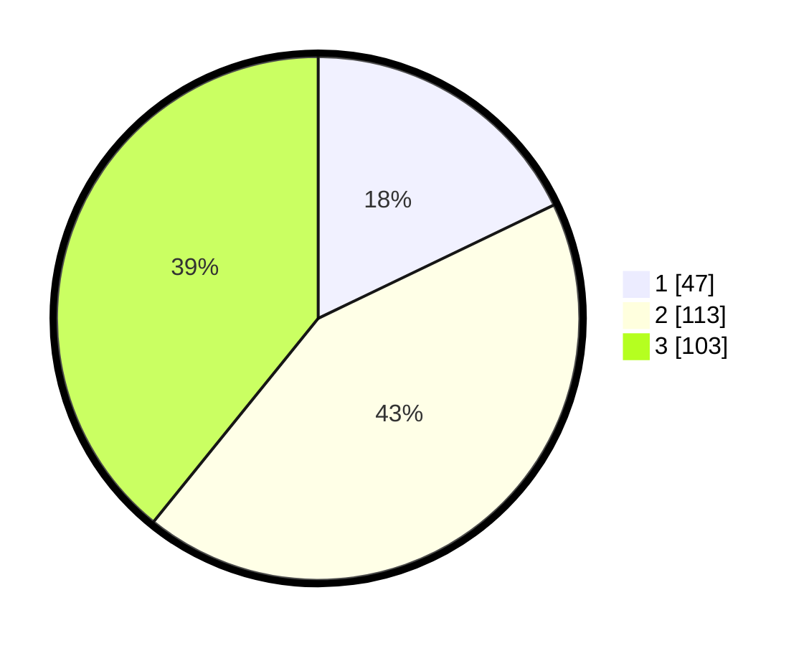

# Hasil

## Grafik

## Tabel

| No. | Nama Paslon    | Suara | Suara (raw) | Persentase |
|:--- |:-------------- | -----:| -----------:| ----------:|
| 1   | ANIES MUHAIMIN | 47    | [47][p-1]   | 17,87      |
| 2   | PRABOWO GIBRAN | 113   | [113][p-2]  | 42,97      |
| 3   | GANJAR MAHFUD  | 103   | [103][p-3]  | 39,16      |

[p-1]: https://github.com/gigit-pemilu/pemilu-2024-34-di-yogyakarta/blob/main/pilpres/hitung-suara/sub/34-di-yogyakarta/sub/01-kulon-progo/sub/02-wates/sub/2002-sogan/sub/002-tps/sub/paslon-1.txt
[p-2]: https://github.com/gigit-pemilu/pemilu-2024-34-di-yogyakarta/blob/main/pilpres/hitung-suara/sub/34-di-yogyakarta/sub/01-kulon-progo/sub/02-wates/sub/2002-sogan/sub/002-tps/sub/paslon-2.txt
[p-3]: https://github.com/gigit-pemilu/pemilu-2024-34-di-yogyakarta/blob/main/pilpres/hitung-suara/sub/34-di-yogyakarta/sub/01-kulon-progo/sub/02-wates/sub/2002-sogan/sub/002-tps/sub/paslon-3.txt

## Foto C Plano

https://sirekap-obj-formc.kpu.go.id/da9a/pemilu/ppwp/34/01/02/20/02/3401022002002-20240214-223605--fa0e87bd-7255-4ed1-bd1a-a85200fc3b47.jpg

https://sirekap-obj-formc.kpu.go.id/da9a/pemilu/ppwp/34/01/02/20/02/3401022002002-20240214-223720--ae4bfae5-8572-4832-bc8c-b0eacc892354.jpg

https://sirekap-obj-formc.kpu.go.id/da9a/pemilu/ppwp/34/01/02/20/02/3401022002002-20240214-223830--61342e47-459e-4579-95c7-955f7501a860.jpg

## Metadata

| Key        | Value               |
| ---------- | ------------------- |
| Time Stamp | 2024-02-15 18:30:25 |

