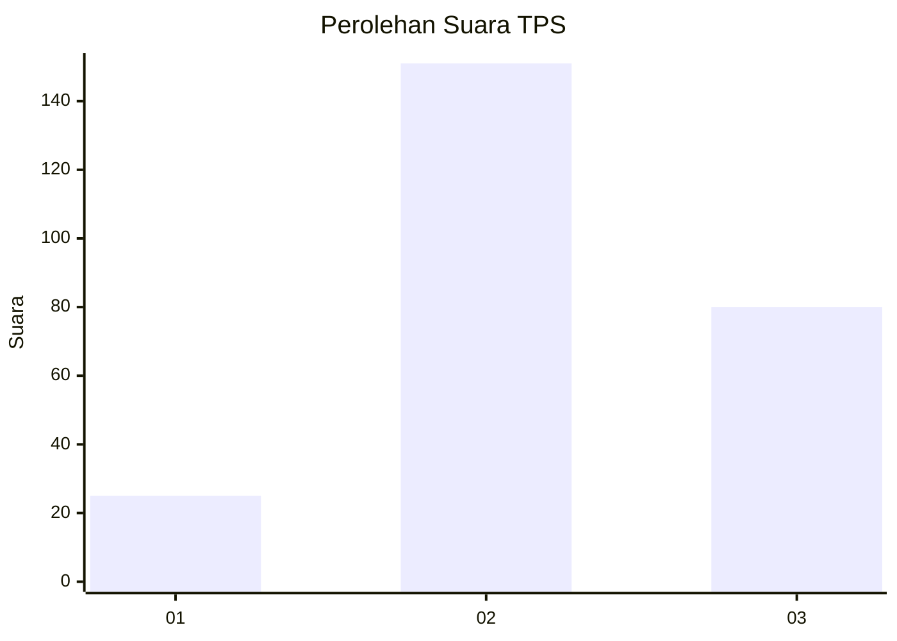
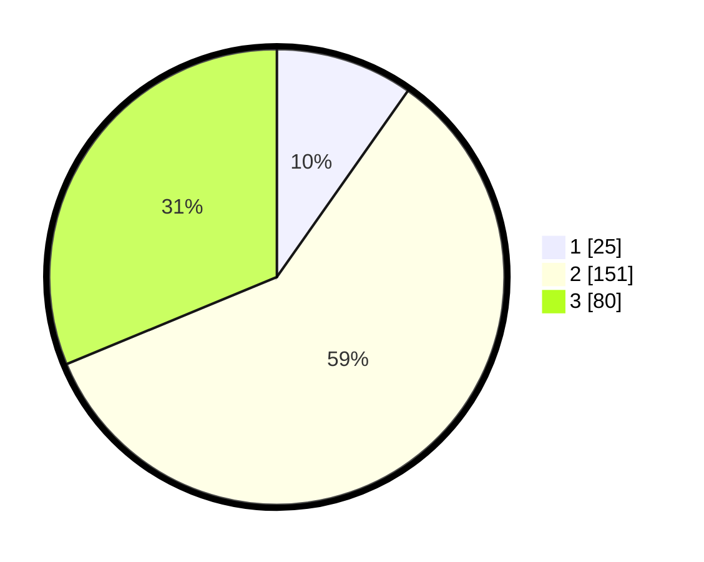

# Hasil

## Grafik

## Tabel

| No. | Nama Paslon    | Suara | Suara (raw) | Persentase |
|:--- |:-------------- | -----:| -----------:| ----------:|
| 1   | ANIES MUHAIMIN | 25    | [25][p-1]   | 9,77       |
| 2   | PRABOWO GIBRAN | 151   | [151][p-2]  | 58,98      |
| 3   | GANJAR MAHFUD  | 80    | [80][p-3]   | 31,25      |

[p-1]: https://github.com/gigit-pemilu/pemilu-2024-34-di-yogyakarta/blob/main/pilpres/hitung-suara/sub/34-di-yogyakarta/sub/01-kulon-progo/sub/02-wates/sub/2002-sogan/sub/003-tps/sub/paslon-1.txt
[p-2]: https://github.com/gigit-pemilu/pemilu-2024-34-di-yogyakarta/blob/main/pilpres/hitung-suara/sub/34-di-yogyakarta/sub/01-kulon-progo/sub/02-wates/sub/2002-sogan/sub/003-tps/sub/paslon-2.txt
[p-3]: https://github.com/gigit-pemilu/pemilu-2024-34-di-yogyakarta/blob/main/pilpres/hitung-suara/sub/34-di-yogyakarta/sub/01-kulon-progo/sub/02-wates/sub/2002-sogan/sub/003-tps/sub/paslon-3.txt

## Foto C Plano

https://sirekap-obj-formc.kpu.go.id/7895/pemilu/ppwp/34/01/02/20/02/3401022002003-20240215-021155--f4064a22-b0e0-4729-90f9-c2d0bfe026d0.jpg

https://sirekap-obj-formc.kpu.go.id/7895/pemilu/ppwp/34/01/02/20/02/3401022002003-20240215-021235--07f7588b-5ac8-4180-8882-3b1c1203fb17.jpg

https://sirekap-obj-formc.kpu.go.id/7895/pemilu/ppwp/34/01/02/20/02/3401022002003-20240215-050022--e49d5b34-dd7c-4195-8c25-1a09c3f0ac4e.jpg

## Metadata

| Key        | Value               |
| ---------- | ------------------- |
| Time Stamp | 2024-02-15 15:00:29 |

## DATA PEMILIH TETAP

Jumlah pemilih dalam DPT: **263**.
 * L: **117**.
 * P: **146**.

## DATA PENGGUNA HAK PILIH

Jumlah pengguna hak pilih dalam DPT: **234**.
 * L: **102**.
 * P: **132**.

Jumlah pengguna hak pilih dalam DPTb: **23**.
 * L: **20**.
 * P: **3**.

Jumlah pengguna hak pilih dalam DPK: **1**.
 * L: **1**.
 * P: **0**.

Jumlah pengguna hak pilih: **258**.
 * L: **123**.
 * P: **135**.

## JUMLAH SUARA SAH DAN TIDAK SAH

JUMLAH SELURUH SUARA SAH: **256**.

JUMLAH SUARA TIDAK SAH: **2**.

JUMLAH SELURUH SUARA SAH DAN SUARA TIDAK SAH: **258**.

