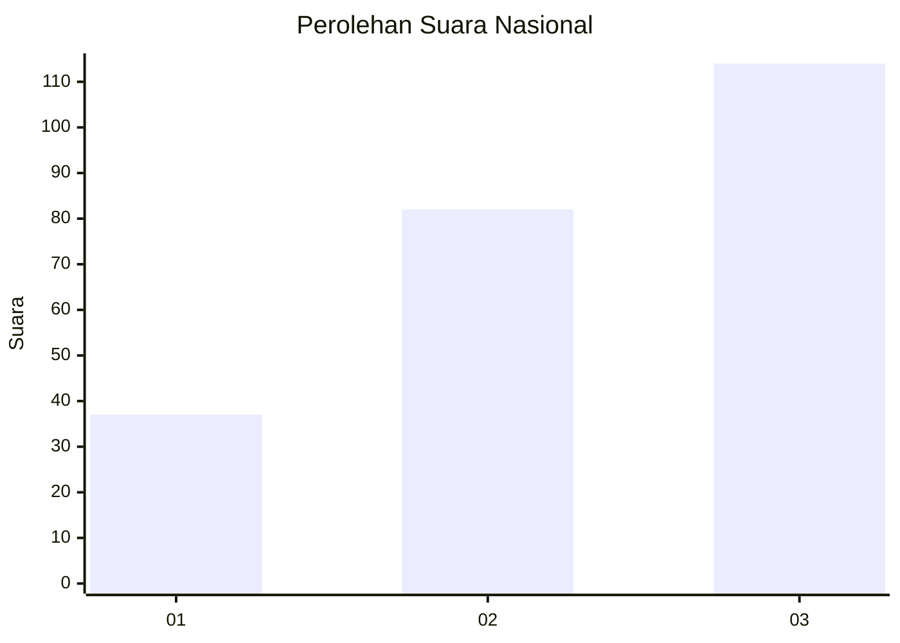
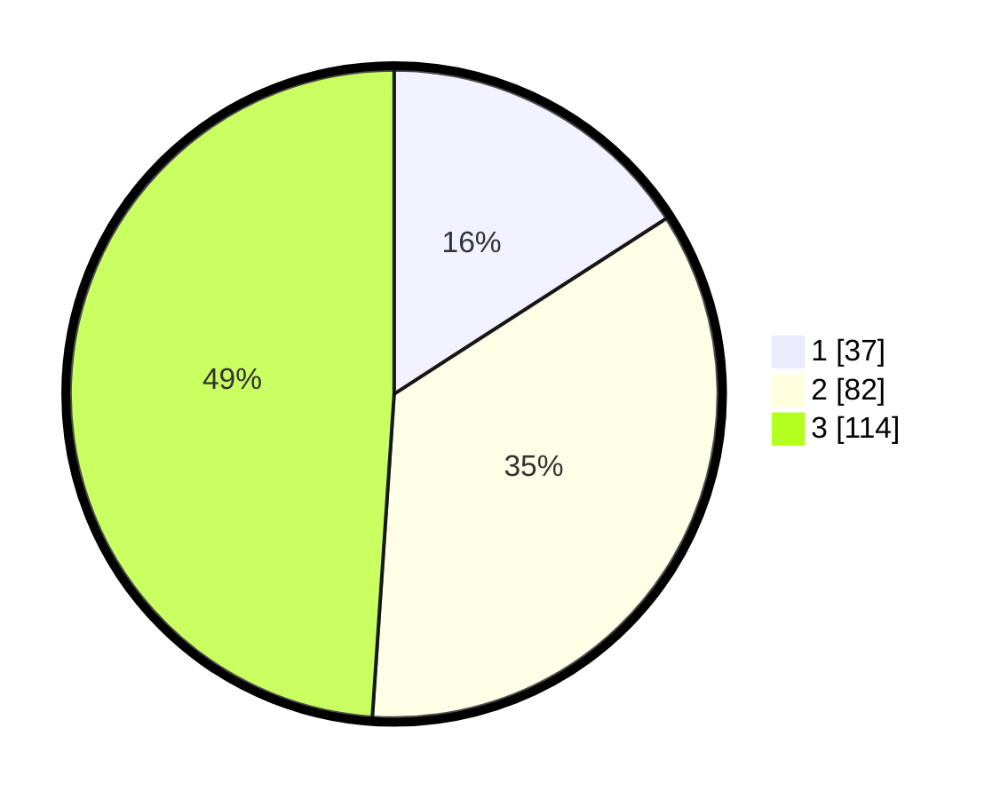

# Hasil

## Grafik

## Tabel

| No. | Nama Paslon    | Suara | Suara (raw) | Persentase |
|:--- |:-------------- | -----:| -----------:| ----------:|
| 1   | ANIES MUHAIMIN | 37    | [37][p-1]   | 15,88      |
| 2   | PRABOWO GIBRAN | 82    | [82][p-2]   | 35,19      |
| 3   | GANJAR MAHFUD  | 114   | [114][p-3]  | 48,93      |

[p-1]: https://github.com/gigit-pemilu/pemilu-2024/blob/main/pilpres/hitung-suara/sub/34-di-yogyakarta/sub/01-kulon-progo/sub/02-wates/sub/2002-sogan/sub/004-tps/sub/paslon-1.txt
[p-2]: https://github.com/gigit-pemilu/pemilu-2024/blob/main/pilpres/hitung-suara/sub/34-di-yogyakarta/sub/01-kulon-progo/sub/02-wates/sub/2002-sogan/sub/004-tps/sub/paslon-2.txt
[p-3]: https://github.com/gigit-pemilu/pemilu-2024/blob/main/pilpres/hitung-suara/sub/34-di-yogyakarta/sub/01-kulon-progo/sub/02-wates/sub/2002-sogan/sub/004-tps/sub/paslon-3.txt

## Foto C Plano

https://sirekap-obj-formc.kpu.go.id/3779/pemilu/ppwp/34/01/02/20/02/3401022002004-20240214-232931--11c10a06-85d0-4236-a31d-00eb7ef3409a.jpg

https://sirekap-obj-formc.kpu.go.id/3779/pemilu/ppwp/34/01/02/20/02/3401022002004-20240214-233054--d05acb3d-1dc2-4a3e-ad3a-5a1e2afdcf12.jpg

https://sirekap-obj-formc.kpu.go.id/3779/pemilu/ppwp/34/01/02/20/02/3401022002004-20240214-233833--c16b93a3-e18c-4da4-ae9d-4d6ab274bf94.jpg

## Metadata

| Key        | Value               |
| ---------- | ------------------- |
| Time Stamp | 2024-02-15 18:30:25 |

