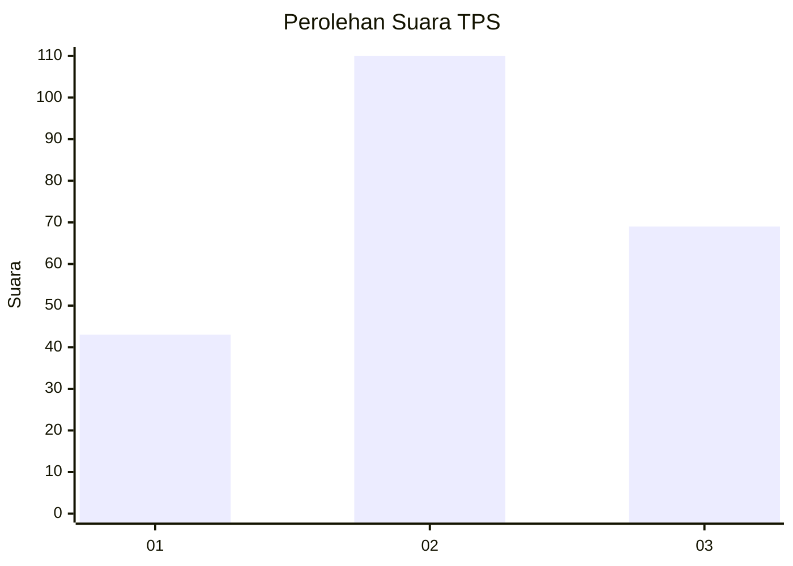
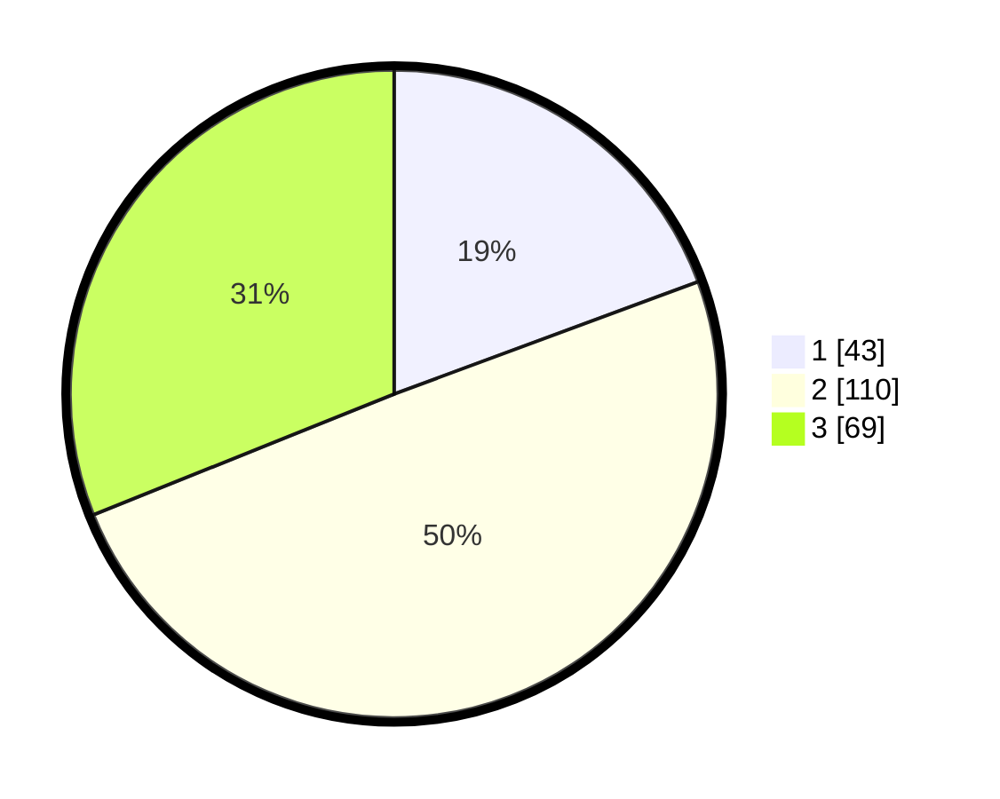

# Hasil

## Grafik

## Tabel

| No. | Nama Paslon    | Suara | Suara (raw) | Persentase |
|:--- |:-------------- | -----:| -----------:| ----------:|
| 1   | ANIES MUHAIMIN | 43    | [43][p-1]   | 19,37      |
| 2   | PRABOWO GIBRAN | 110   | [110][p-2]  | 49,55      |
| 3   | GANJAR MAHFUD  | 69    | [69][p-3]   | 31,08      |

[p-1]: https://github.com/gigit-pemilu/pemilu-2024-34-di-yogyakarta/blob/main/pilpres/hitung-suara/sub/34-di-yogyakarta/sub/01-kulon-progo/sub/02-wates/sub/2002-sogan/sub/005-tps/sub/paslon-1.txt
[p-2]: https://github.com/gigit-pemilu/pemilu-2024-34-di-yogyakarta/blob/main/pilpres/hitung-suara/sub/34-di-yogyakarta/sub/01-kulon-progo/sub/02-wates/sub/2002-sogan/sub/005-tps/sub/paslon-2.txt
[p-3]: https://github.com/gigit-pemilu/pemilu-2024-34-di-yogyakarta/blob/main/pilpres/hitung-suara/sub/34-di-yogyakarta/sub/01-kulon-progo/sub/02-wates/sub/2002-sogan/sub/005-tps/sub/paslon-3.txt

## Foto C Plano

https://sirekap-obj-formc.kpu.go.id/b436/pemilu/ppwp/34/01/02/20/02/3401022002005-20240215-115542--89531ab3-4cb7-4ff5-aa52-252112d6a602.jpg

https://sirekap-obj-formc.kpu.go.id/b436/pemilu/ppwp/34/01/02/20/02/3401022002005-20240215-115601--cdc320b1-3464-4026-9aff-047387fb2624.jpg

https://sirekap-obj-formc.kpu.go.id/b436/pemilu/ppwp/34/01/02/20/02/3401022002005-20240215-115620--9bfd93a7-54db-4f65-a7aa-a2d0fc6c31c2.jpg

## Metadata

| Key        | Value               |
| ---------- | ------------------- |
| Time Stamp | 2024-02-24 22:31:28 |

