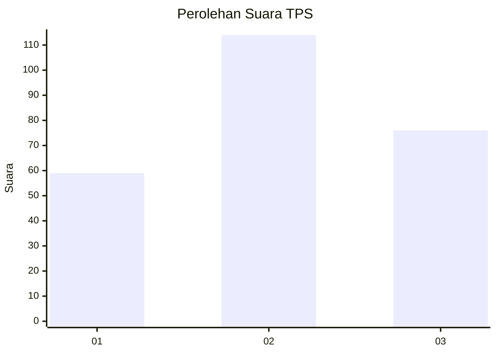
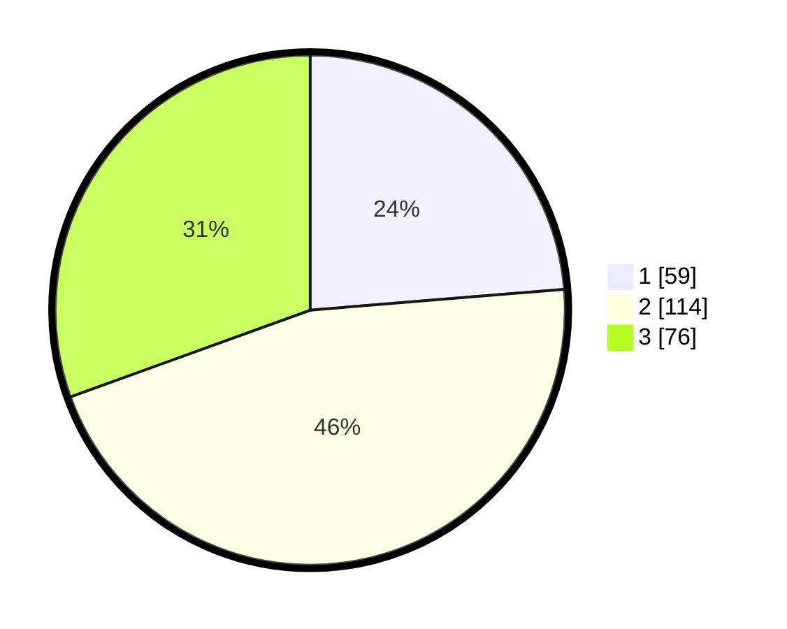

# Hasil

## Grafik

## Tabel

| No. | Nama Paslon    | Suara | Suara (raw) | Persentase |
|:--- |:-------------- | -----:| -----------:| ----------:|
| 1   | ANIES MUHAIMIN | 59    | [59][p-1]   | 23,69      |
| 2   | PRABOWO GIBRAN | 114   | [114][p-2]  | 45,78      |
| 3   | GANJAR MAHFUD  | 76    | [76][p-3]   | 30,52      |

[p-1]: https://github.com/gigit-pemilu/pemilu-2024-34-di-yogyakarta/blob/main/pilpres/hitung-suara/sub/34-di-yogyakarta/sub/01-kulon-progo/sub/02-wates/sub/2003-kulwaru/sub/005-tps/sub/paslon-1.txt
[p-2]: https://github.com/gigit-pemilu/pemilu-2024-34-di-yogyakarta/blob/main/pilpres/hitung-suara/sub/34-di-yogyakarta/sub/01-kulon-progo/sub/02-wates/sub/2003-kulwaru/sub/005-tps/sub/paslon-2.txt
[p-3]: https://github.com/gigit-pemilu/pemilu-2024-34-di-yogyakarta/blob/main/pilpres/hitung-suara/sub/34-di-yogyakarta/sub/01-kulon-progo/sub/02-wates/sub/2003-kulwaru/sub/005-tps/sub/paslon-3.txt

## Foto C Plano

https://sirekap-obj-formc.kpu.go.id/fcea/pemilu/ppwp/34/01/02/20/03/3401022003005-20240215-032404--8180e955-422f-48ad-98df-08b9dce0ae10.jpg

https://sirekap-obj-formc.kpu.go.id/fcea/pemilu/ppwp/34/01/02/20/03/3401022003005-20240215-032944--68bdfa89-937e-436e-934e-2cec3c3863d9.jpg

https://sirekap-obj-formc.kpu.go.id/fcea/pemilu/ppwp/34/01/02/20/03/3401022003005-20240215-032922--092b1dde-b566-4a4d-b95e-0759eb3e0426.jpg

## Metadata

| Key        | Value               |
| ---------- | ------------------- |
| Time Stamp | 2024-02-24 22:31:28 |

