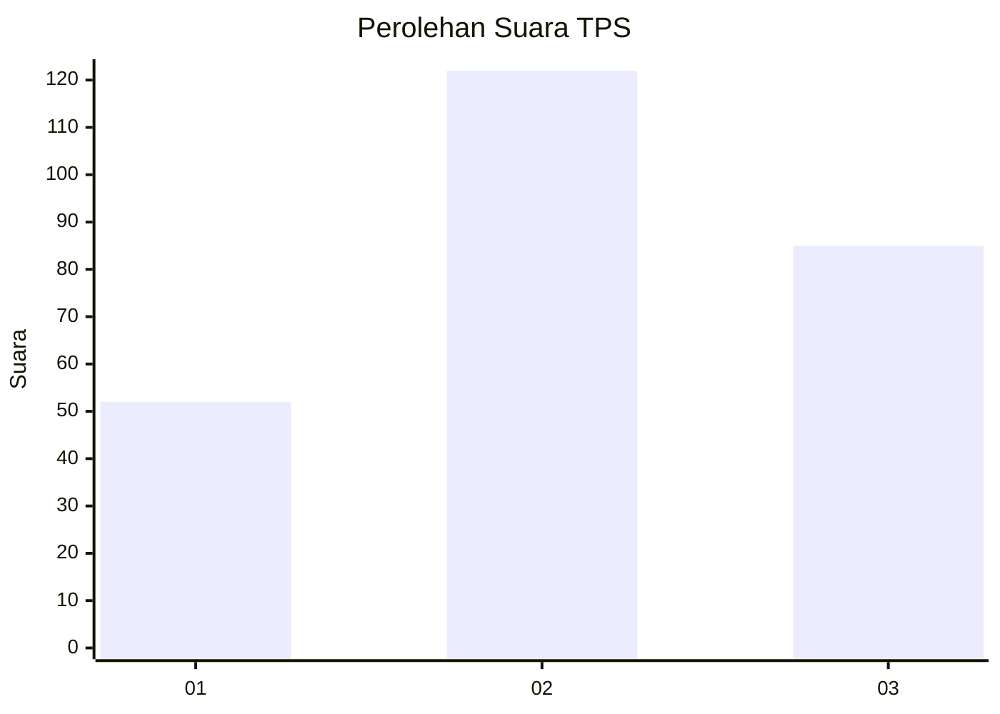
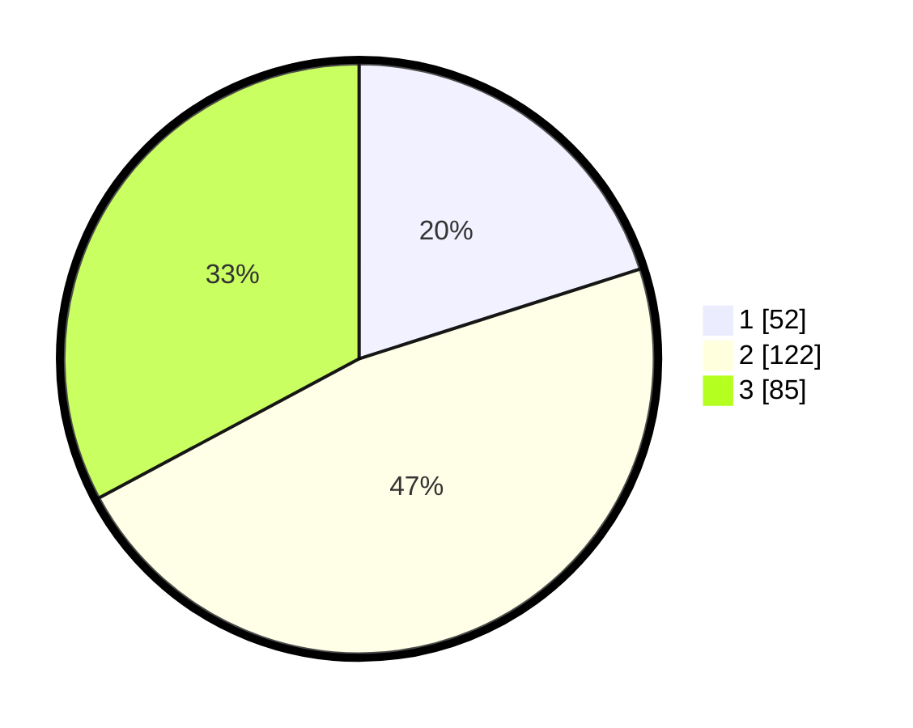

# Hasil

## Grafik

## Tabel

| No. | Nama Paslon    | Suara | Suara (raw) | Persentase |
|:--- |:-------------- | -----:| -----------:| ----------:|
| 1   | ANIES MUHAIMIN | 52    | [52][p-1]   | 20,08      |
| 2   | PRABOWO GIBRAN | 122   | [122][p-2]  | 47,10      |
| 3   | GANJAR MAHFUD  | 85    | [85][p-3]   | 32,82      |

[p-1]: https://github.com/gigit-pemilu/pemilu-2024-34-di-yogyakarta/blob/main/pilpres/hitung-suara/sub/34-di-yogyakarta/sub/01-kulon-progo/sub/02-wates/sub/2003-kulwaru/sub/006-tps/sub/paslon-1.txt
[p-2]: https://github.com/gigit-pemilu/pemilu-2024-34-di-yogyakarta/blob/main/pilpres/hitung-suara/sub/34-di-yogyakarta/sub/01-kulon-progo/sub/02-wates/sub/2003-kulwaru/sub/006-tps/sub/paslon-2.txt
[p-3]: https://github.com/gigit-pemilu/pemilu-2024-34-di-yogyakarta/blob/main/pilpres/hitung-suara/sub/34-di-yogyakarta/sub/01-kulon-progo/sub/02-wates/sub/2003-kulwaru/sub/006-tps/sub/paslon-3.txt

## Foto C Plano

https://sirekap-obj-formc.kpu.go.id/fc3b/pemilu/ppwp/34/01/02/20/03/3401022003006-20240216-161140--35a51bae-8721-435e-a5bf-ad831c3f55dc.jpg

https://sirekap-obj-formc.kpu.go.id/fc3b/pemilu/ppwp/34/01/02/20/03/3401022003006-20240216-161141--e8c87c2a-58ab-4161-b8bf-dee73c5145ed.jpg

https://sirekap-obj-formc.kpu.go.id/fc3b/pemilu/ppwp/34/01/02/20/03/3401022003006-20240216-161140--6a271a68-5ef9-4dcb-9a06-a173782bc92e.jpg

## Metadata

| Key        | Value               |
| ---------- | ------------------- |
| Time Stamp | 2024-02-20 10:00:00 |

## DATA PEMILIH TETAP

Jumlah pemilih dalam DPT: **293**.
 * L: **142**.
 * P: **151**.

## DATA PENGGUNA HAK PILIH

Jumlah pengguna hak pilih dalam DPT: **255**.
 * L: **124**.
 * P: **131**.

Jumlah pengguna hak pilih dalam DPTb: **6**.
 * L: **1**.
 * P: **5**.

Jumlah pengguna hak pilih dalam DPK: **1**.
 * L: **0**.
 * P: **1**.

Jumlah pengguna hak pilih: **262**.
 * L: **125**.
 * P: **137**.

## JUMLAH SUARA SAH DAN TIDAK SAH

JUMLAH SELURUH SUARA SAH: **259**.

JUMLAH SUARA TIDAK SAH: **3**.

JUMLAH SELURUH SUARA SAH DAN SUARA TIDAK SAH: **262**.

