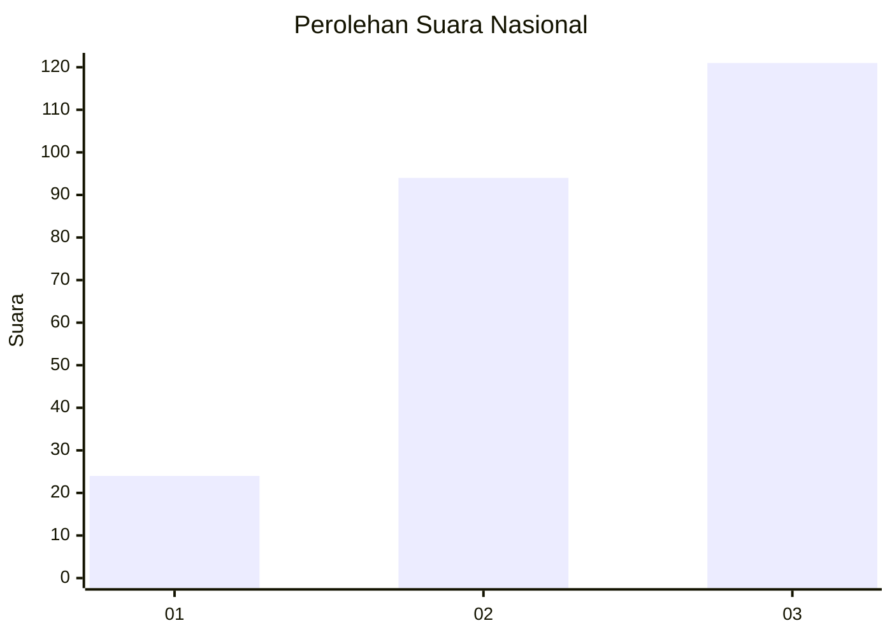
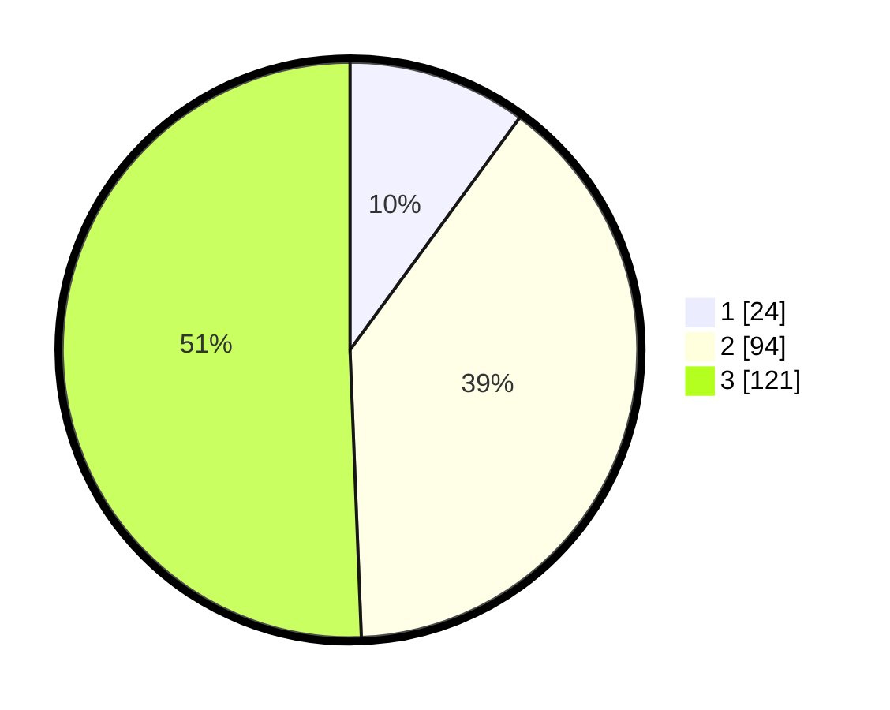

# Hasil

## Grafik

## Tabel

| No. | Nama Paslon    | Suara | Suara (raw) | Persentase |
|:--- |:-------------- | -----:| -----------:| ----------:|
| 1   | ANIES MUHAIMIN | 24    | [24][p-1]   | 10,04      |
| 2   | PRABOWO GIBRAN | 94    | [94][p-2]   | 39,33      |
| 3   | GANJAR MAHFUD  | 121   | [121][p-3]  | 50,63      |

[p-1]: https://github.com/gigit-pemilu/pemilu-2024/blob/main/pilpres/hitung-suara/sub/34-di-yogyakarta/sub/01-kulon-progo/sub/02-wates/sub/2004-ngestiharjo/sub/002-tps/sub/paslon-1.txt
[p-2]: https://github.com/gigit-pemilu/pemilu-2024/blob/main/pilpres/hitung-suara/sub/34-di-yogyakarta/sub/01-kulon-progo/sub/02-wates/sub/2004-ngestiharjo/sub/002-tps/sub/paslon-2.txt
[p-3]: https://github.com/gigit-pemilu/pemilu-2024/blob/main/pilpres/hitung-suara/sub/34-di-yogyakarta/sub/01-kulon-progo/sub/02-wates/sub/2004-ngestiharjo/sub/002-tps/sub/paslon-3.txt

## Foto C Plano

https://sirekap-obj-formc.kpu.go.id/ad15/pemilu/ppwp/34/01/02/20/04/3401022004002-20240215-022403--e533ab02-44b5-4805-8e8c-82ec6e7b3466.jpg

https://sirekap-obj-formc.kpu.go.id/ad15/pemilu/ppwp/34/01/02/20/04/3401022004002-20240215-022529--bc0e7219-5b31-4e75-abf1-807c0794718f.jpg

https://sirekap-obj-formc.kpu.go.id/ad15/pemilu/ppwp/34/01/02/20/04/3401022004002-20240215-022659--c650707f-24b9-4d26-9a97-fbb12b58a0ef.jpg

## Metadata

| Key        | Value               |
| ---------- | ------------------- |
| Time Stamp | 2024-02-15 18:30:25 |

