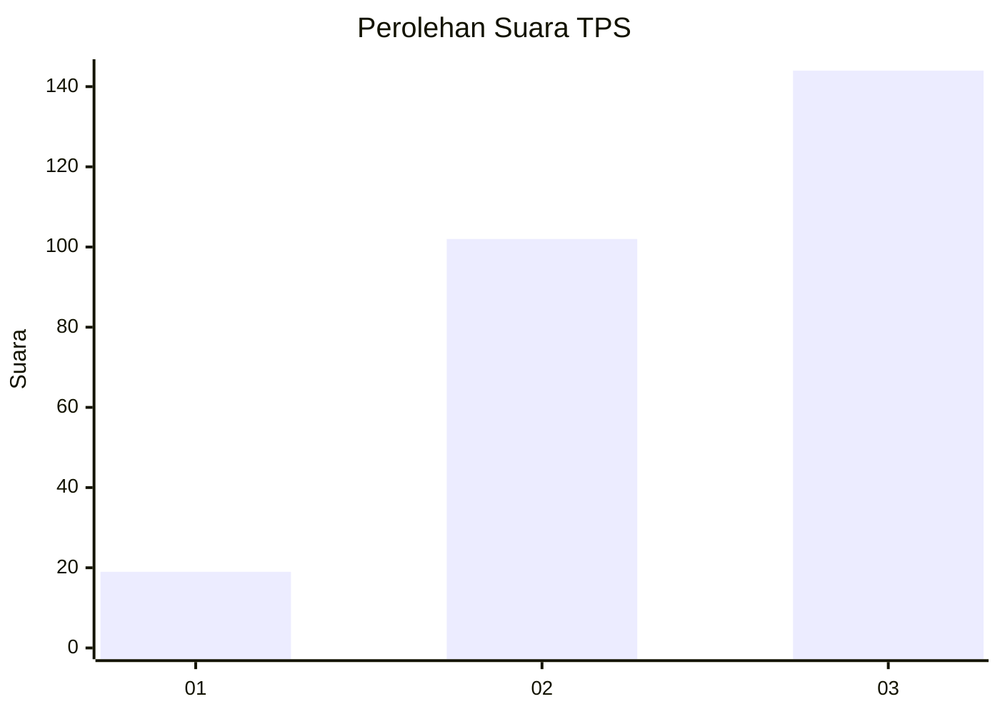
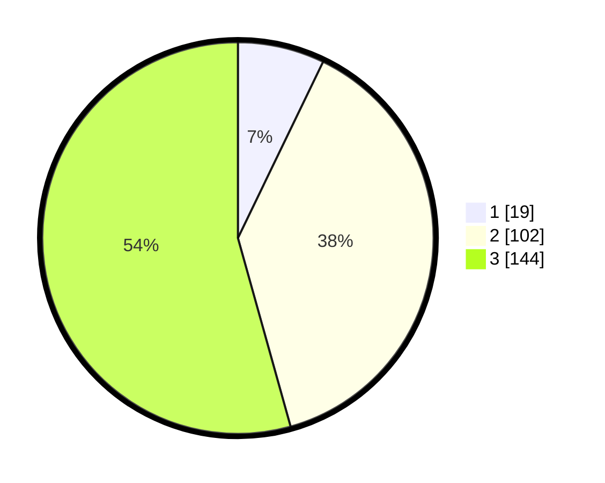

# Hasil

## Grafik

## Tabel

| No. | Nama Paslon    | Suara | Suara (raw) | Persentase |
|:--- |:-------------- | -----:| -----------:| ----------:|
| 1   | ANIES MUHAIMIN | 19    | [19][p-1]   | 7,17       |
| 2   | PRABOWO GIBRAN | 102   | [102][p-2]  | 38,49      |
| 3   | GANJAR MAHFUD  | 144   | [144][p-3]  | 54,34      |

[p-1]: https://github.com/gigit-pemilu/pemilu-2024-34-di-yogyakarta/blob/main/pilpres/hitung-suara/sub/34-di-yogyakarta/sub/01-kulon-progo/sub/02-wates/sub/2004-ngestiharjo/sub/004-tps/sub/paslon-1.txt
[p-2]: https://github.com/gigit-pemilu/pemilu-2024-34-di-yogyakarta/blob/main/pilpres/hitung-suara/sub/34-di-yogyakarta/sub/01-kulon-progo/sub/02-wates/sub/2004-ngestiharjo/sub/004-tps/sub/paslon-2.txt
[p-3]: https://github.com/gigit-pemilu/pemilu-2024-34-di-yogyakarta/blob/main/pilpres/hitung-suara/sub/34-di-yogyakarta/sub/01-kulon-progo/sub/02-wates/sub/2004-ngestiharjo/sub/004-tps/sub/paslon-3.txt

## Foto C Plano

https://sirekap-obj-formc.kpu.go.id/4621/pemilu/ppwp/34/01/02/20/04/3401022004004-20240215-001834--13f54a11-f7f3-43b0-970c-f76c81d93b24.jpg

https://sirekap-obj-formc.kpu.go.id/4621/pemilu/ppwp/34/01/02/20/04/3401022004004-20240215-002010--3391b336-0e6b-44c9-ac06-41e06ebd4ad4.jpg

https://sirekap-obj-formc.kpu.go.id/4621/pemilu/ppwp/34/01/02/20/04/3401022004004-20240215-002101--bb2981a2-cf0c-4bfb-9563-35475db93b58.jpg

## Metadata

| Key        | Value               |
| ---------- | ------------------- |
| Time Stamp | 2024-02-15 04:00:24 |

